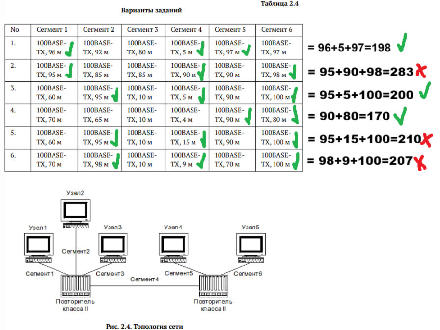

---
## Front matter
lang: ru-RU
title: Лабораторная работа №2
subtitle: Сетевые технологии
author:
  - Иванов Сергей Владимирович, НПИбд-01-23
institute:
  - Российский университет дружбы народов, Москва, Россия
date: 18 сентября 2025

## i18n babel
babel-lang: russian
babel-otherlangs: english

## Formatting pdf
toc: false
slide_level: 2
aspectratio: 169
section-titles: true
theme: metropolis
header-includes:
 - \metroset{progressbar=frametitle,sectionpage=progressbar,numbering=fraction}
 - '\makeatletter'
 - '\beamer@ignorenonframefalse'
 - '\makeatother'

 ## Fonts
mainfont: PT Serif
romanfont: PT Serif
sansfont: PT Sans
monofont: PT Mono
mainfontoptions: Ligatures=TeX
romanfontoptions: Ligatures=TeX
sansfontoptions: Ligatures=TeX,Scale=MatchLowercase
monofontoptions: Scale=MatchLowercase,Scale=0.9
---

## Цель работы

Цель данной работы — изучение принципов технологий Ethernet и Fast Ethernet
и практическое освоение методик оценки работоспособности сети, построенной
на базе технологии Fast Ethernet.

## Задание

Требуется оценить работоспособность 100-мегабитной сети Fast Ethernet в соответствии с первой и второй моделями.

# Выполнение работы

## Рассчет по первой модели

Для оценки работоспособности сети по первой модели, необходимо взять самые удаленные пути между двумя узлами домена коллизий, сложить их и сравнить с предельно допустимым диаметром домена коллизий в Fast Ethernet при наличии двух повторителей класса II (все сегменты TX). Это значение составляет 205. (рис. 1).

## Рассчет по первой модели

{#fig:001 width=70%}

## Рассчет по второй модели

Для оценки работоспособности сети по второй модели, выполняем аналогичные действия, только диаметр домена коллизий и количество сегментов в нём ограничены временем двойного оборота, для вычисления времени двойного оборота нужно умножить длину сегмента
на величину удельного времени двойного оборота.
Определив времена двойного оборота для всех сегментов наихудшего пути,
к ним нужно прибавить задержку, вносимую парой оконечных узлов и повторителями. Для учёта непредвиденных задержек
рекомендуется добавить ещё 4 битовых интервала и сравнить результат
с числом 512. (рис. 2)

## Рассчет по второй модели

{#fig:002 width=70%}

# Вывод

## Вывод 

В рамках лабораторной работы мы оценили работоспособность 100-мегабитной сети Fast Ethernet в соответствии с первой и второй моделями.

 
