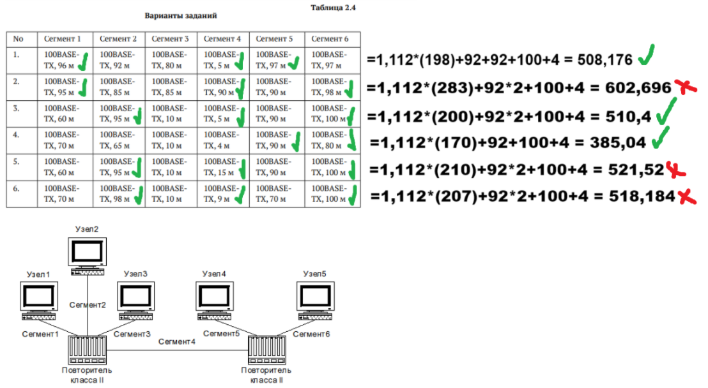

---
## Front matter
title: "Отчет по лабораторной работе №2"
subtitle: "Дисциплина: Сетевые технологии"
author: "Иванов Сергей Владимирович"

## Generic otions
lang: ru-RU
toc-title: "Содержание"

## Bibliography
bibliography: bib/cite.bib
csl: pandoc/csl/gost-r-7-0-5-2008-numeric.csl

## Pdf output format
toc: true # Table of contents
toc-depth: 2
lof: true # List of figures
fontsize: 12pt
linestretch: 1.5
papersize: a4
documentclass: scrreprt
## I18n polyglossia
polyglossia-lang:
  name: russian
  options:
	- spelling=modern
	- babelshorthands=true
polyglossia-otherlangs:
  name: english
## I18n babel
babel-lang: russian
babel-otherlangs: english
## Fonts
mainfont: PT Serif
romanfont: PT Serif
sansfont: PT Sans
monofont: PT Mono
mainfontoptions: Ligatures=TeX
romanfontoptions: Ligatures=TeX
sansfontoptions: Ligatures=TeX,Scale=MatchLowercase
monofontoptions: Scale=MatchLowercase,Scale=0.9
## Biblatex
biblatex: true
biblio-style: "gost-numeric"
biblatexoptions:
  - parentracker=true
  - backend=biber
  - hyperref=auto
  - language=auto
  - autolang=other*
  - citestyle=gost-numeric
## Pandoc-crossref LaTeX customization
figureTitle: "Рис."
listingTitle: "Листинг"
lofTitle: "Список иллюстраций"
lolTitle: "Листинги"
## Misc options
indent: true
header-includes:
  - \usepackage{indentfirst}
  - \usepackage{float} # keep figures where there are in the text
  - \floatplacement{figure}{H} # keep figures where there are in the text
---

# Цель работы

Цель данной работы — изучение принципов технологий Ethernet и Fast Ethernet
и практическое освоение методик оценки работоспособности сети, построенной
на базе технологии Fast Ethernet.

# Задание

Требуется оценить работоспособность 100-мегабитной сети Fast Ethernet в соответствии с первой и второй моделями.

# Выполнение лабораторной работы

Для оценки работоспособности сети в соответствии с первой моделью, необходимо взять самые удаленные пути между двумя узлами домена коллизий. Необходимо сложить их и сравнить с предельно допустимым диаметром домена коллизий в Fast Ethernet при наличии двух повторителей класса II (все сегменты TX). Это значение составляет 205. Видим, что работоспособными являются сети 1, 3 и 4. (рис. 1)

{#fig:001 width=70%}

Для оценки работоспособности сети в соответствии со второй моделью, выполняем аналогичные действия, только диаметр домена коллизий и количество сегментов в нём ограничены временем двойного оборота, необходимым для правильной работы механизма
обнаружения и разрешения коллизий для вычисления времени двойного оборота нужно умножить длину сегмента
на величину удельного времени двойного оборота соответствующего сегмента.
Определив времена двойного оборота для всех сегментов наихудшего пути,
к ним нужно прибавить задержку, вносимую парой оконечных узлов и повторителями. Для учёта непредвиденных задержек к полученному результату
рекомендуется добавить ещё 4 битовых интервала (би) и сравнить результат
с числом 512. Если полученный результат не превышает 512 би, то сеть считается
работоспособной.

Работоспособными являются сети 1, 3 и 4. (рис. 2)

{#fig:002 width=70%}

# Выводы

В рамках лабораторной работы мы оценили работоспособность 100-мегабитной сети Fast Ethernet в соответствии с первой и второй моделями.
