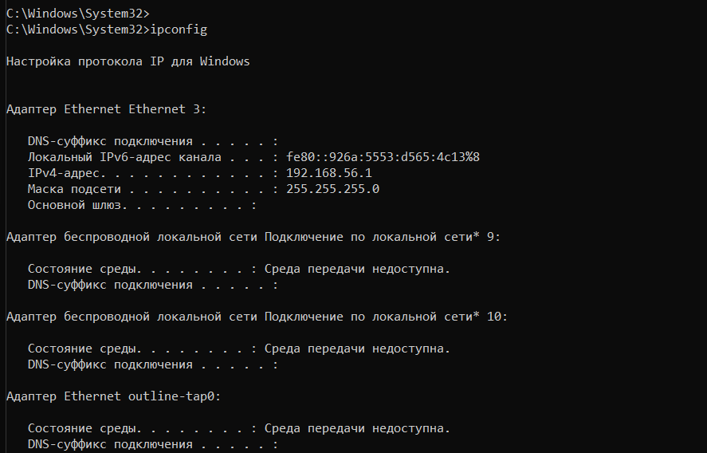
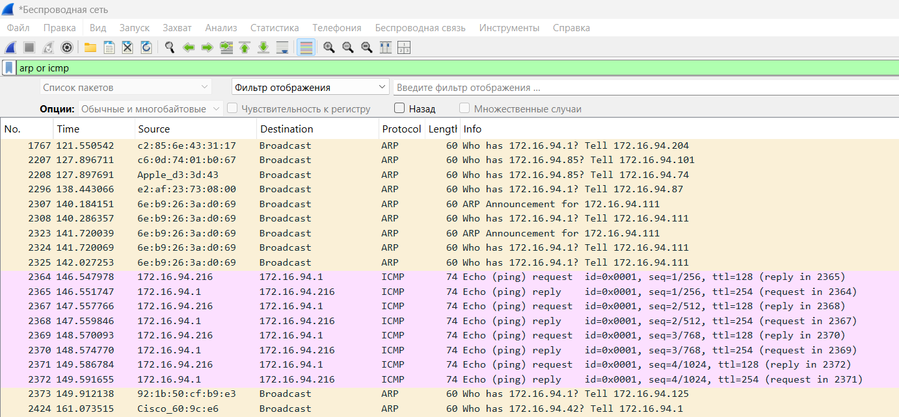
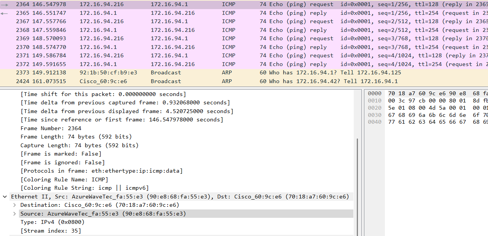
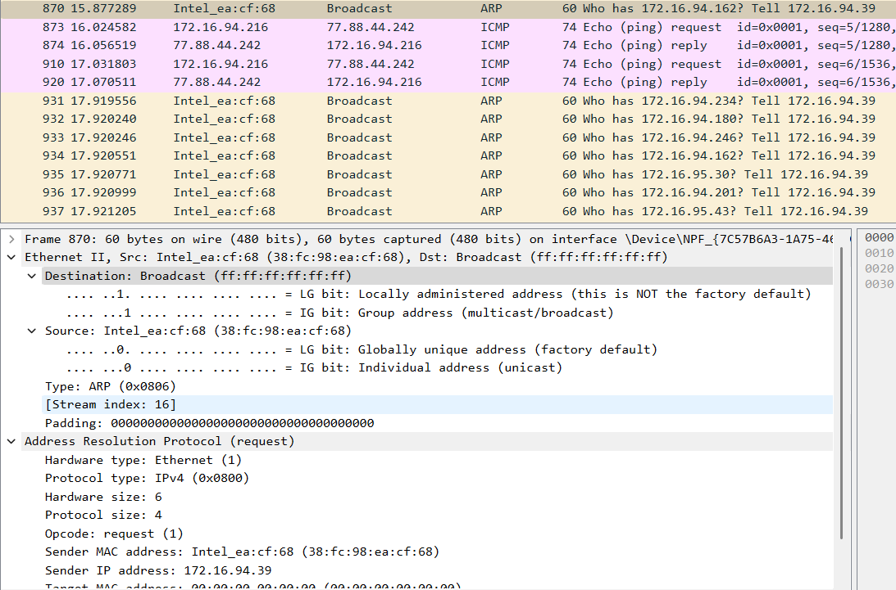
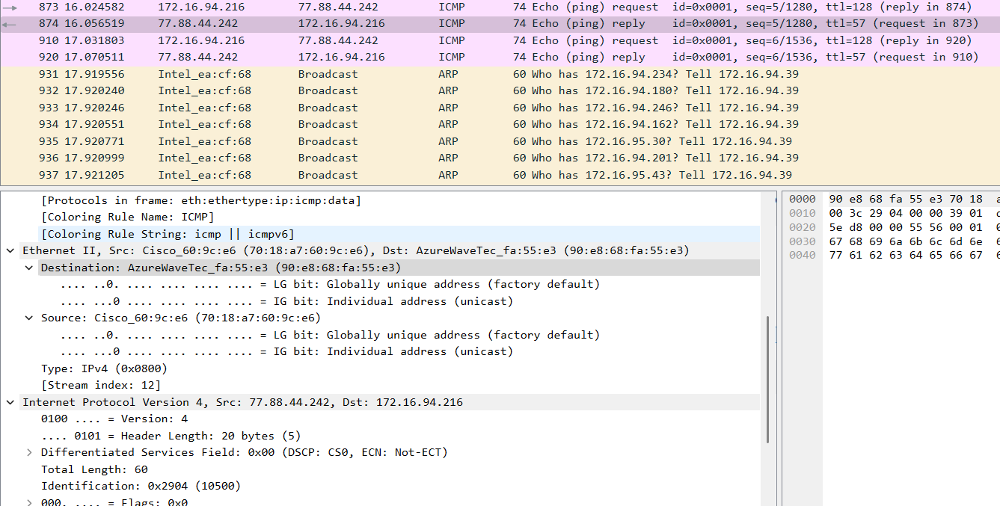
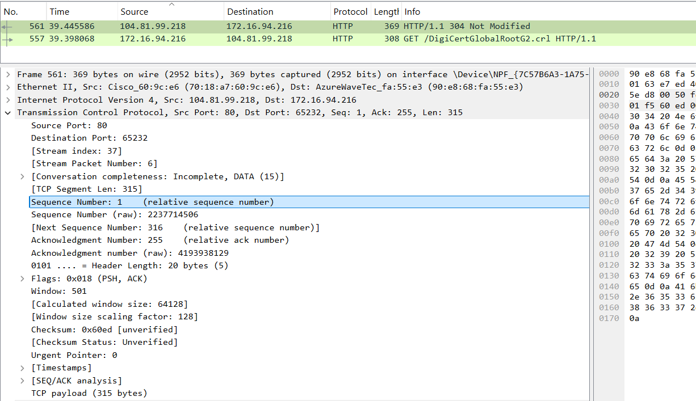
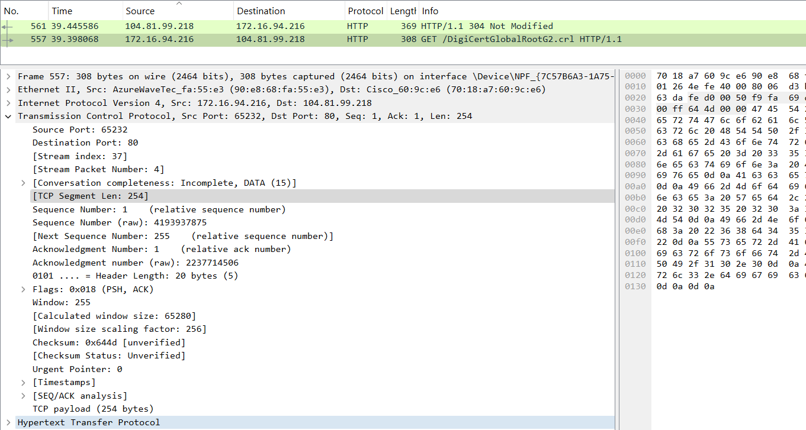
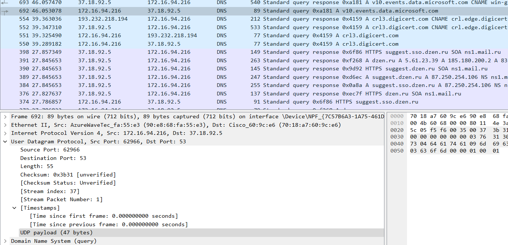
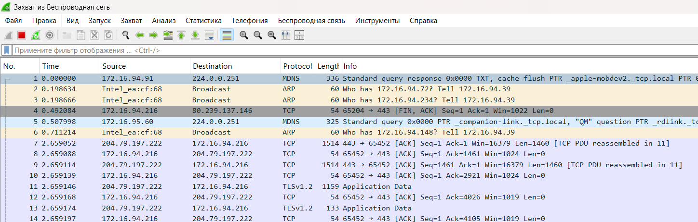

---
## Front matter
lang: ru-RU
title: Лабораторная работа №3
subtitle: Сетевые технологии
author:
  - Иванов Сергей Владимирович, НПИбд-01-23
institute:
  - Российский университет дружбы народов, Москва, Россия
date: 4 октября 2025

## i18n babel
babel-lang: russian
babel-otherlangs: english

## Formatting pdf
toc: false
slide_level: 2
aspectratio: 169
section-titles: true
theme: metropolis
header-includes:
 - \metroset{progressbar=frametitle,sectionpage=progressbar,numbering=fraction}
 - '\makeatletter'
 - '\beamer@ignorenonframefalse'
 - '\makeatother'

 ## Fonts
mainfont: PT Serif
romanfont: PT Serif
sansfont: PT Sans
monofont: PT Mono
mainfontoptions: Ligatures=TeX
romanfontoptions: Ligatures=TeX
sansfontoptions: Ligatures=TeX,Scale=MatchLowercase
monofontoptions: Scale=MatchLowercase,Scale=0.9
---

## MAC-адресация

С помощью команды ipconfig для ОС типа Windows выведем информацию о текущем сетевом соединении. (рис. 1).

{#fig:001 width=70%}

## MAC-адресация

1. Адаптер Ethernet Ethernet 3. (VirtualBox)

2. Адаптер беспроводной локальной сети Подключение по локальной сети* 9. Звёздочка указывает на виртуальный или вспомогательный адаптер. Состояние среды: Среда передачи недоступна. Этот адаптер неактивен.

3. Адаптер беспроводной локальной сети Подключение по локальной сети* 10. Аналогичен предыдущему. Этот адаптер тоже неактивен.

4. Адаптер Ethernet outline-tap0. Название говорит, что это виртуальный адаптер, созданный VPN (Outline VPN). Состояние среды: Среда передачи недоступна. Адаптер отключён, так как VPN выключен. 

## MAC-адресация

Теперь используем опцию /all команды ipconfig. Команда предоставляет расширенную информацию о конфигурации сетевых адаптеров. 

{#fig:002 width=70%}

## MAC-адресация

{#fig:003 width=70%}

## MAC-адресация

DNS-суффикс подключения: (пусто). Это может быть связано с динамической настройкой через DHCP.

Описание: MediaTek Wi-Fi 6 MT7921 Wireless LAN Card. 

Физический адрес: 90-E8-68-FA-55-E3. 

DHCP включён: Да. DHCP включён, IP-адрес и другие параметры сети автоматически выдаются сервером.

Локальный IPv6-адрес канала: fe80::2fef:1cdc:5e8:217a%14. используется для коммуникации внутри локального сегмента сети без маршрутизации.

IPv4-адрес: 172.16.4.1. 

## MAC-адресация

Маска подсети: 255.255.255.0. Маска подсети /24 определяет, что подсеть содержит до 254 хостов. 

Аренда получена: 29 сентября 2025 г. 10:49:21. Срок аренды истекает: 29 сентября 2025 г. 15:49:10. 

Основной шлюх: 172.16.4.59. Шлюз, через который трафик направляется за пределы локальной сети. 

DHCP-сервер: 192.168.80.59. IP-адрес сервера DHCP, который выдал конфигурацию. 

DNS-серверы: 37.18.92.5 193.232.218.194. Два DNS-сервера. 

## MAC-адресация 

Определим MAC-адрес интерфеса Беспроводное соединение (Wi-Fi). Он находится в поле физический адрес. Имеет длину 6 байт. Первые 3 байта — идентификатор организации, который определяет производителя оборудования. Последние 3 байта — серийный номер, назначаемый производителем.

{#fig:004 width=70%}

## MAC-адресация

90-E8-68 принадлежит компании AzureTechnolody (MediaTek Inc.). Это совпадает с описанием устройства в выводе команды. Проанализируем адрес. Для этого нужно посмотреть на значение первого первого байта адреса в двоичном формате.

Первый байт: 90 (в шестнадцатеричной системе) = 1001 0000 (в двоичной системе).

Нас интересуют два младших бита:

b0 (самый младший бит): Управляет типом адресации. 0 = Индивидуальный (Unicast). 1 = Групповой (Multicast).

b1 (второй бит): Управляет способом администрирования. 0 = Глобально управляемый. 1 = Локально управляемый.

Значит, наш адрес индивидуальный и глобально администрируемый. 

## Анализ кадров канального уровня в Wireshark

Запустим Wireshark. Выберем активный на устройстве сетевой интерфейс и убедимся, что начался процесс захвата трафика. (рис. 5)

{#fig:005 width=70%}

## Анализ кадров канального уровня в Wireshark

На устройстве в консоли определим с помощью команды ipconfig IP-адрес устройства и шлюз по умолчанию. IP: 172.16.94.216, 
Шлюз: 172.16.94.1 (рис. 6)

{#fig:006 width=70%}

## Анализ кадров канального уровня в Wireshark

В консоли с помощью команды ping адрес_шлюза пропингуем шлюз по умолчанию. (рис. 7)

{#fig:007 width=70%}

## Анализ кадров канального уровня в Wireshark

Остановим захват трафика. В строке фильтра пропишем фильтр arp or icmp. Убедимся, что в списке пакетов отобразятся только пакеты
ARP или ICMP. (рис. 8)

{#fig:008 width=70%}

## Анализ кадров канального уровня в Wireshark

Изучим эхо-запрос и эхо-ответ ICMP в программе Wireshark:

Эхо-запрос: длина кадра - 74 байта, относится к типу Ethernet (1), MAC-адрес источника - 90:e8:68:fa:55:e3 (тип индивидуальный, глобально администрируемый), MAC-адрес шлюза - 70:18:a7:60:9c:e6 (тип индивидуальный, глобально администрируемый). (рис. 9)

## Анализ кадров канального уровня в Wireshark

{#fig:009 width=70%}

## Анализ кадров канального уровня в Wireshark

Эхо-ответ: длина кадра - 74 байта, относится к типу Ethernet (1), MAC-адрес источника - 70:18:a7:60:9c:e6 (тип индивидуальный, глобально администрируемый), MAC-адрес шлюза - 90:e8:68:fa:55:e3 (тип индивидуальный, глобально администрируемый) (рис. 10)

## Анализ кадров канального уровня в Wireshark

{#fig:010 width=70%}

## Анализ кадров канального уровня в Wireshark

Изучим кадры данных протокола ARP. Изучим данные в полях заголовка Ethernet II. 

MAC-адрес назначения (Destination): ff:ff:ff:ff:ff:ff

Тип адреса: Широковещательный (Broadcast). ARP-запрос отправляется всем узлам в сети, так как отправителю неизвестен MAC-адрес получателя.

MAC-адрес источника (Source): 70:18:a7:60:9c:e6

Тип адреса: Индивидуальный, глобально администрируемый. Производитель (OUI): 70:18:a7 — Cisco Systems. (рис. 11)

## Анализ кадров канального уровня в Wireshark

{#fig:011 width=70%}

## Анализ кадров канального уровня в Wireshark

Начнем новый процесс захвата трафика в Wireshark. На устройстве в консоли пропингуем по имени какой-нибудь известный адрес, я возьму ya.ru (рис. 12)

{#fig:012 width=70%}

## Анализ кадров канального уровня в Wireshark

Остановим захват трафика. Изучим запросы и ответы протоколов
ARP и ICMP. Определим MAC-адреса источника и получателя, определим
тип MAC-адресов. 

Источник данных: IP-адрес: 172.16.94.39

MAC-адрес: 38:fc:98:ea:cf:68. Производитель (OUI): 38:fc:98 — Intel Corporate. Тип MAC-адреса: Индивидуальный, Глобально администрируемый.

Получатель данных (Destination): IP-адрес: 172.16.94.162.

MAC-адрес: ff:ff:ff:ff:ff:ff. Тип MAC-адреса: Широковещательный (Broadcast). Это адрес для отправки кадра всем устройствам в сети.

Устройство с IP 172.16.94.39 (Intel) не знает MAC-адрес устройства с IP 172.16.94.162 и широковещательно запрашивает его у всех в сети. (рис. 13)

## Анализ кадров канального уровня в Wireshark

{#fig:013 width=70%}

## Анализ кадров канального уровня в Wireshark

Анализ ICMP-протокола 

ICMP (эхо-запрос) это пакет, который отправляется с компьютера на удаленный сервер.

Содержание: 172.16.94.216 -> 77.88.44.242

Источник данных в кадре Ethernet II:

MAC-адрес: 90:e8:68:fa:55:e3 (Это беспроводной адаптер моего компьютера).

Тип MAC-адреса: Индивидуальный, Глобально администрируемый.

Получатель данных (Destination) в кадре Ethernet II:

MAC-адрес: 70:18:a7:60:9c:e6

Тип MAC-адреса: Индивидуальный, Глобально администрируемый.

## Анализ кадров канального уровня в Wireshark

Мой компьютер хочет отправить пакет на внешний IP 77.88.44.242. По правилам маршрутизации, он отправляет пакет на свой основной шлюз. Он уже знает MAC-адрес шлюза, поэтому кадр Ethernet адресован напрямую на MAC-адрес маршрутизатора. (рис. 14)

{#fig:014 width=70%}

## Анализ кадров канального уровня в Wireshark

Это ответ, который возвращается с удаленного сервера на ваш компьютер.

Содержание: 77.88.44.242 -> 172.16.94.216

Источник данных в кадре Ethernet II:

MAC-адрес: 70:18:a7:60:9c:e6 (Cisco)

Тип MAC-адреса: Индивидуальный, Глобально администрируемый.

Получатель данных (Destination) в кадре Ethernet II:

MAC-адрес: 90:e8:68:fa:55:e3 (мой комп)

Тип MAC-адреса: Индивидуальный, Глобально администрируемый.

## Анализ кадров канального уровня в Wireshark

Маршрутизатор получил ответ от сервера и теперь должен доставить его моему компьютеру в локальной сети. Он знает MAC-адрес ПК и отправляет кадр Ethernet напрямую на мой MAC-адрес. (рис. 15)

{#fig:015 width=70%}

## Анализ протоколов транспортного уровня в Wireshark

Запустим Wireshark. Выберем активный на устройстве сетевой интерфейс. Убедимся, что начался процесс захвата трафика. (рис. 16)

{#fig:016 width=70%}

## Анализ протоколов транспортного уровня в Wireshark

В браузере перейдем на сайт, работающий по протоколу
HTTP (например, на сайт CERN http://info.cern.ch/). (рис. 17)

{#fig:017 width=70%}

## Анализ протоколов транспортного уровня в Wireshark

В Wireshark в строке фильтра укажем http. Это пакет, в котором компьютер отправляет HTTP-запрос на сервер. Анализируем TCP (запрос)

Порты: Source Port: 65232 — это исходный порт, который случайным образом выбирается компьютером. Destination Port: 80 — это порт назначения

Sequence Number (последовательный номер): Relative (относительный): 1, Raw (абсолютный): 4193937875. Это номер первого байта данных в этом сегменте. Wireshark для удобства показывает относительный номер, начиная с 1.

## Анализ протоколов транспортного уровня в Wireshark

Acknowledgment Number (номер подтверждения): Relative (относительный): 1, Raw (абсолютный): 2237714506. Это номер следующего байта, который отправитель этого пакета ожидает получить от противоположной стороны. Подтверждает успешное получение всех данных до этого номера.

Flags: PSH, ACK. ACK (Acknowledgment): Установлен, чтобы подтвердить получение предыдущих пакетов от сервера. PSH (Push): Указывает получателю (серверу) немедленно передать данные приложению (веб-серверу), не дожидаясь заполнения буфера. 

TCP Segment Len (длина сегмента): 254. (рис. 18)

## Анализ протоколов транспортного уровня в Wireshark

{#fig:018 width=70%}

## Анализ протоколов транспортного уровня в Wireshark

Порты: Source Port (порт источника): 80. Destination Port (порт назначения): 65232.

Sequence Number (последовательный номер): Relative (относительный): 1, Raw (абсолютный): 2237714506. Это номер первого байта данных, которые сервер отправляет в этом сегменте.

Acknowledgment Number (номер подтверждения): Relative (относительный): 255, Raw (абсолютный): 4193938129

Flags: PSH, ACK. ACK (Acknowledgment): Подтверждает получение HTTP-запроса от клиента. PSH (Push): Указывает компьютеру немедленно передать данные (HTTP-ответ) приложению (браузеру).

TCP Segment Len (длина сегмента): 315. Размер полезных данных (HTTP-ответа), переносимых в этом TCP-сегменте. (рис. 19)

## Анализ протоколов транспортного уровня в Wireshark

{#fig:019 width=70%}

## Анализ протоколов транспортного уровня в Wireshark

UDP в DNS-запросе. Это пакет, в котором компьютер отправляет вопрос DNS-серверу.

Source Port (порт источника): 62966. Destination Port (порт назначения): 53. Это стандартный порт для службы DNS. 

Length (длина): 55 байт. Общая длина UDP-датаграммы (заголовок + данные). (рис. 20)

## Анализ протоколов транспортного уровня в Wireshark

{#fig:020 width=70%}

## Анализ протоколов транспортного уровня в Wireshark

UDP в DNS-ответе. Это пакет, в котором DNS-сервер возвращает ответ компьютеру.

Source Port (порт источника): 53. Destination Port (порт назначения): 62966. 

Length (длина): 506 байт. Общая длина этой UDP-датаграммы. (рис. 21)

## Анализ протоколов транспортного уровня в Wireshark

{#fig:021 width=70%}

## Анализ протоколов транспортного уровня в Wireshark

Wireshark в строке фильтра укажем quic и проанализируем информацию по
протоколу quic в случае запросов и ответов.

QUIC работает поверх UDP, поэтому в заголовках мы сначала видим Ethernet, затем IP, затем UDP, и только потом — QUIC.

QUIC-пакет от Клиента. Это пакет, который компьютер отправляет на сервер.

Транспорт (UDP): Source Port (порт источника): 62198, Destination Port (порт назначения): 443 (порт QUIC/HTTPS сервера)

## Анализ протоколов транспортного уровня в Wireshark

QUIC Заголовок:

Destination Connection ID (DCID): f8a9378badb7bea3. Идентификатор соединения назначения. Это уникальный идентификатор, который клиент использует для указания, с каким именно серверным соединением связан этот пакет. Сервер изначально предоставляет этот ID клиенту.

Полезная нагрузка: Remaining Payload: d6e43ad86a11... Основные данные протокола. Как видно из названия пакета в общем списке — "Protected Payload" — эта часть зашифрована. Это одно из ключевых преимуществ QUIC — шифрование, и даже заголовки полей, относящиеся к управлению соединением, шифруются. (рис. 22)

## Анализ протоколов транспортного уровня в Wireshark

{#fig:022 width=70%}

## Анализ протоколов транспортного уровня в Wireshark

Транспорт (UDP): Source Port (порт источника): 443, Destination Port (порт назначения): 62198 (сервер отправляет ответ на исходный порт ПК)

QUIC Заголовок:

В ответах сервер будет использовать тот Connection ID, который был предоставлен клиенту (или новый, согласованный в процессе установления соединения).

Полезная нагрузка: Remaining Payload: 3fcea12c11cd... Аналогично клиентскому пакету, полезная нагрузка сервера также является "Protected Payload" (Защищенной) и зашифрована. (рис. 23)

## Анализ протоколов транспортного уровня в Wireshark

{#fig:023 width=70%}

## Анализ handshake протокола TCP в Wireshark

Запустим Wireshark. Выберем активный на устройстве сетевой интерфейс. Убедимся, что начался процесс захвата трафика. (рис. 24)

{#fig:024 width=70%}

## Анализ handshake протокола TCP в Wireshark

Использую соединение по HTTP с каким-то сайтом для захвата в Wireshark пакетов TCP. В Wireshark проанализируем handshake протокола TCP. 

Шаг 1: SYN (Синхронизация). Клиент инициирует соединение, отправляя серверу специальный пакет.

Ключевые поля TCP:

Sequence Number: 0. Клиент генерирует начальный номер последовательности (ISN). 

Flags: SYN (0x002). Установлен только флаг SYN. Это запрос на синхронизацию и начало соединения.

## Анализ handshake протокола TCP в Wireshark

Параметры (Options): MSS=1460 — максимальный размер сегмента, который клиент может принять, WS=256 — фактор масштабирования окна для увеличения его эффективного размера, SACK_PERM — поддержка выборочных подтверждений (Selective Acknowledgements).

Клиент говорит серверу: я хочу установить соединение. Мой начальный номер последовательности — 0, и вот мои параметры. (рис. 25)

## Анализ handshake протокола TCP в Wireshark

{#fig:025 width=70%}

## Анализ handshake протокола TCP в Wireshark

Шаг 2: SYN-ACK (Синхронизация-Подтверждение). Сервер отвечает, подтверждая запрос клиента и отправляя свой собственный запрос на синхронизацию.

Sequence Number: 0. Сервер генерирует свой собственный начальный номер последовательности (ISN).

Acknowledgment Number: 1. Это поле подтверждения. Сервер подтверждает получение SYN-пакета клиента. 

Flags: SYN, ACK (0x012). Установлены флаги SYN (запрос синхронизации от сервера) и ACK (подтверждение пакета клиента).

Сервер отвечает клиенту: Я получил запрос на соединение (ACK=1). Я согласен установить соединение, и мой начальный номер последовательности — 0 (SYN). Вот мои параметры. (рис. 26)

## Анализ handshake протокола TCP в Wireshark

{#fig:026 width=70%}

## Анализ handshake протокола TCP в Wireshark

Шаг 3: ACK (Подтверждение). Клиент завершает рукопожатие, подтверждая SYN-пакет сервера.

Ключевые поля TCP:

Sequence Number (относительный): 1. Номер последовательности клиента теперь 1, так как его SYN-пакет "потребил" номер 0.

Acknowledgment Number (относительный): 1. Это поле подтверждения. Клииент подтверждает получение SYN-пакета сервера. Номер подтверждения равен ISN сервера + 1. Ack=1.

Flags: ACK (0x010). Установлен только флаг ACK.

Клиент говорит серверу: Я получил SYN-пакет. Соединение установлено. (рис. 27)

## Анализ handshake протокола TCP в Wireshark

{#fig:027 width=70%}

# Вывод

## Вывод 

В ходе выполнения лабораторной работы мы изученили посредством Wireshark кадры Ethernet, проанализировали PDU протоколы
транспортного и прикладного уровней стека TCP/IP.

 
