---
## Front matter
title: "Отчет по лабораторной работе №3"
subtitle: "Дисциплина: Сетевые технологии"
author: "Иванов Сергей Владимирович"

## Generic otions
lang: ru-RU
toc-title: "Содержание"

## Bibliography
bibliography: bib/cite.bib
csl: pandoc/csl/gost-r-7-0-5-2008-numeric.csl

## Pdf output format
toc: true # Table of contents
toc-depth: 2
lof: true # List of figures
fontsize: 12pt
linestretch: 1.5
papersize: a4
documentclass: scrreprt
## I18n polyglossia
polyglossia-lang:
  name: russian
  options:
	- spelling=modern
	- babelshorthands=true
polyglossia-otherlangs:
  name: english
## I18n babel
babel-lang: russian
babel-otherlangs: english
## Fonts
mainfont: PT Serif
romanfont: PT Serif
sansfont: PT Sans
monofont: PT Mono
mainfontoptions: Ligatures=TeX
romanfontoptions: Ligatures=TeX
sansfontoptions: Ligatures=TeX,Scale=MatchLowercase
monofontoptions: Scale=MatchLowercase,Scale=0.9
## Biblatex
biblatex: true
biblio-style: "gost-numeric"
biblatexoptions:
  - parentracker=true
  - backend=biber
  - hyperref=auto
  - language=auto
  - autolang=other*
  - citestyle=gost-numeric
## Pandoc-crossref LaTeX customization
figureTitle: "Рис."
listingTitle: "Листинг"
lofTitle: "Список иллюстраций"
lolTitle: "Листинги"
## Misc options
indent: true
header-includes:
  - \usepackage{indentfirst}
  - \usepackage{float} # keep figures where there are in the text
  - \floatplacement{figure}{H} # keep figures where there are in the text
---

# Цель работы

Целью этой лабораторной работы является изучение посредством Wireshark кадров Ethernet, анализ PDU протоколов
транспортного и прикладного уровней стека TCP/IP.

# Выполнение лабораторной работы

## MAC-адресация

С помощью команды ipconfig для ОС типа Windows выведем информацию о текущем сетевом соединении. Вывод команды показывает информацию о сетевых адаптерах. Некоторые из них активны, другие - отключены.

1. Адаптер Ethernet Ethernet 3. Это Ethernet-адаптер (проводное соединение). Это виртуальный адаптер, созданный для локальной сети, в виртуальной машине (VirtualBox). Он активен и имеет конфигурацию.

DNS-суффикс подключения: отсутствует. DNS-суффикс — это доменное имя, которое автоматически добавляется к неполным именам хостов при разрешении DNS. Если поле пустое, суффикс не задан, и система будет использовать только полные доменные имена или другие глобальные DNS-настройки. 

Локальный IPv6-адрес канала: fe80::926a:5553:d565:4c13%8. Это link-local IPv6-адрес (адрес локальной связи). IPv6-адреса типа fe80:: используются для коммуникации только внутри локального сегмента сети (без маршрутизации через роутеры). Суффикс "%8" — это идентификатор интерфейса, указывающий, к какому адаптеру привязан адрес. Этот адрес генерируется автоматически на основе MAC-адреса устройства и не требует DHCP-сервера.

IPv4-адрес: 192.168.56.1. Это основной IPv4-адрес адаптера. 192.168.56.1 — приватный IP-адрес из диапазона 192.168.0.0/16, предназначенный для локальных сетей.

Маска подсети: 255.255.255.0. Маска подсети определяет размер сети и разделяет IP-адрес на сетевую и хостовую части. 255.255.255.0 соответствует префиксу /24, то есть в сети может быть до 254 хостов. 

Основной шлюз: (пусто). Шлюз по умолчанию — это IP-адрес роутера, через который трафик направляется за пределы локальной сети. Пустое поле означает, что шлюз не настроен, поэтому этот адаптер может общаться только с устройствами в той же подсети. Доступ к интернету через этот адаптер невозможен.

2. Адаптер беспроводной локальной сети Подключение по локальной сети* 9. Это беспроводной (Wi-Fi) адаптер. Звёздочка указывает на виртуальный или вспомогательный адаптер, созданный системой.

Состояние среды: Среда передачи недоступна. Этот адаптер неактивен.

3. Адаптер беспроводной локальной сети Подключение по локальной сети* 10. Аналогично предыдущему — ещё один беспроводной адаптер. Этот адаптер тоже неактивен.

4. Адаптер Ethernet outline-tap0. Это Ethernet-адаптер с названием "outline-tap0". Название говорит, что это виртуальный TAP-адаптер, созданный программой VPN (Outline VPN).

Состояние среды: Среда передачи недоступна. Адаптер отключён, так как VPN выключен. (рис. 1).

{#fig:001 width=70%}

Теперь используем опцию /all команды ipconfig. Команда предоставляет расширенную информацию о конфигурации сетевых адаптеров. Разберу подробно Беспроводное соединение.

DNS-суффикс подключения: (пусто). DNS-суффикс — это доменное имя, добавляемое автоматически к запросам DNS для разрешения неполных имён. Отсутствие суффикса указывает, что система не настроена на использование определённого домена по умолчанию для этого подключения. Это может быть связано с динамической настройкой через DHCP.

Описание: MediaTek Wi-Fi 6 MT7921 Wireless LAN Card. Это беспроводной адаптер, поддерживающий Wi-Fi 6.

Физический адрес: 90-E8-68-FA-55-E3. MAC-адрес — уникальный идентификатор сетевого интерфейса, назначенный производителем

DHCP включён: Да. DHCP включён, IP-адрес и другие параметры сети автоматически выдаются сервером DHCP (например, роутером).

Автонастройка IPv4-адрес канала: Да. Включена автоконфигурация IPv4, что позволяет адаптеру автоматически назначать себе link-local адрес, если DHCP-сервер недоступен. Это резервный механизм.

Локальный IPv6-адрес канала: fe80::2fef:1cdc:5e8:217a%14. Link-local IPv6-адрес используется для коммуникации внутри локального сегмента сети без маршрутизации.

IPv4-адрес: 172.16.4.1. Это основной IPv4-адрес, назначенный адаптеру. Адрес 172.16.4.1 находится в частном диапазоне 172.16.0.0/12, используемом для локальных сетей. Это может быть адрес, выданный DHCP-сервером роутера или точки доступа.

Маска подсети: 255.255.255.0. Маска подсети /24 определяет, что подсеть содержит до 254 хостов. 

Аренда получена: 29 сентября 2025 г. 10:49:21. Дата и время, когда адаптер получил текущую конфигурацию от DHCP-сервера. 

Срок аренды истекает: 29 сентября 2025 г. 15:49:10. Время истечения аренды IP-адреса. 

Основной шлю: 172.16.4.59. Шлюз по умолчанию — IP-адрес роутера или точки доступа, через который трафик направляется за пределы локальной сети. Адрес 172.16.4.59 находится в той же подсети, что и адаптер, что логично для внутренней маршрутизации.

DHCP-сервер: 192.168.80.59. IP-адрес сервера DHCP, который выдал конфигурацию. 

IAID DHCPv6: 49603594. Идентификатор клиента для DHCPv6, используемый при конфигурации IPv6.

DUID клиента DHCPv6: 00-01-00-01-2D-00-EA-E7-58-11-22-88-F5-69. Уникальный идентификатор клиента DHCPv6, сгенерированный системой для работы с IPv6.

DNS-серверы: 37.18.92.5 193.232.218.194. Два DNS-сервера. Первый может быть публичным сервером, второй — возможно, сервер организации или резервный.

NetBIOS через TCP/IP: Включён. NetBIOS включён, что позволяет использовать старые протоколы именования в локальной сети. (рис. 2, 3).

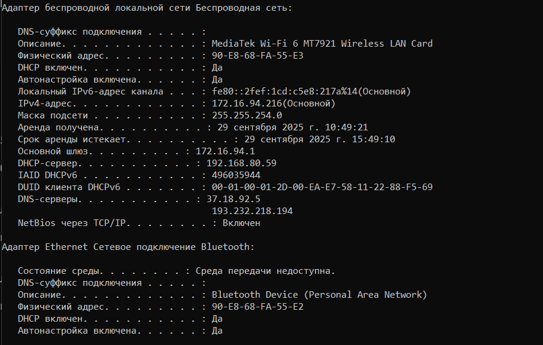{#fig:002 width=70%}

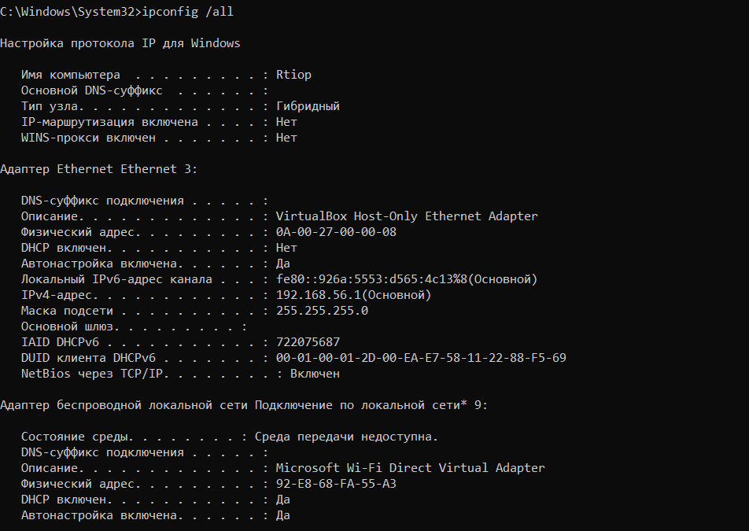{#fig:003 width=70%}

Определим MAC-адрес интерфеса Беспроводное соединение (Wi-Fi). Он находится в поле физический адрес (90-E8-68-FA-55-E3). Имеет длину 6 байт и записывается в 16-ти ричном формате. Первые 3 байта: OUI (Organizationally Unique Identifier) — идентификатор организации, который определяет производителя оборудования. Последние 3 байта: NIC Specific — серийный номер, назначаемый производителем.

Согласно базе данных IEEE, OUI 90-E8-68 принадлежит компании AzureTechnolody (MediaTek Inc.). Это совпадает с описанием устройства в выводе команды: "MediaTek Mi-Fi 6 MT7921 Wireless LAN Card". Проанализируем адрес 90-E8-68-FA-55-E3. Для этого нужно посмотреть на значение первого первого байта адреса в двоичном формате.

Первый байт: 90 (в шестнадцатеричной системе) = 1001 0000 (в двоичной системе).

В этом байте нас интересуют два младших бита:

b0 (самый младший бит): Управляет типом адресации. 0 = Индивидуальный (Unicast) Адрес предназначен для одного конкретного сетевого интерфейса. 1 = Групповой (Multicast) Адрес предназначен для группы интерфейсов.

b1 (второй бит): Управляет способом администрирования. 0 = Глобально уникальный (UAA, Universally Administered Address). Постоянный адрес, прошитый на заводе. 1 = Локально управляемый (LAA, Locally Administered Address). Адрес, переопределенный пользователем или программным обеспечением.

Значит, наш адрес индивидуальный и глобально администрируемый. (рис. 4) 

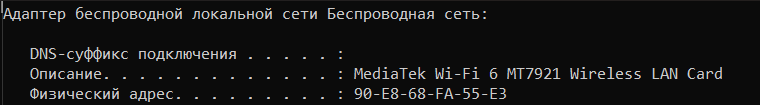{#fig:004 width=70%}

## Анализ кадров канального уровня в Wireshark

Запустим Wireshark. Выберем активный на устройстве сетевой интерфейс и убедимся, что начался процесс захвата трафика. (рис. 5)

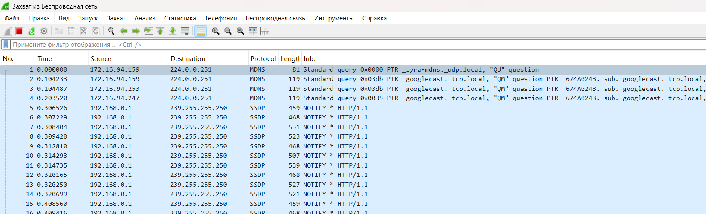{#fig:005 width=70%}

На устройстве в консоли определим с помощью команды ipconfig IP-адрес устройства и шлюз по умолчанию. IP: 172.16.94.216, 
Шлюз: 172.16.94.1 (рис. 6)

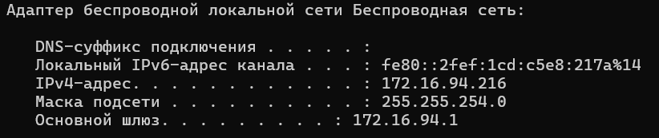{#fig:006 width=70%}

В консоли с помощью команды ping адрес_шлюза пропингуем шлюз по умолчанию. (рис. 7)

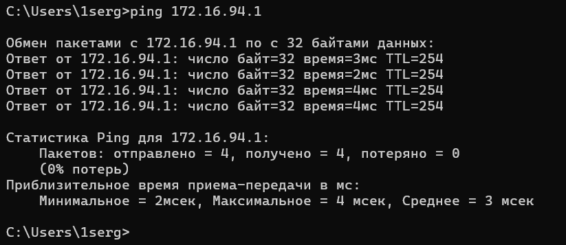{#fig:007 width=70%}

В Wireshark остановим захват трафика. В строке фильтра пропишем фильтр arp or icmp. Убедимся, что в списке пакетов отобразятся только пакеты
ARP или ICMP, в частности пакеты, которые были сгенерированы с помощью
команды ping. (рис. 8)

{#fig:008 width=70%}

Изучим эхо-запрос и эхо-ответ ICMP в программе Wireshark:

Эхо-запрос: длина кадра - 74 байта, относится к типу Ethernet (1), MAC-адрес источника - 90:e8:68:fa:55:e3 (тип индивидуальный, глобально администрируемый, как мы уже определяли), MAC-адрес шлюза - 70:18:a7:60:9c:e6 (тип индивидуальный, глобально администрируемый, т.к 70 в 16 системе = 11100000 в 2). (рис. 9)

{#fig:009 width=70%}

Эхо-ответ: длина кадра - 74 байта, относится к типу Ethernet (1), MAC-адрес источника - 70:18:a7:60:9c:e6 (тип индивидуальный, глобально администрируемый), MAC-адрес шлюза - 90:e8:68:fa:55:e3 (тип индивидуальный, глобально администрируемый) (рис. 10)

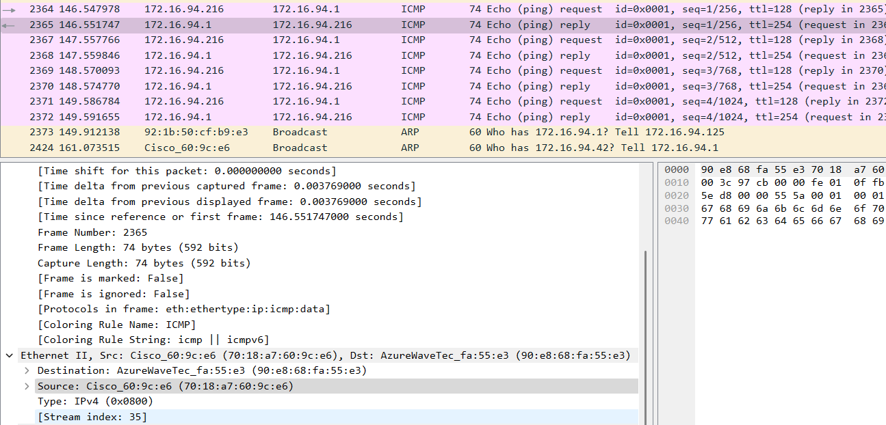{#fig:010 width=70%}

Изучим кадры данных протокола ARP. Изучим данные в полях заголовка Ethernet II. 

MAC-адрес назначения (Destination): ff:ff:ff:ff:ff:ff

Тип адреса: Широковещательный (Broadcast). ARP-запрос отправляется всем узлам в сети, так как отправителю неизвестен MAC-адрес получателя.

MAC-адрес источника (Source): 70:18:a7:60:9c:e6

Тип адреса: Индивидуальный, глобально администрируемый. Производитель (OUI): 70:18:a7 — Cisco Systems.

Тип (Type): 0x0806. Назначение: Идентифицирует инкапсулированный протокол. Указывает, что содержимым кадра является пакет протокола ARP (Address Resolution Protocol). (рис. 11)

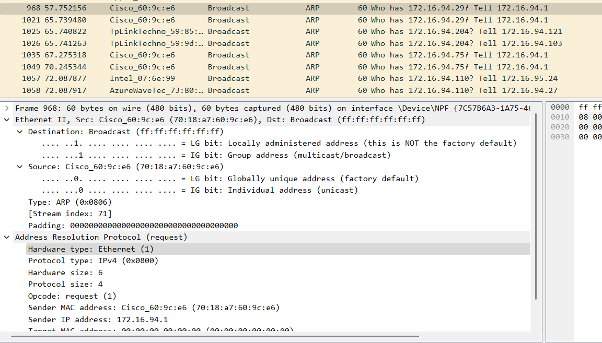{#fig:011 width=70%}

Начнем новый процесс захвата трафика в Wireshark. На устройстве в консоли пропингуем по имени какой-нибудь известный адрес, я возьму ya.ru (рис. 12)

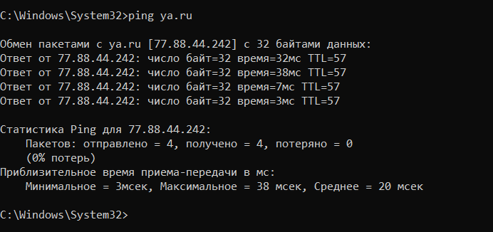{#fig:012 width=70%}

В Wireshark остановим захваттрафика. Изучим запросы и ответы протоколов
ARP и ICMP. Определим MAC-адреса источника и получателя, определим
тип MAC-адресов. 

Анализ ARP-протокола. ARP-запросы используются для нахождения MAC-адреса по известному IP-адресу в локальной сети.

Источник данных:

IP-адрес: 172.16.94.39

MAC-адрес: 38:fc:98:ea:cf:68

Производитель (OUI): 38:fc:98 — Intel Corporate.

Тип MAC-адреса: Индивидуальный, Глобально администрируемый.

Получатель данных (Destination):

IP-адрес: 172.16.94.162.

MAC-адрес: ff:ff:ff:ff:ff:ff

Тип MAC-адреса: Широковещательный (Broadcast). Это адрес для отправки кадра всем устройствам в сети.

Устройство с IP 172.16.94.39 (Intel) не знает MAC-адрес устройства с IP 172.16.94.162 и широковещательно запрашивает его у всех в сети. (рис. 13)

{#fig:013 width=70%}

Анализ ICMP-протокола 

ICMP (эхо-запрос) это пакет, который отправляется с компьютера на удаленный сервер.

Содержание: 172.16.94.216 -> 77.88.44.242

Источник данных в кадре Ethernet II:

MAC-адрес: 90:e8:68:fa:55:e3 (Это беспроводной адаптер моего компьютера).

Тип MAC-адреса: Индивидуальный, Глобально администрируемый.

Получатель данных (Destination) в кадре Ethernet II:

MAC-адрес: 70:18:a7:60:9c:e6

Тип MAC-адреса: Индивидуальный, Глобально администрируемый.

Мой компьютер (172.16.94.216) хочет отправить пакет на внешний IP 77.88.44.242. По правилам маршрутизации, он отправляет пакет на свой основной шлюз (маршрутизатор). Он уже знает MAC-адрес шлюза (вероятно, из предыдущего ARP-запроса), поэтому кадр Ethernet адресован напрямую на MAC-адрес маршрутизатора Cisco. (рис. 14)

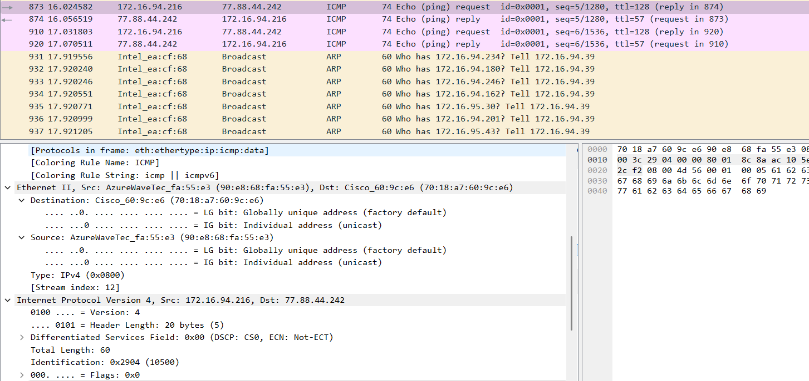{#fig:014 width=70%}

Это ответ, который возвращается с удаленного сервера на ваш компьютер.

Содержание: 77.88.44.242 -> 172.16.94.216

Источник данных в кадре Ethernet II:

MAC-адрес: 70:18:a7:60:9c:e6 (Cisco)

Тип MAC-адреса: Индивидуальный, Глобально администрируемый.

Получатель данных (Destination) в кадре Ethernet II:

MAC-адрес: 90:e8:68:fa:55:e3 (мой комп)

Тип MAC-адреса: Индивидуальный, Глобально администрируемый.

Маршрутизатор получил ответ от сервера и теперь должен доставить его моему компьютеру в локальной сети. Он знает MAC-адрес ПК и отправляет кадр Ethernet напрямую на мой MAC-адрес. (рис. 15)

{#fig:015 width=70%}

## Анализ протоколов транспортного уровня в Wireshark

Запустим Wireshark. Выберем активный на устройстве сетевой интерфейс. Убедимся, что начался процесс захвата трафика. (рис. 16)

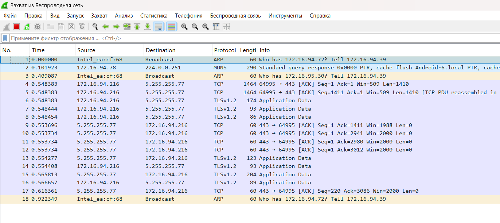{#fig:016 width=70%}

В браузере перейдем на сайт, работающий по протоколу
HTTP (например, на сайт CERN http://info.cern.ch/). (рис. 17)

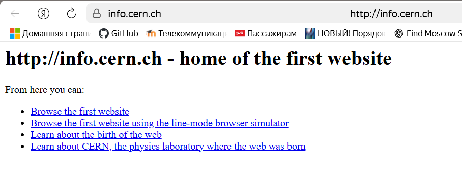{#fig:017 width=70%}

В Wireshark в строке фильтра укажем http и проанализируем информацию
по протоколу TCP в случае запросов и ответов. 

Это пакет, в котором компьютер отправляет HTTP-запрос на сервер.

Порты: Source Port (порт источника): 65232 — это исходный порт, который случайным образом выбирается компьютером для этой сессии.

Destination Port (порт назначения): 80 — это порт назначения, стандартный порт для HTTP-сервиса.

Sequence Number (последовательный номер): Relative (относительный): 1, Raw (абсолютный): 4193937875. Это номер первого байта данных в этом сегменте. Wireshark для удобства показывает относительный номер, начиная с 1.

Acknowledgment Number (номер подтверждения): Relative (относительный): 1, Raw (абсолютный): 2237714506. Это номер следующего байта, который отправитель этого пакета ожидает получить от противоположной стороны. Подтверждает успешное получение всех данных до этого номера.

Flags: PSH, ACK. ACK (Acknowledgment): Установлен, чтобы подтвердить получение предыдущих пакетов от сервера. PSH (Push): Указывает получателю (серверу) немедленно передать данные приложению (веб-серверу), не дожидаясь заполнения буфера. 

Window: 255 (Расчетный размер: 65280 байт). Это размер окна приема  моего компьютера. Он сообщает серверу, сколько данных ваш компьютер готов принять без подтверждения. Используется для управления потоком данных (Flow Control).

TCP Segment Len (длина сегмента): 254. Размер полезных данных (HTTP-запроса), переносимых в этом TCP-сегменте. (рис. 18)

{#fig:018 width=70%}

TCP в HTTP-ответе это пакет, в котором сервер отправляет HTTP-ответ моему компьютеру.

Порты: Source Port (порт источника): 80 — сервер отвечает с того же порта, на который был отправлен запрос. Destination Port (порт назначения): 65232 — сервер отправляет ответ на исходный порт компьютера.

Sequence Number (последовательный номер): Relative (относительный): 1, Raw (абсолютный): 2237714506. Это номер первого байта данных, которые сервер отправляет в этом сегменте.

Acknowledgment Number (номер подтверждения): Relative (относительный): 255, Raw (абсолютный): 4193938129

Сервер подтверждает получение 254 байт данных от клиента. Расчет: 1 (отн. Seq клиента) + 254 (длина данных) = 255 (отн. Ack сервера). Сервер ожидает получить от клиента следующий байт с номером 255.

Flags: PSH, ACK. ACK (Acknowledgment): Подтверждает получение HTTP-запроса от клиента. PSH (Push): Указывает компьютеру немедленно передать данные (HTTP-ответ) приложению (браузеру).

Window (окно): 501 (Расчетный размер: 64128 байт). Это размер окна приема сервера. Он сообщает компьютеру, сколько данных сервер готов принять.

TCP Segment Len (длина сегмента): 315. Размер полезных данных (HTTP-ответа), переносимых в этом TCP-сегменте. (рис. 19)

{#fig:019 width=70%}

UDP в DNS-запросе. Это пакет, в котором компьютер отправляет вопрос DNS-серверу.

Source Port (порт источника): 62966. Это исходный порт, который случайным образом выбирается компьютером для этого запроса. Именно на этот порт клиент будет ожидать ответ.

Destination Port (порт назначения): 53. Это стандартный порт для службы DNS. Все DNS-серверы слушают запросы на этом порту.

Length (длина): 55 байт. Общая длина UDP-датаграммы (заголовок + данные). Заголовок UDP всегда 8 байт, значит, полезные данные (DNS-запрос) составляют 55 - 8 = 47 байт.

Checksum (контрольная сумма): 0x3b31 (unverified). Контрольная сумма для проверки целостности заголовка и данных. Wireshark отмечает ее статус как Unverified, так как для проверки требуется полный пакет, включая фиктивный заголовок IP, который может отсутствовать в захвате. (рис. 20)

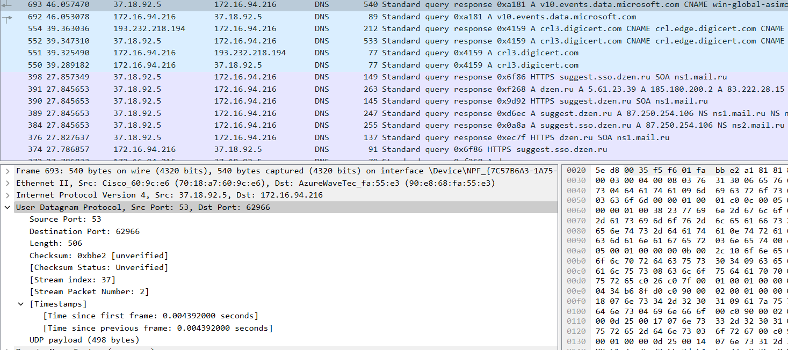{#fig:020 width=70%}

UDP в DNS-ответе. Это пакет, в котором DNS-сервер возвращает ответ компьютеру.

Source Port (порт источника): 53. Сервер отвечает со своего стандартного порта для DNS.

Destination Port (порт назначения): 62966. Сервер отправляет ответ именно на тот исходный порт, с которого клиент отправил запрос. Это важно, чтобы ответ попал в нужное приложение на клиенте.

Length (длина): 506 байт. Общая длина этой UDP-датаграммы. Полезные данные (DNS-ответ) составляют 506 - 8 = 498 байт. Ответ значительно больше запроса, так как содержит не только запрошенную информацию, но и CNAME-запись (псевдоним).

Checksum (контрольная сумма): 0xbbc2 (unverified). Аналогично запросу, контрольная сумма для проверки целостности данных ответа. (рис. 21)

{#fig:021 width=70%}

Wireshark в строке фильтра укажем quic и проанализируем информацию по
протоколу quic в случае запросов и ответов.

QUIC работает поверх UDP, поэтому в заголовках мы сначала видим Ethernet, затем IP, затем UDP, и только потом — QUIC.

QUIC-пакет от Клиента. Это пакет, который компьютер отправляет на сервер.

Транспорт (UDP): Source Port (порт источника): 62198, Destination Port (порт назначения): 443 (порт QUIC/HTTPS сервера)

QUIC Заголовок:

Header Form: Short Header (0). Короткий заголовок используется после установления соединения, что указывает на то, что это действующие данные уже установленного QUIC-соединения.

Fixed Bit: True. Обязательный бит, всегда должен быть установлен в 1 в корректных QUIC-пакетах.

Spin Bit: False. Экспериментальный бит, который может использоваться для измерения задержки в сети. Его значение не несет функциональной нагрузки для соединения.

Destination Connection ID (DCID): f8a9378badb7bea3. Идентификатор соединения назначения. Это уникальный идентификатор, который клиент использует для указания, с каким именно серверным соединением связан этот пакет. Сервер изначально предоставляет этот ID клиенту.

Полезная нагрузка: Remaining Payload: d6e43ad86a11... Основные данные протокола (например, кадры HTTP/3). Как видно из названия пакета в общем списке — "Protected Payload" — эта часть зашифрована. Это одно из ключевых преимуществ QUIC — шифрование , и даже заголовки полей, относящиеся к управлению соединением, шифруются. (рис. 22)

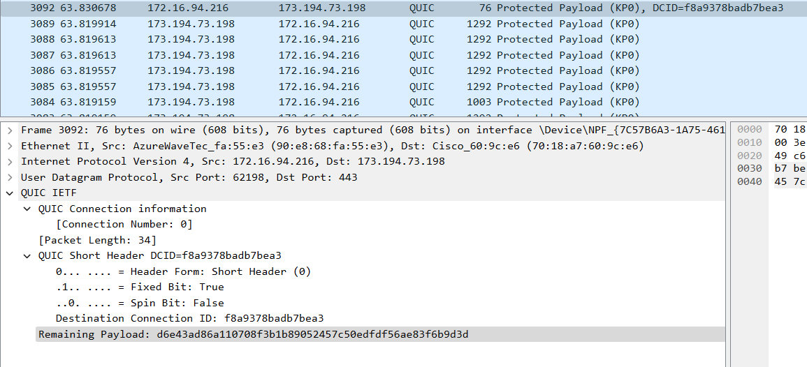{#fig:022 width=70%}

QUIC-пакет от Сервера. Это один из многих пакетов, которые сервер отправляет компьютеру в ответ.

Транспорт (UDP): Source Port (порт источника): 443, Destination Port (порт назначения): 62198 (сервер отправляет ответ на исходный порт ПК)

QUIC Заголовок:

Header Form: Short Header (0). Сервер также использует короткий заголовок, подтверждая, что это данные установленного соединения.

Fixed Bit: True

Spin Bit: False

В ответах сервер будет использовать тот Connection ID, который был предоставлен клиенту (или новый, согласованный в процессе установления соединения).

Полезная нагрузка: Remaining Payload: 3fcea12c11cd... Аналогично клиентскому пакету, полезная нагрузка сервера также является "Protected Payload" (Защищенной) и зашифрована. (рис. 23)

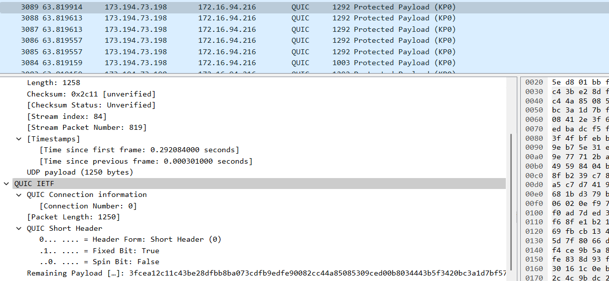{#fig:023 width=70%}

## Анализ handshake протокола TCP в Wireshark

Запустим Wireshark. Выберем активный на устройстве сетевой интерфейс. Убедимся, что начался процесс захвата трафика. (рис. 24)

{#fig:024 width=70%}

Использую соединение по HTTP с каким-то сайтом для захвата в Wireshark пакетов TCP. 
В Wireshark проанализируем handshake протокола TCP. 

Шаг 1: SYN (Синхронизация). Клиент инициирует соединение, отправляя серверу специальный пакет.

Источник: 172.16.94.216:50451, Назначение: 122.189.32.168:80

Ключевые поля TCP:

Sequence Number: 0. Клиент генерирует начальный номер последовательности (ISN). Wireshark для удобства показывает его как 0.

Flags: SYN (0x002). Установлен только флаг SYN. Это запрос на синхронизацию и начало соединения.

Window: 65535. Размер окна, который клиент готов принимать.

Параметры (Options): MSS=1460 (Maximum Segment Size) — максимальный размер сегмента, который клиент может принять, WS=256 (Window Scaling) — фактор масштабирования окна для увеличения его эффективного размера, SACK_PERM — поддержка выборочных подтверждений (Selective Acknowledgements).

Клиент говорит серверу: я хочу установить соединение. Мой начальный номер последовательности — 0, и вот мои параметры. (рис. 25)

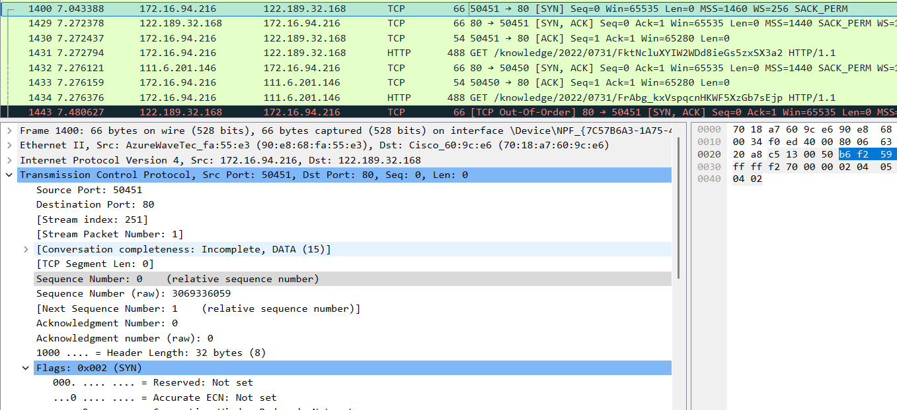{#fig:025 width=70%}

Шаг 2: SYN-ACK (Синхронизация-Подтверждение). Сервер отвечает, подтверждая запрос клиента и отправляя свой собственный запрос на синхронизацию.

Источник: 122.189.32.168:80, Назначение: 172.16.94.216:50451

Ключевые поля TCP:

Sequence Number: 0. Сервер генерирует свой собственный начальный номер последовательности (ISN).

Acknowledgment Number: 1. Это поле подтверждения. Сервер подтверждает получение SYN-пакета клиента. 

Flags: SYN, ACK (0x012). Установлены флаги SYN (запрос синхронизации от сервера) и ACK (подтверждение пакета клиента).

Сервер отвечает клиенту: Я получил запрос на соединение (ACK=1). Я согласен установить соединение, и мой начальный номер последовательности — 0 (SYN). Вот мои параметры. (рис. 26)

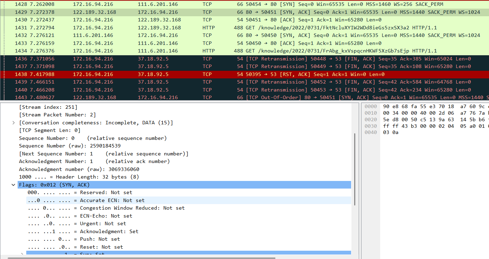{#fig:026 width=70%}

Шаг 3: ACK (Подтверждение). Клиент завершает рукопожатие, подтверждая SYN-пакет сервера.

Источник: 172.16.94.216:50451, Назначение: 122.189.32.168:80

Ключевые поля TCP:

Sequence Number (относительный): 1. Номер последовательности клиента теперь 1, так как его SYN-пакет "потребил" номер 0.

Acknowledgment Number (относительный): 1. Это поле подтверждения. Клииент подтверждает получение SYN-пакета сервера. Номер подтверждения равен ISN сервера + 1. Ack=1.

Flags: ACK (0x010). Установлен только флаг ACK.

Window: 65280. Размер окна обновлен после применения масштабирования (65535 / 256 ≈ 255 -> 255 * 256 = 65280).

Клиент говорит серверу: Я получил SYN-пакет. Соединение установлено. (рис. 27)

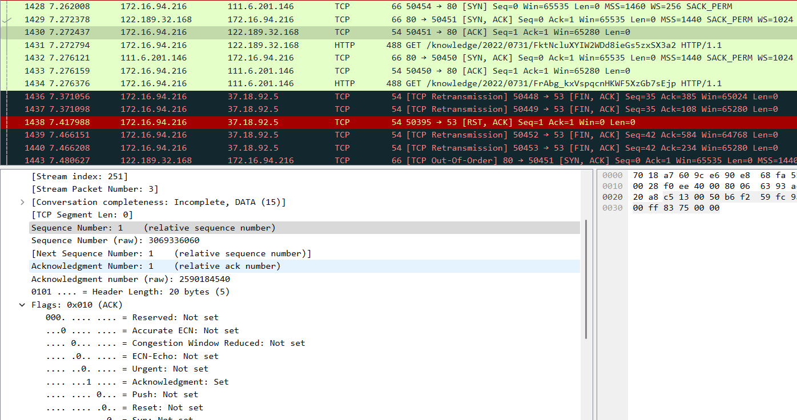{#fig:027 width=70%}

В Wireshark в меню «Статистика» выберем «График Потока». 

При установлении соединения TCP используется трёхстороннее рукопожатие. Клиент отправляет сегмент с флагом SYN, где указывает начальный номер последовательности, MSS, размер окна и другие параметры. Сервер отвечает сегментом SYN+ACK с собственными параметрами и подтверждает приём SYN клиента. Далее клиент отправляет ACK, подтверждая SYN сервера. После этого соединение считается установленным. Изменение значений Seq и Ack связано с нумерацией байтов и подтверждением их приёма, а параметры Win, MSS и WS — с настройкой характеристик передачи данных между сторонами.

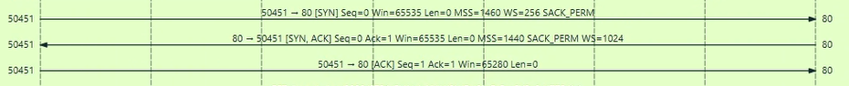{#fig:028 width=70%}

# Выводы

В ходе выполнения лабораторной работы мы изученили посредством Wireshark кадры Ethernet, проанализировали PDU протоколы
транспортного и прикладного уровней стека TCP/IP.