---
## Front matter
lang: ru-RU
title: Лабораторная работа №4
subtitle: Сетевые технологии
author:
  - Иванов Сергей Владимирович, НПИбд-01-23
institute:
  - Российский университет дружбы народов, Москва, Россия
date: 12 октября 2025

## i18n babel
babel-lang: russian
babel-otherlangs: english

## Formatting pdf
toc: false
slide_level: 2
aspectratio: 169
section-titles: true
theme: metropolis
header-includes:
 - \metroset{progressbar=frametitle,sectionpage=progressbar,numbering=fraction}
 - '\makeatletter'
 - '\beamer@ignorenonframefalse'
 - '\makeatother'

 ## Fonts
mainfont: PT Serif
romanfont: PT Serif
sansfont: PT Sans
monofont: PT Mono
mainfontoptions: Ligatures=TeX
romanfontoptions: Ligatures=TeX
sansfontoptions: Ligatures=TeX,Scale=MatchLowercase
monofontoptions: Scale=MatchLowercase,Scale=0.9
---

## Цель

Установка и настройка GNS3 и сопутствующего программного обеспечения.

## Задание

1. Установить GNS3-all-in-one, GNS3 VM, проверить корректность запуска (см.
раздел 4.3).
2. Импортировать в GNS3 образ маршрутизатора FRR (см. раздел 4.4).
3. Импортировать в GNS3 образ маршрутизатора VyOS (см. раздел 4.4).

## Установка GNS3-all-in-one

Сначала я скачал с репозитория GitHub необходимый .exe файл. Далее запускаю его, следуя указаниям, нажимая
Next, принимая соглашение по лицензии, выбирая отображение названия
каталога в стартовом меню. (рис. 1)

## Установка GNS3-all-in-one

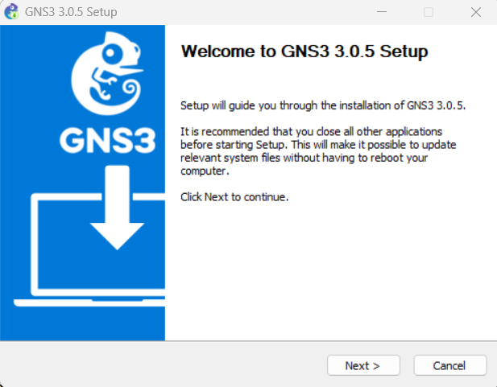{#fig:001 width=70%}

## Установка GNS3-all-in-one

В процессе установки при выборе комплектации требуется отметить MSVC
Runtime, GNS3-Desktop, GNS3-VM, Tools. (рис. 2)

{#fig:002 width=70%}

## Установка GNS3-all-in-one
 
Требуется указать расположение устанавливаемого пакета и в следующем окне отметить тип виртуальной машины (VirtualBox), затем нажать Inslall  (рис. 3)

{#fig:003 width=70%}

## Установка GNS3-all-in-one

Началась установка. (рис. 4) 

{#fig:004 width=70%}

## Установка GNS3-all-in-one

В конце процесса установки появится
окно с предложением запуска GNS3 после установки, снимаю галочку, нажимаю Finish. (рис. 5)

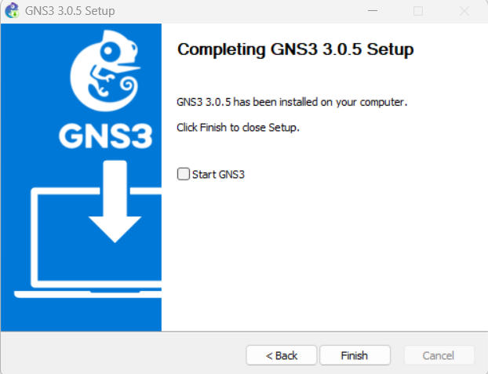{#fig:005 width=70%}

## Установка GNS3 VM для VirtualBox

Перейдем в каталог, в который скачан архив с образом
GNS3.VM.VirtualBox.номер-версии.zip. Распакуем архив с образом. (рис. 6)

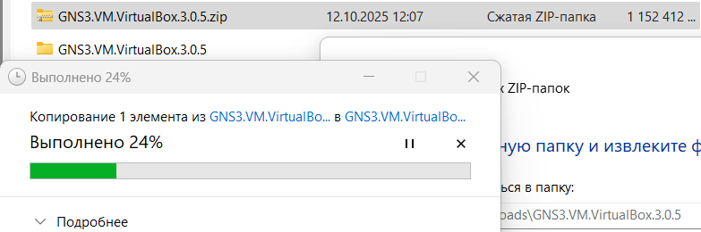{#fig:006 width=70%}

## Установка GNS3 VM для VirtualBox

Запустим VirtualBox. Выберем меню Файл Импорт конфигураций... Укажем
месторасположение распакованного образа GNS3 VM.ova. В следующем окне выберем в политике MAC-адреса «Сгенерировать
новые MAC-адреса всех сетевых адаптеров». Нажмем Импорт. (рис. 7)

## Установка GNS3 VM для VirtualBox

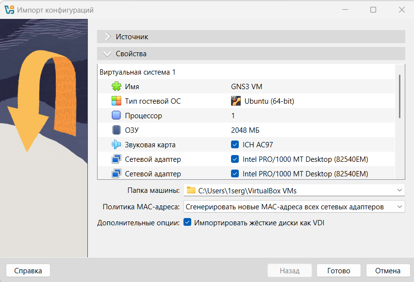{#fig:007 width=70%}

## Установка GNS3 VM для VirtualBox

Уточним настройки виртуальной машины GNS3 VM в VirtualBox. Основная память — 2048 МБ, число ЦП — 2. Убедимся, что флажок «Включить Nested VT-x/AMD-V» включен (рис. 8)

{#fig:008 width=70%}

## Установка GNS3 VM для VirtualBox

Настроим сетевой адаптер. Во вкладке «Адаптер 1» тип подключения должен быть
установлен как «Виртуальный адаптер хоста». (рис. 9)

{#fig:009 width=70%}

##  Запуск экземпляра GNS3 в VirtualBox

Запустим GNS3 VM в VirtualBox. (рис. 10)

{#fig:010 width=70%}

##  Запуск экземпляра GNS3 в VirtualBox

Затем в основной операционной системе запустим приложение gns3. (рис. 11)

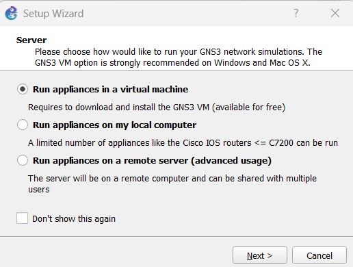{#fig:011 width=70%}

##  Запуск экземпляра GNS3 в VirtualBox

При первом запуске приложения gns3 запускается мастер настройки, в котором следует выбрать первый способ работы с gns3 — «Run appliance in a virtual
machine». В следующем окне указываются настройки локального сервера. Путь к серверу и порту оставлю без изменений. Выберем IP-адрес привязки хоста, находящегося в подсети VirtualBox, затем нажмем Next. (рис. 12)

##  Запуск экземпляра GNS3 в VirtualBox

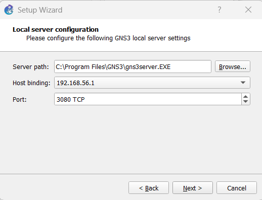{#fig:012 width=70%}

##  Запуск экземпляра GNS3 в VirtualBox

После успешного подсоединения должно появиться окно с итоговыми настройками, на котором следует нажать Finish. (рис. 13)

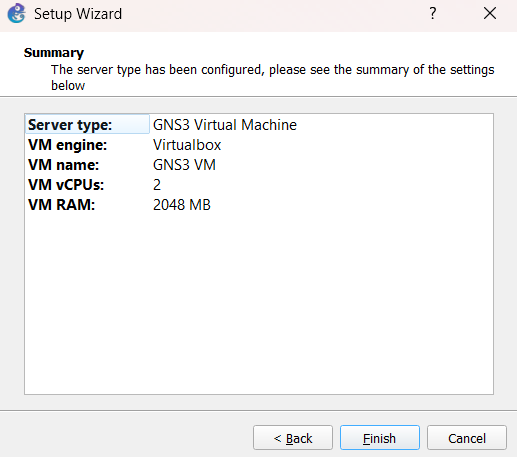{#fig:013 width=70%}

##  Запуск экземпляра GNS3 в VirtualBox

Интерфейс GNS3. (рис. 14)

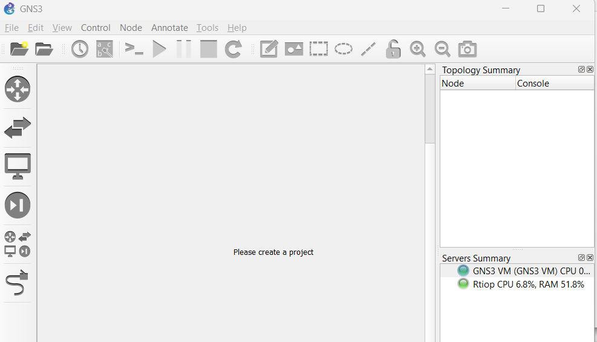{#fig:014 width=70%}

## Добавление образа маршрутизатора FRR

В рабочем пространстве GNS3 на левой боковой панели выберем просмотр
маршрутизаторов (Browse Routers), затем нажмем на + New template. (рис. 15)

{#fig:015 width=70%}

## Добавление образа маршрутизатора FRR

В следующем окне выберем Routers и образ FRR (FRRouting), нажмем Install. (рис. 16)

{#fig:016 width=70%}

## Добавление образа маршрутизатора FRR

В следующем окне укажем, что устанавливать образ следует на виртуальную
машину GNS3 VM. Далее предлагается выбор эмулятора, оставлю предложенное, нажмем Next. В следующем 
окне выберем наиболее актуальную версию и нажмем Download (рис. 17)

## Добавление образа маршрутизатора FRR

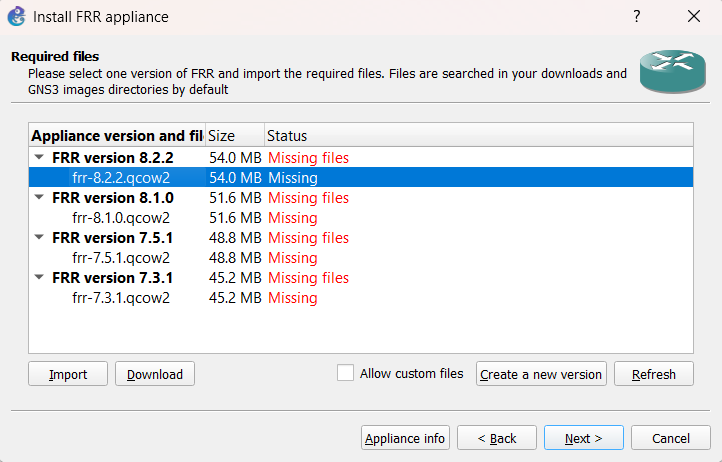{#fig:017 width=70%}

## Добавление образа маршрутизатора FRR

После окончания скачивания можно импортировать образ, затем нажать Next. (рис. 18)

{#fig:018 width=70%}

## Добавление образа маршрутизатора FRR

На заключительном окне указывается краткая информация об устройстве,
просмотрим её и нажмем Finish. (рис. 19)

{#fig:019 width=70%}

## Добавление образа маршрутизатора FRR

Далее необходимо настроить образ маршрутизатора. Правой кнопкой мыши
щёлкнем на образе устройства, в меню выберем Configure template. (рис. 20)

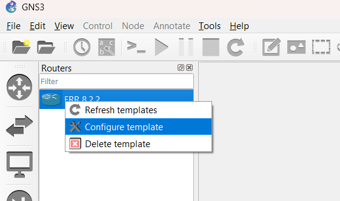{#fig:020 width=70%}

## Добавление образа маршрутизатора FRR

В открывшемся окне необходимо во вкладке «General settings» в поле «On close» выбрать Send the shutdown signal (ACPI) . Во вкладке «HDD» 
необходимо поставить галочку «Automatically create a config disk on HDD». (рис. 21, 22)

## Добавление образа маршрутизатора FRR

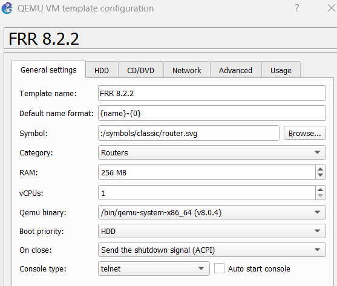{#fig:021 width=70%}

## Добавление образа маршрутизатора FRR

{#fig:022 width=70%}

## Добавление образа маршрутизатора VyOS

По аналогии с установкой FRR, на левой боковой панели выберем просмотр
маршрутизаторов (Browse Routers), затем нажмем на + New template. В следующем окне выберем Routers и образ VyOS, нажмем Install (рис. 23)

## Добавление образа маршрутизатора VyOS

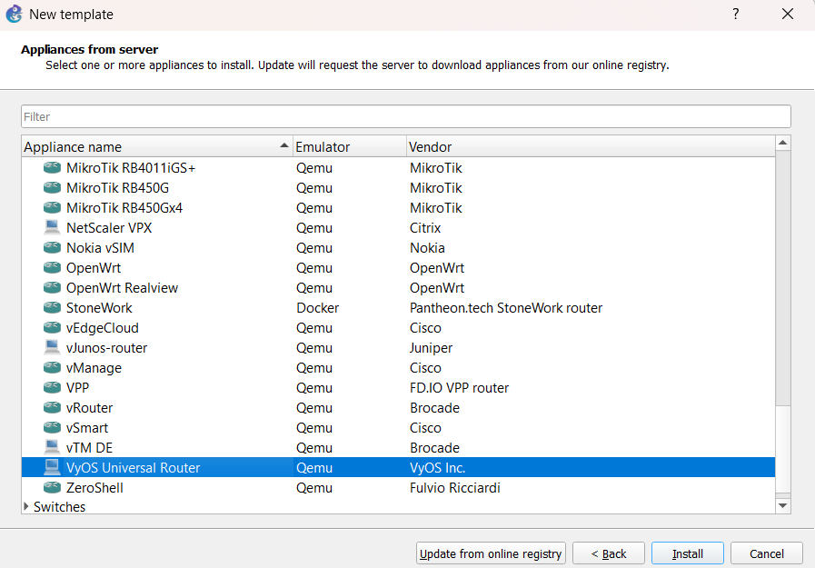{#fig:023 width=70%}

## Добавление образа маршрутизатора VyOS

Выберем версию и нажмем Download. (рис. 24)

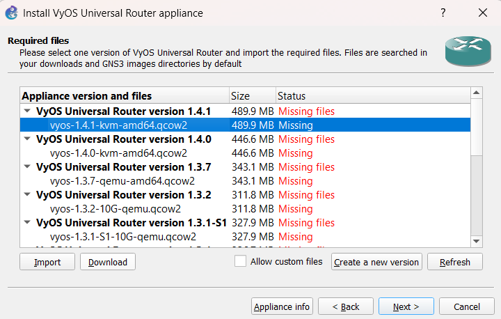{#fig:024 width=70%}

## Добавление образа маршрутизатора VyOS

После окончания скачивания можно импортировать образ, затем нажать Next. (рис. 25)

{#fig:025 width=70%}

## Добавление образа маршрутизатора VyOS

Далее необходимо настроить образ маршрутизатора. Правой кнопкой мыши
щёлкнем на образе устройства, в меню выберем Configure template. В открывшемся окне необходимо во вкладке «General settings» в поле «On close» выбрать Send the shutdown signal (ACPI). Во вкладке «HDD» 
необходимо поставить галочку «Automatically create a config disk on HDD». (рис. 26, 27)

## Добавление образа маршрутизатора VyOS

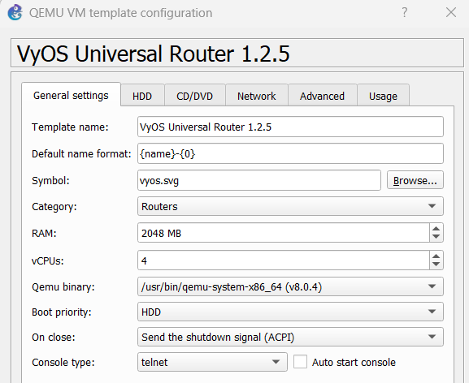{#fig:026 width=70%}

## Добавление образа маршрутизатора VyOS

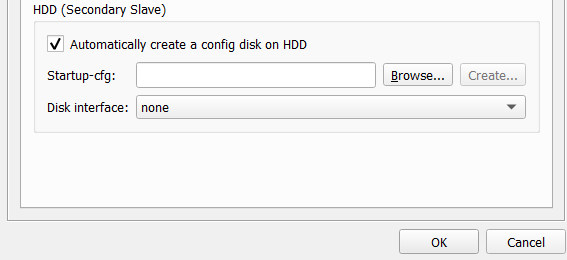{#fig:027 width=70%}

# Вывод

## Вывод 

В ходе выполнения лабораторной работы мы установили и настроили GNS3 и сопутствующее программное обеспечение.

 
