---
## Front matter
title: "Отчет по лабораторной работе №5"
subtitle: "Дисциплина: Сетевые технологии"
author: "Иванов Сергей Владимирович"

## Generic otions
lang: ru-RU
toc-title: "Содержание"

## Bibliography
bibliography: bib/cite.bib
csl: pandoc/csl/gost-r-7-0-5-2008-numeric.csl

## Pdf output format
toc: true # Table of contents
toc-depth: 2
lof: true # List of figures
fontsize: 12pt
linestretch: 1.5
papersize: a4
documentclass: scrreprt
## I18n polyglossia
polyglossia-lang:
  name: russian
  options:
	- spelling=modern
	- babelshorthands=true
polyglossia-otherlangs:
  name: english
## I18n babel
babel-lang: russian
babel-otherlangs: english
## Fonts
mainfont: PT Serif
romanfont: PT Serif
sansfont: PT Sans
monofont: PT Mono
mainfontoptions: Ligatures=TeX
romanfontoptions: Ligatures=TeX
sansfontoptions: Ligatures=TeX,Scale=MatchLowercase
monofontoptions: Scale=MatchLowercase,Scale=0.9
## Biblatex
biblatex: true
biblio-style: "gost-numeric"
biblatexoptions:
  - parentracker=true
  - backend=biber
  - hyperref=auto
  - language=auto
  - autolang=other*
  - citestyle=gost-numeric
## Pandoc-crossref LaTeX customization
figureTitle: "Рис."
listingTitle: "Листинг"
lofTitle: "Список иллюстраций"
lolTitle: "Листинги"
## Misc options
indent: true
header-includes:
  - \usepackage{indentfirst}
  - \usepackage{float} # keep figures where there are in the text
  - \floatplacement{figure}{H} # keep figures where there are in the text
---

# Цель работы

Построение простейших моделей сети на базе коммутатора и маршрутизаторов FRR и VyOS в GNS3, анализ трафика посредством Wireshark.

# Выполнение лабораторной работы

## Моделирование простейшей сети на базе коммутатора в GNS3

Запустим GNS3 VM и GNS3. (рис. 1)

{#fig:001 width=70%}

Создадим новый проект. (рис. 2)

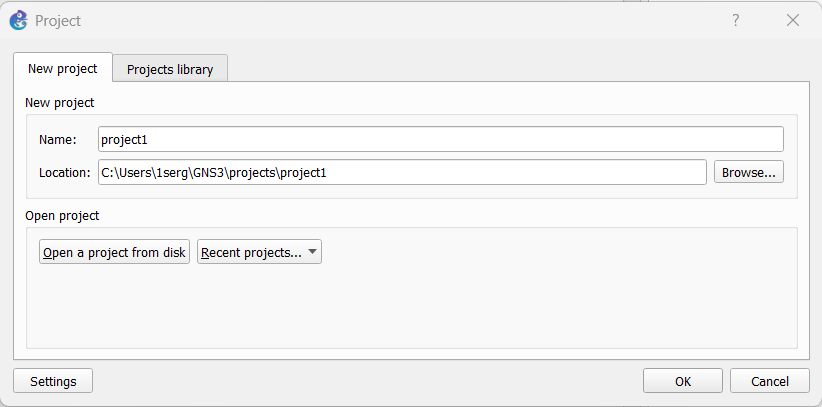{#fig:002 width=70%}

В рабочей области GNS3 разместим коммутатор Ethernet и два VPCS. Щёлкнув
на устройстве правой кнопкой мыши выберем в меню Configure. Изменим
название устройства, включив в имя устройства имя учётной записи. Соединим VPCS с коммутатором. Отобразим обозначение интерфейсов соединения (рис. 3)

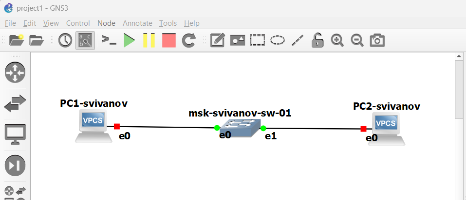{#fig:003 width=70%}

Зададим IP-адреса VPCS. Для этого с помощью меню, вызываемого правой
кнопкой мыши, запустим Start, например, PC-1, затем вызовем его терминал Console . Для просмотра синтаксиса возможных для ввода команд наберем /?. (рис. 4) 

{#fig:004 width=70%}

Для задания IP-адреса 192.168.1.11 в сети 192.168.1.0/24 введем: ip 192.168.1.11/24 192.168.1.1 (рис. 5)

{#fig:005 width=70%}

Аналогичным образом зададим IP-адрес 192.168.1.12 для PC-2. (рис. 6)

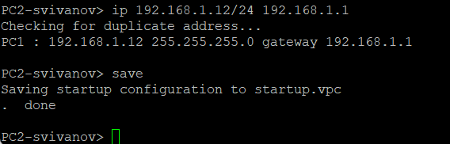{#fig:006 width=70%}

Проверим работоспособность соединения между PC-1 и PC-2 с помощью
команды ping. Видим, что соеднинение работоспособно. (рис. 7)

{#fig:007 width=70%}

## Анализ трафика в GNS3 посредством Wireshark

Запустим на соединении между PC-1 и коммутатором анализатор трафика. Для этого щёлкнем правой кнопкой мыши на соединении, выберем
в меню Start capture. Запустится Wireshark, а в проекте GNS3 на соединении появится
значок лупы. (рис. 8)

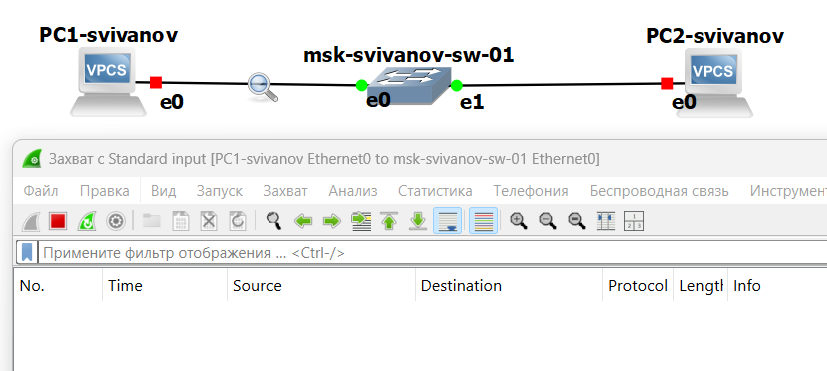{#fig:008 width=70%}

В проекте GNS3 стартуем все узлы. В окне Wireshark отобразится информация по протоколу ARP. Проанализируем полученную информацию. 

Отправляются Gratuitous запросы от PC1 К PC2. Это широковещательные сообщения для проверки уникальности своего IP адреса в сети. Также отправляются запросы от PC2 к PC1. (рис. 9)

{#fig:009 width=70%}

В терминале PC-2 посмотрим информацию по опциям команды ping, введя ping /?. (рис. 10)

{#fig:010 width=70%}

Затем сделаем один эхо-запрос в ICMP-моде к узлу PC-1. (рис. 11)

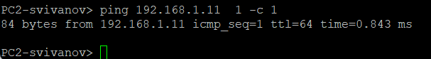{#fig:011 width=70%}

Отправляется ICMP запрос (request) от PC2 к PC1. РС1 отвечает (reply) с теми же id и seq. ICMP используется для проверки доступности узлов. (рис. 12)

{#fig:012 width=70%}

Сделаем один эхо-запрос в UDP-моде к узлу PC-1. (рис. 13)

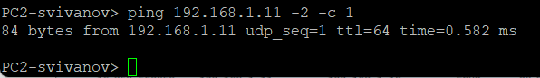{#fig:013 width=70%}

Отправляется UDP пакет от РС2 к РС1. Порт источника 14503. Порт назначения 7. Длина: 64 байта. Отправленные данные (полезная нагрузка): 56 байт. РС1 отправил ответный UDP пакет (Response). (рис. 14)

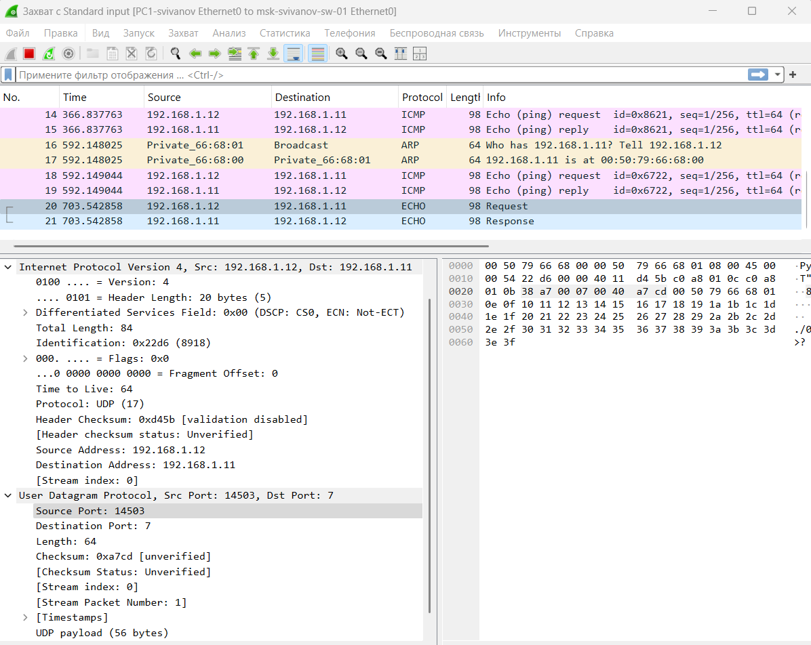{#fig:014 width=70%}

Сделаем один эхо-запрос в TCP-моде к узлу PC-1. (рис. 15)

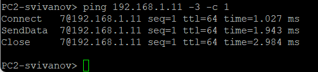{#fig:015 width=70%}

Устанавливается ТСР соединение:

[SYN] от РС2 (порт 28458) к РС1 (порт 7)

[SYN, ACK] в ответ от РС1 к РС2

[ACK] завершает 3-х стороннее рукопожатие

Затем начинается передача данных, после чего аналогичным образом завершается соединение, добавляются флаги [FIN] которые говорят о завершении сеанса. (рис. 16)

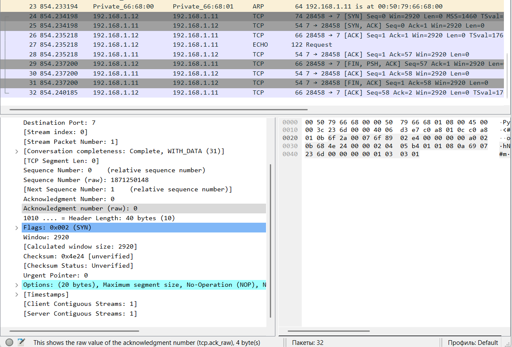{#fig:016 width=70%}

## Моделирование простейшей сети на базе маршрутизатора FRR в GNS3

Создадим новый проект. В рабочей области GNS3 разместим VPCS, коммутатор Ethernet и маршрутизатор FRR. 
Изменим отображаемые названия устройств. (рис. 17)

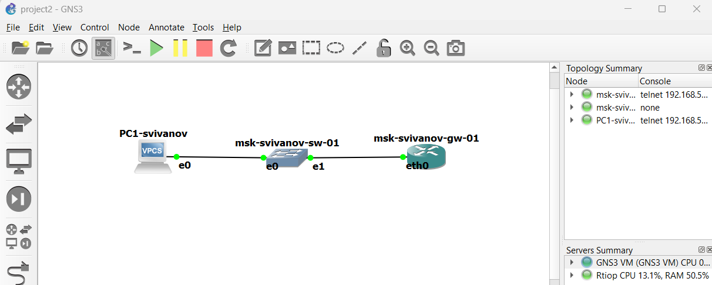{#fig:017 width=70%}

Включим захват трафика на соединении между коммутатором и маршрутизатором. (рис. 18)

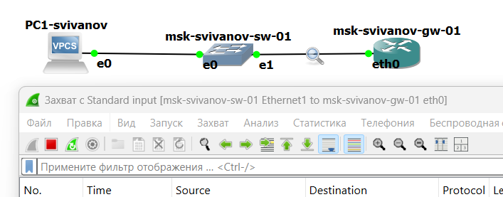{#fig:018 width=70%}

Запустим все устройства проекта. Откроем консоль всех устройств проекта. Настроим IP-адресацию для интерфейса узла PC1:

ip 192.168.1.10/24 192.168.1.1

save

show ip (рис. 19)

{#fig:019 width=70%}

Настроим IP-адресацию для интерфейса локальной сети маршрутизатора: (рис. 20)

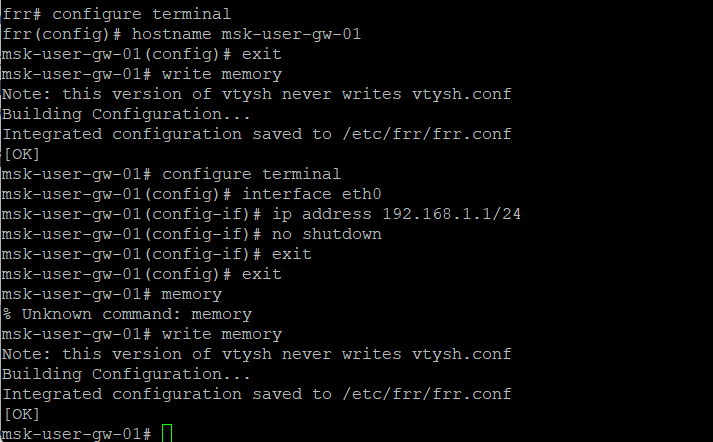{#fig:020 width=70%}

Проверим конфигурацию маршрутизатора и настройки IP-адресации:

msk-user-gw-01# show running-config

msk-user-gw-01# show interface brief (рис. 21)

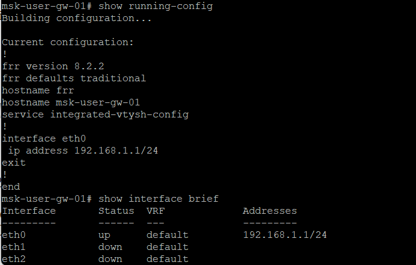{#fig:021 width=70%}

Проверим подключение. Узел PC1 должен успешно отправлять эхо-запросы
на адрес маршрутизатора 192.168.1.1. Все отправилось корректно. (рис. 22)

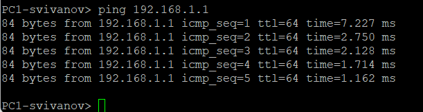{#fig:022 width=70%}

В окне Wireshark проанализируем полученную информацию. 

Видим, что отправилось 5 пар ICMP запросов. В каждой паре: 

1) ICMP запрос (request) от РС1 к маршрутизатору.

2) ICMP ответ (reply) от маршрутизатора к РС1 с теми же id и seq. Это говорит о том, что подключение между РС1 и маршрутизатором успешное, РС1 корректно отправляет эхо- запросы, а маршрутизатор отвечает на них. (рис. 23)

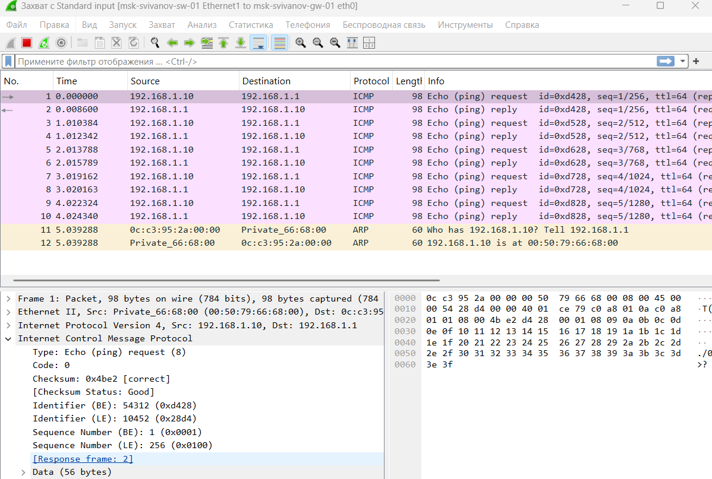{#fig:023 width=70%}

## Моделирование простейшей сети на базе маршрутизатора VyOS в GNS3

Создадим новый проект. В рабочей области GNS3 разместим VPCS, коммутатор Ethernet и маршрутизатор VyOS. 
Изменим отображаемые названия устройств. (рис. 24)

{#fig:024 width=70%}

Включим захват трафика на соединении между коммутатором и маршрутизатором. (рис. 25)

{#fig:025 width=70%}

Запустим все устройства проекта. Откроем консоль всех устройств проекта.
Настроим IP-адресацию для интерфейса узла PC1:

ip 192.168.1.10/24 192.168.1.1

save

show ip (рис. 26)

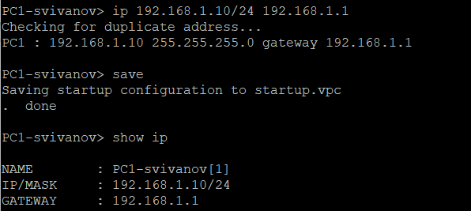{#fig:026 width=70%}

Настройте маршрутизатор VyOS. После загрузки введем логин vyos и пароль vyos: (рис. 27)

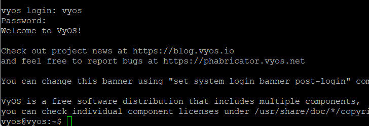{#fig:027 width=70%}

Установим систему на диск: vyos@vyos:~$ install image. В моем случае система уже установлена. (рис. 28)

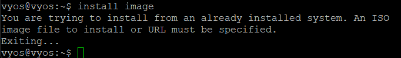{#fig:028 width=70%}

Перейдем в режим конфигурирования: vyos@vyos$ configure

Изменим имя устройства: vyos@vyos#set system host-name msk-user-gw-01 (рис. 29)

{#fig:029 width=70%}

Зададим IP-адрес на интерфейсе eth0: vyos@vyos# set interfaces ethernet eth0 address 192.168.1.1/24

Посмотрим внесённые в конфигурацию изменения: vyos@vyos# compare (рис. 30)

{#fig:030 width=70%}

Применим изменения в конфигурации и сохраним саму конфигурацию:

vyos@vyos# commit

vyos@vyos# save (рис. 31)

{#fig:031 width=70%}

Посмотрим информацию об интерфейсах маршрутизатора:
vyos@vyos# show interfaces (рис. 32)

{#fig:032 width=70%}

Выйдем из режима конфигурирования. Проверим подключение. Узел PC1 должен успешно отправлять эхо-запросы
на адрес маршрутизатора 192.168.1.1. (рис. 33)

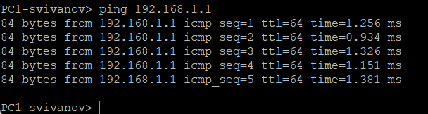{#fig:033 width=70%}

В окне Wireshark проанализируем полученную информацию. (рис. 34)

Сначала РС1 отправляет широковещательный ARP запрос чтобы узнать MAC адрес маршрутизатора. Маршрутизатор отвечает, и теперь РС1 знает его MAC адрес.

Далее видим, что отправилось 5 пар ICMP запросов. В каждой паре: 

1) ICMP запрос (request) от РС1 к маршрутизатору.

2) ICMP ответ (reply) от маршрутизатора к РС1 с теми же id и seq. Это говорит о том, что подключение между РС1 и маршрутизатором успешное, РС1 корректно отправляет эхо- запросы, а маршрутизатор отвечает на них.

В конце аналогично маршрутизатор запрашивает МАС адрес РС1, и тот ему отвечает.

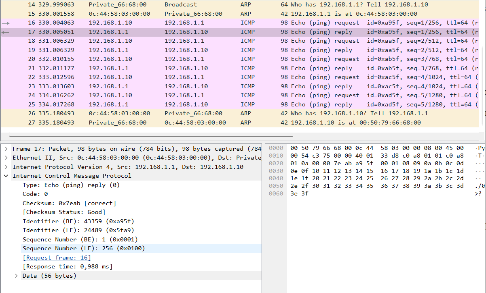{#fig:034 width=70%}

# Выводы

В ходе выполнения лабораторной работы мы построили простейшие модели сети на базе коммутатора и маршрутизаторов FRR и VyOS в GNS3, и проанализировали трафик посредством Wireshark.