---
## Front matter
lang: ru-RU
title: Лабораторная работа №6
subtitle: Сетевые технологии
author:
  - Иванов Сергей Владимирович, НПИбд-01-23
institute:
  - Российский университет дружбы народов, Москва, Россия
date: 21 ноября 2025

## i18n babel
babel-lang: russian
babel-otherlangs: english

## Formatting pdf
toc: false
slide_level: 2
aspectratio: 169
section-titles: true
theme: metropolis
header-includes:
 - \metroset{progressbar=frametitle,sectionpage=progressbar,numbering=fraction}
 - '\makeatletter'
 - '\beamer@ignorenonframefalse'
 - '\makeatother'

 ## Fonts
mainfont: PT Serif
romanfont: PT Serif
sansfont: PT Sans
monofont: PT Mono
mainfontoptions: Ligatures=TeX
romanfontoptions: Ligatures=TeX
sansfontoptions: Ligatures=TeX,Scale=MatchLowercase
monofontoptions: Scale=MatchLowercase,Scale=0.9
---

## Цель

Изучение принципов распределения и настройки адресного пространства на устройствах сети.

## Разбиение IPv4-сети на подсети

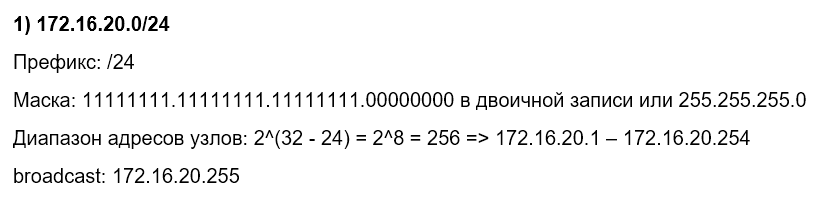{#fig:001 width=70%}

## Разбиение IPv4-сети на подсети

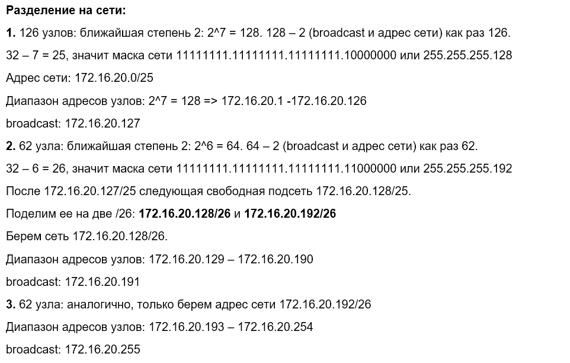{#fig:002 width=70%}

## Разбиение IPv4-сети на подсети

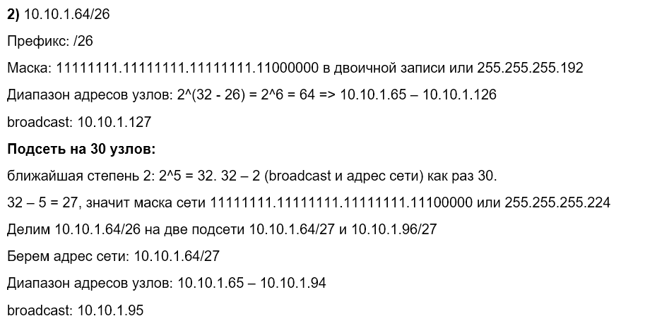{#fig:003 width=70%}

## Разбиение IPv4-сети на подсети

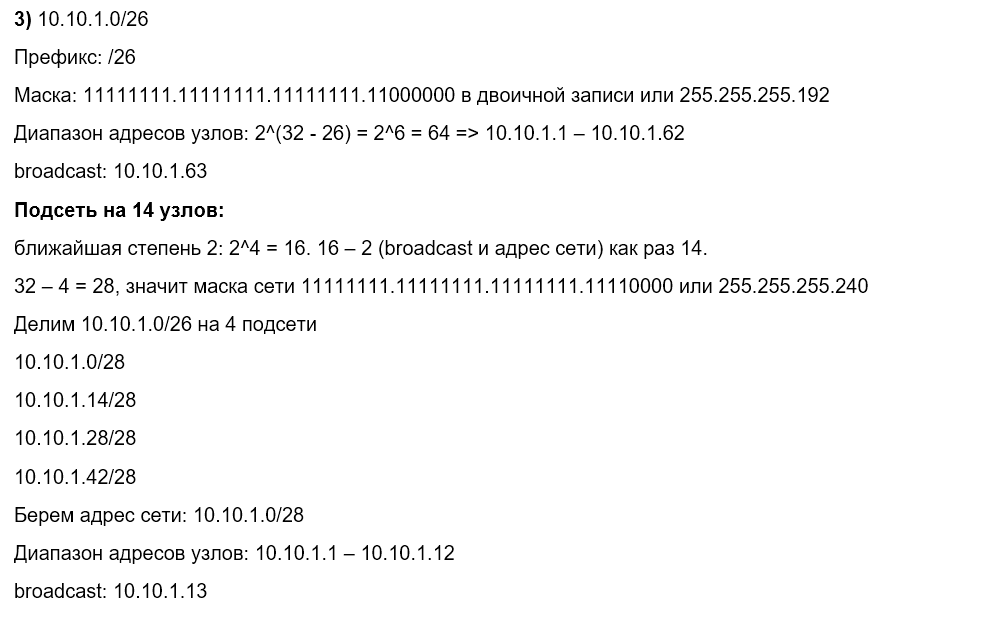{#fig:004 width=70%}

## Разбиение IPv6-сети на подсети

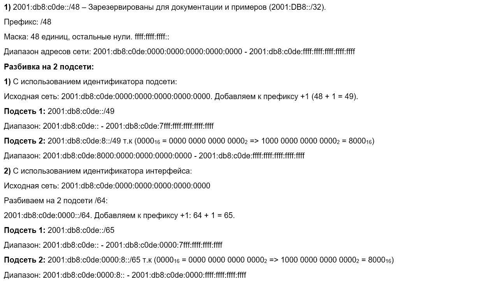{#fig:005 width=70%}

## Разбиение IPv6-сети на подсети

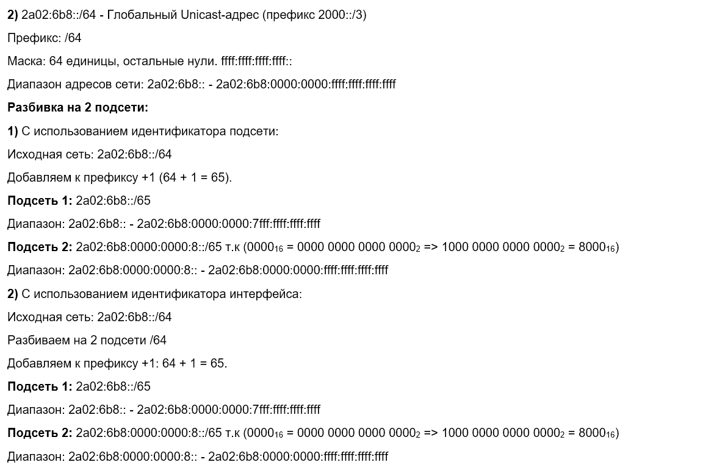{#fig:006 width=70%}

## Настройка двойного стека адресации IPv4 и IPv6 в локальной сети

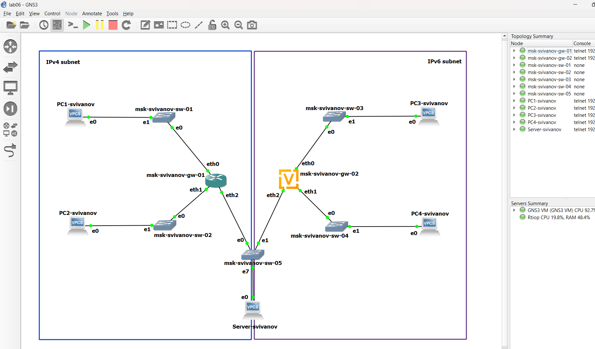{#fig:007 width=70%}

## Настройка двойного стека адресации IPv4 и IPv6 в локальной сети

Включим захват трафика.

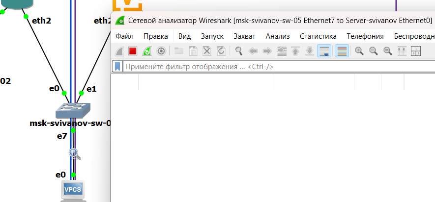{#fig:008 width=70%}

## Настройка двойного стека адресации IPv4 и IPv6 в локальной сети

Настроим IPv4-адресацию для интерфейсов узлов PC1, PC2, Server:

{#fig:009 width=70%}

## Настройка двойного стека адресации IPv4 и IPv6 в локальной сети

PC2: 

{#fig:010 width=70%}

## Настройка двойного стека адресации IPv4 и IPv6 в локальной сети

Server: 

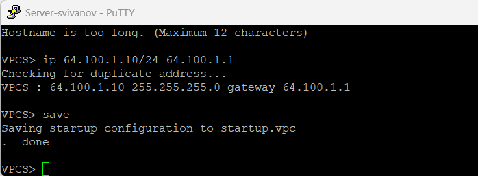{#fig:011 width=70%}

## Настройка двойного стека адресации IPv4 и IPv6 в локальной сети

{#fig:012 width=70%}

## Настройка двойного стека адресации IPv4 и IPv6 в локальной сети

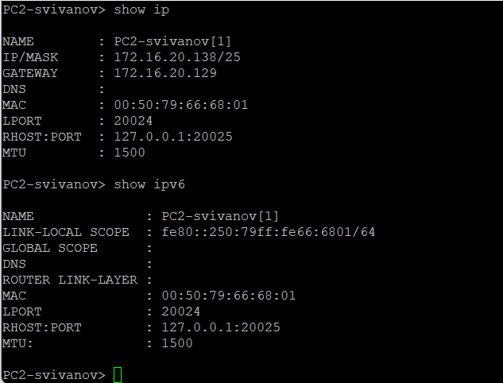{#fig:013 width=70%}

## Настройка двойного стека адресации IPv4 и IPv6 в локальной сети

{#fig:014 width=70%}

## Настройка двойного стека адресации IPv4 и IPv6 в локальной сети

{#fig:015 width=70%}

## Настройка двойного стека адресации IPv4 и IPv6 в локальной сети

{#fig:016 width=70%}

## Настройка двойного стека адресации IPv4 и IPv6 в локальной сети

{#fig:017 width=70%}

## Настройка двойного стека адресации IPv4 и IPv6 в локальной сети

Настроим IPv6-адресацию для интерфейсов узлов PC3, PC4, Server

{#fig:018 width=70%}

## Настройка двойного стека адресации IPv4 и IPv6 в локальной сети

PC4:

{#fig:019 width=70%}

## Настройка двойного стека адресации IPv4 и IPv6 в локальной сети

Server:

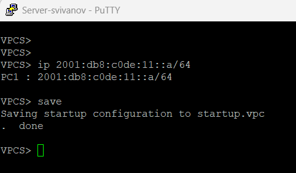{#fig:020 width=70%}

## Настройка двойного стека адресации IPv4 и IPv6 в локальной сети

{#fig:021 width=70%}

## Настройка двойного стека адресации IPv4 и IPv6 в локальной сети

{#fig:022 width=70%}

## Настройка двойного стека адресации IPv4 и IPv6 в локальной сети

{#fig:023 width=70%}

## Настройка двойного стека адресации IPv4 и IPv6 в локальной сети

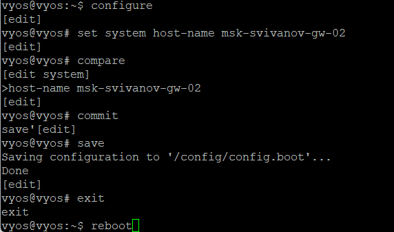{#fig:024 width=70%}

## Настройка двойного стека адресации IPv4 и IPv6 в локальной сети

{#fig:025 width=70%}

## Настройка двойного стека адресации IPv4 и IPv6 в локальной сети

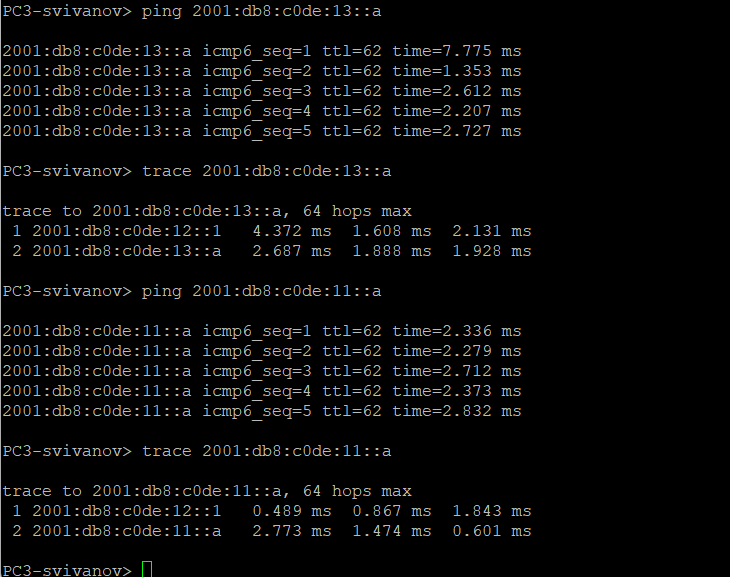{#fig:026 width=70%}

## Настройка двойного стека адресации IPv4 и IPv6 в локальной сети

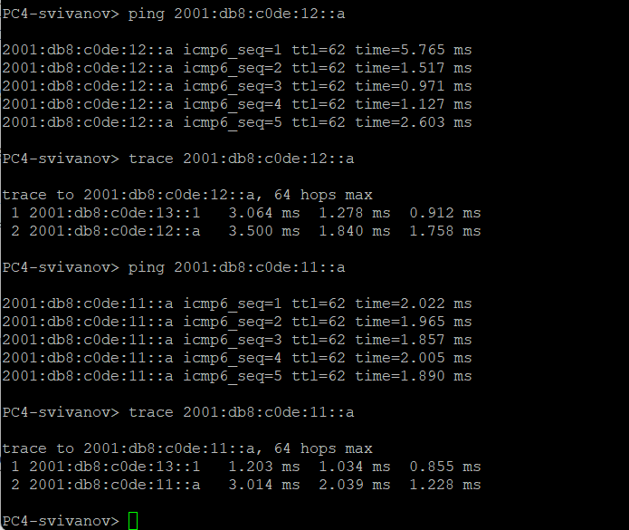{#fig:027 width=70%}

## Настройка двойного стека адресации IPv4 и IPv6 в локальной сети

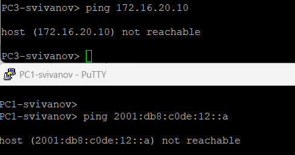{#fig:028 width=70%}

## Настройка двойного стека адресации IPv4 и IPv6 в локальной сети

{#fig:029 width=70%}

## Настройка двойного стека адресации IPv4 и IPv6 в локальной сети

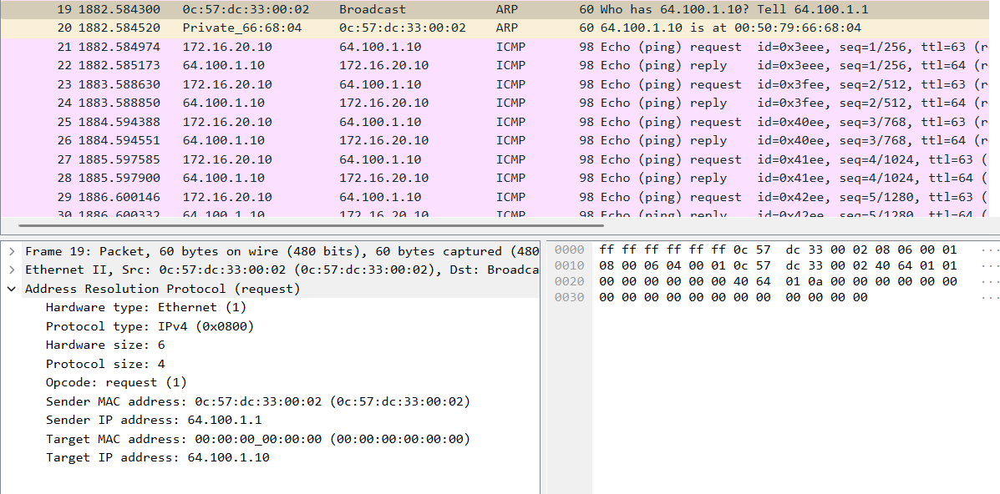{#fig:030 width=70%}

## Настройка двойного стека адресации IPv4 и IPv6 в локальной сети

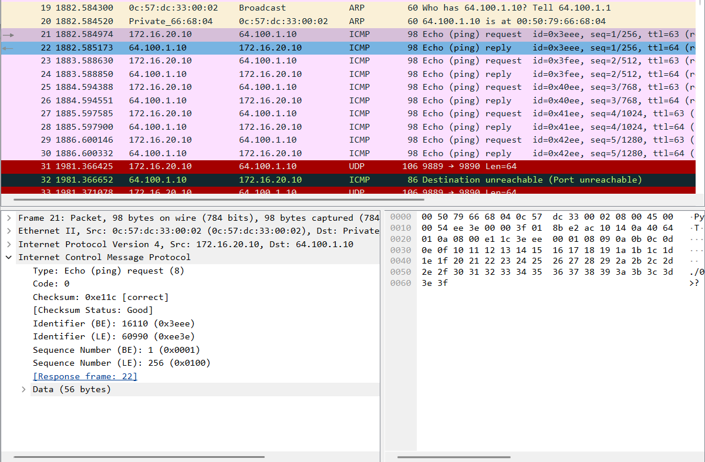{#fig:031 width=70%}

## Настройка двойного стека адресации IPv4 и IPv6 в локальной сети

{#fig:032 width=70%}

## Задание для самостоятельного выполнения

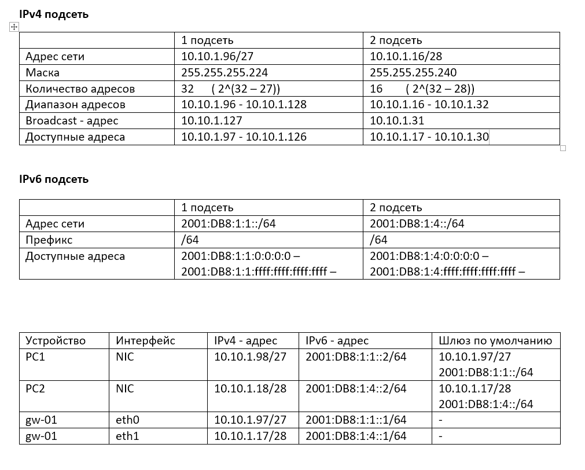{#fig:033 width=70%}

## Задание для самостоятельного выполнения

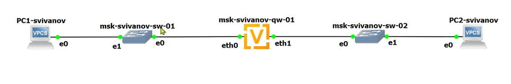{#fig:034 width=70%}

## Задание для самостоятельного выполнения

Настроим маршрутизацию на PC1 

{#fig:035 width=70%}

## Задание для самостоятельного выполнения

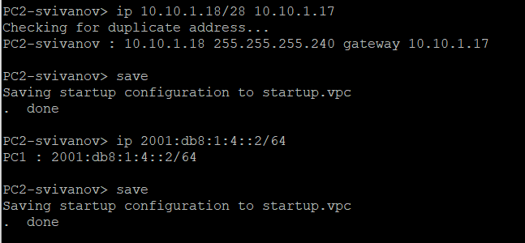{#fig:036 width=70%}

## Задание для самостоятельного выполнения

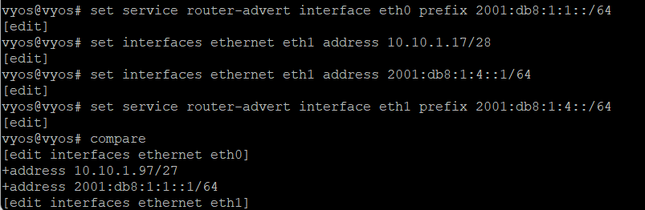{#fig:037 width=70%}

## Задание для самостоятельного выполнения

{#fig:038 width=70%}

## Задание для самостоятельного выполнения

{#fig:039 width=70%}

## Задание для самостоятельного выполнения

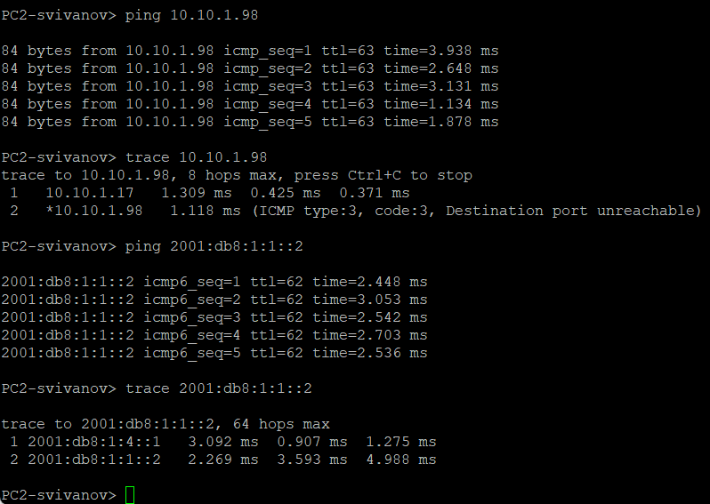{#fig:040 width=70%}

# Вывод

## Вывод 

В ходе выполнения лабораторной работы мы изучили принципы распределения и настройки адресного пространства на устройствах сети.

 
