---
## Front matter
title: "Отчет по лабораторной работе №6"
subtitle: "Дисциплина: Сетевые технологии"
author: "Иванов Сергей Владимирович"

## Generic otions
lang: ru-RU
toc-title: "Содержание"

## Bibliography
bibliography: bib/cite.bib
csl: pandoc/csl/gost-r-7-0-5-2008-numeric.csl

## Pdf output format
toc: true # Table of contents
toc-depth: 2
lof: true # List of figures
fontsize: 12pt
linestretch: 1.5
papersize: a4
documentclass: scrreprt
## I18n polyglossia
polyglossia-lang:
  name: russian
  options:
	- spelling=modern
	- babelshorthands=true
polyglossia-otherlangs:
  name: english
## I18n babel
babel-lang: russian
babel-otherlangs: english
## Fonts
mainfont: PT Serif
romanfont: PT Serif
sansfont: PT Sans
monofont: PT Mono
mainfontoptions: Ligatures=TeX
romanfontoptions: Ligatures=TeX
sansfontoptions: Ligatures=TeX,Scale=MatchLowercase
monofontoptions: Scale=MatchLowercase,Scale=0.9
## Biblatex
biblatex: true
biblio-style: "gost-numeric"
biblatexoptions:
  - parentracker=true
  - backend=biber
  - hyperref=auto
  - language=auto
  - autolang=other*
  - citestyle=gost-numeric
## Pandoc-crossref LaTeX customization
figureTitle: "Рис."
listingTitle: "Листинг"
lofTitle: "Список иллюстраций"
lolTitle: "Листинги"
## Misc options
indent: true
header-includes:
  - \usepackage{indentfirst}
  - \usepackage{float} # keep figures where there are in the text
  - \floatplacement{figure}{H} # keep figures where there are in the text
---

# Цель работы

Изучение принципов распределения и настройки адресного пространства на устройствах сети.

# Выполнение лабораторной работы

## Разбиение IPv4-сети на подсети

1) Задана IPv4-сеть 172.16.20.0/24. Для заданной сети определим префикс, маску, broadcast-адрес, число возможных подсетей, диапазон адресов узлов.
Разобьем сеть на 3 подсети с максимально возможным числом адресов узлов 126, 62, 62 соответственно. 

Префикс: /24

Маска: 11111111.11111111.11111111.00000000 в двоичной записи или 255.255.255.0

Диапазон адресов узлов: 2^(32 - 24) = 2^8 = 256 => 172.16.20.1 – 172.16.20.254

broadcast: 172.16.20.255

**Разделение на сети:**

1. 126 узлов: ближайшая степень 2: 2^7 = 128. 128 – 2 (broadcast и адрес сети) как раз 126. 

32 – 7 = 25, значит маска сети 11111111.11111111.11111111.10000000 или 255.255.255.128

Адрес сети: 172.16.20.0/25

Диапазон адресов узлов: 2^7 = 128 => 172.16.20.1 -172.16.20.126

broadcast: 172.16.20.127

2. 62 узла: ближайшая степень 2: 2^6 = 64. 64 – 2 (broadcast и адрес сети) как раз 62.

32 – 6 = 26, значит маска сети 11111111.11111111.11111111.11000000 или 255.255.255.192

После 172.16.20.127/25 следующая свободная подсеть 172.16.20.128/25.

Поделим ее на две /26: 172.16.20.128/26 и 172.16.20.192/26. Берем сеть 172.16.20.128/26. 

Диапазон адресов узлов: 172.16.20.129 – 172.16.20.190

broadcast: 172.16.20.191

3. 62 узла: аналогично, только берем адрес сети 172.16.20.192/26 .

Диапазон адресов узлов: 172.16.20.193 – 172.16.20.254

broadcast: 172.16.20.255

2) Задана сеть 10.10.1.64/26. Для заданной сети определим префикс, маску,
broadcast-адрес, число возможных подсетей, диапазон адресов узлов. Выделим в этой сети подсеть на 30 узлов. Запишем характеристики для выделенной
подсети.

Префикс: /26

Маска: 11111111.11111111.11111111.11000000 в двоичной записи или 255.255.255.192

Диапазон адресов узлов: 2^(32 - 26) = 2^6 = 64 => 10.10.1.65 – 10.10.1.126

broadcast: 10.10.1.127

**Подсеть на 30 узлов:**

ближайшая степень 2: 2^5 = 32. 32 – 2 (broadcast и адрес сети) как раз 30. 

32 – 5 = 27, значит маска сети 11111111.11111111.11111111.11100000 или 255.255.255.224

Делим 10.10.1.64/26 на две подсети 10.10.1.64/27 и 10.10.1.96/27

Берем адрес сети: 10.10.1.64/27

Диапазон адресов узлов: 10.10.1.65 – 10.10.1.94

broadcast: 10.10.1.95

3) Задана сеть 10.10.1.0/26. Для этой сети определим префикс, маску, broadcast-адрес, число возможных подсетей, диапазон адресов узлов. Выделим в этой
сети подсеть на 14 узлов. Запишем характеристики для выделенной подсети.

Префикс: /26

Маска: 11111111.11111111.11111111.11000000 в двоичной записи или 255.255.255.192

Диапазон адресов узлов: 2^(32 - 26) = 2^6 = 64 => 10.10.1.1 – 10.10.1.62

broadcast: 10.10.1.63

**Подсеть на 14 узлов:**

ближайшая степень 2: 2^4 = 16. 16 – 2 (broadcast и адрес сети) как раз 14. 

32 – 4 = 28, значит маска сети 11111111.11111111.11111111.11110000 или 255.255.255.240

Делим 10.10.1.0/26 на 4 подсети 

- 10.10.1.0/28
- 10.10.1.14/28
- 10.10.1.28/28
- 10.10.1.42/28

Берем адрес сети: 10.10.1.0/28

Диапазон адресов узлов: 10.10.1.1 – 10.10.1.12

broadcast: 10.10.1.13

## Разбиение IPv6-сети на подсети

1) Задана сеть 2001:db8:c0de::/48. Охарактеризуем адрес, определим маску,
префикс, диапазон адресов для узлов сети (краевые значения). Разобьем сеть
на 2 подсети двумя способами — с использованием идентификатора подсети
и с использованием идентификатора интерфейса. 

2001:db8:c0de::/48 – Зарезервированы для документации и примеров (2001:DB8::/32).

Префикс: /48

Маска: 48 единиц, остальные нули. ffff:ffff:ffff::

Диапазон адресов сети: 2001:db8:c0de:0000:0000:0000:0000:0000 - 2001:db8:c0de:ffff:ffff:ffff:ffff:ffff

**Разбивка на 2 подсети**

1. С использованием идентификатора подсети:

Исходная сеть: 2001:db8:c0de:0000:0000:0000:0000:0000. Добавляем к префиксу +1 (48 + 1 = 49). 

Подсеть 1: 2001:db8:c0de::/49. Диапазон: 2001:db8:c0de:: - 2001:db8:c0de:7fff:ffff:ffff:ffff:ffff

Подсеть 2: 2001:db8:c0de:8::/49 т.к (000016 = 0000 0000 0000 00002 => 1000 0000 0000 00002 = 800016). Диапазон: 2001:db8:c0de:8000:0000:0000:0000:0000 - 2001:db8:c0de:ffff:ffff:ffff:ffff:ffff 

2. С использованием идентификатора интерфейса:

Исходная сеть: 2001:db8:c0de:0000:0000:0000:0000:0000	

Разбиваем на 2 подсети /64: 2001:db8:c0de:0000::/64. Добавляем к префиксу +1: 64 + 1 = 65.

Подсеть 1: 2001:db8:c0de::/65. Диапазон: 2001:db8:c0de:: - 2001:db8:c0de:0000:7fff:ffff:ffff:ffff

Подсеть 2: 2001:db8:c0de:0000:8::/65 т.к (000016 = 0000 0000 0000 00002 => 1000 0000 0000 00002 = 800016). Диапазон: 2001:db8:c0de:0000:8:: - 2001:db8:c0de:0000:ffff:ffff:ffff:ffff

2) Задана сеть 2a02:6b8::/64. Охарактеризуем адрес, определим маску, префикс, диапазон адресов для узлов сети (краевые значения). Разобьем сеть на
2 подсети двумя способами — с использованием идентификатора подсети
и с использованием идентификатора интерфейса. 

2a02:6b8::/64 - Глобальный Unicast-адрес (префикс 2000::/3)

Префикс: /64

Маска: 64 единицы, остальные нули. ffff:ffff:ffff:ffff::

Диапазон адресов сети: 2a02:6b8:: - 2a02:6b8:0000:0000:ffff:ffff:ffff:ffff

**Разбивка на 2 подсети:**

1) С использованием идентификатора подсети:

Исходная сеть: 2a02:6b8::/64	

Добавляем к префиксу +1 (64 + 1 = 65). 

Подсеть 1: 2a02:6b8::/65. Диапазон: 2a02:6b8:: - 2a02:6b8:0000:0000:7fff:ffff:ffff:ffff

Подсеть 2: 2a02:6b8:0000:0000:8::/65 т.к (000016 = 0000 0000 0000 00002 => 1000 0000 0000 00002 = 800016). Диапазон: 2a02:6b8:0000:0000:8:: - 2a02:6b8:0000:0000:ffff:ffff:ffff:ffff	

2) С использованием идентификатора интерфейса:

Исходная сеть: 2a02:6b8::/64		

Разбиваем на 2 подсети /64

Добавляем к префиксу +1: 64 + 1 = 65.

Подсеть 1: 2a02:6b8::/65. Диапазон: 2a02:6b8:: - 2a02:6b8:0000:0000:7fff:ffff:ffff:ffff

Подсеть 2: 2a02:6b8:0000:0000:8::/65 т.к (000016 = 0000 0000 0000 00002 => 1000 0000 0000 00002 = 800016). Диапазон: 2a02:6b8:0000:0000:8:: - 2a02:6b8:0000:0000:ffff:ffff:ffff:ffff	

## Настройка двойного стека адресации IPv4 и IPv6 в локальной сети

Запустим GNS3 VM и GNS3. Создадим новый проект. В рабочем пространстве разместим и соединим устройства в соответствии
с топологией. Для подсети IPv4 используем маршрутизатор FRR, а для подсети с IPv6 — маршрутизатор VyOS. Изменим отображаемые названия устройств. Коммутаторам присвоим названия по принципу msk-user-sw-0x, маршрутизаторам — по принципу
msk-user-gw-0x, VPCS — по принципу PCx-user. (рис. 1)

{#fig:001 width=70%}

Включим захват трафика на соединении между сервером двойного стека
адресации и ближайшим к нему коммутатором. (рис. 2)

{#fig:002 width=70%}

Настроим IPv4-адресацию для интерфейсов узлов PC1, PC2, Server:

PC1: (рис. 3)

```
ip 172.16.20.10/25 172.16.20.1
save
```

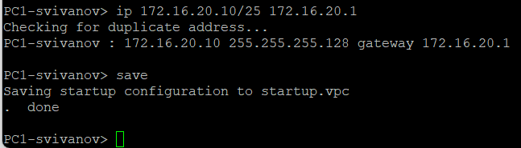{#fig:003 width=70%}

PC2: (рис. 4) 

```
ip 172.16.20.138/25 172.16.20.129
save 
```

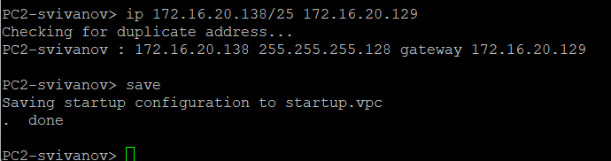{#fig:004 width=70%}

Server: (рис. 5)

```
ip 64.100.1.10/24 64.100.1.1
save
``` 

{#fig:005 width=70%}
 
Посмотрим на PC1 и PC2 конфигурацию IPv4 и IPv6:  (рис. 6, 7)

```
show ip
show ipv6
```

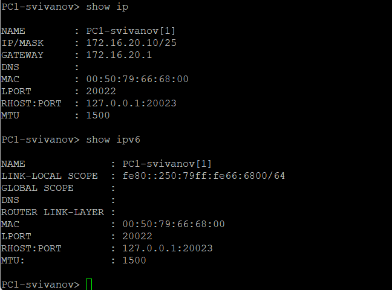{#fig:006 width=70%}

{#fig:007 width=70%}

Настроим IPv4-адресацию для интерфейсов локальной сети маршрутизатора FRR msk-user-gw-01:  (рис. 8)

```
frr# configure terminal
frr(config)# hostname msk-user-gw-01
msk-user-gw-01(config)# exit
msk-user-gw-01# write memory
msk-user-gw-01# configure terminal
msk-user-gw-01(config)# interface eth0
msk-user-gw-01(config-if)# ip address 172.16.20.1/25
msk-user-gw-01(config-if)# no shutdown
msk-user-gw-01(config-if)# exit
msk-user-gw-01(config)# interface eth1
msk-user-gw-01(config-if)# ip address 172.16.20.129/25
msk-user-gw-01(config-if)# no shutdown
msk-user-gw-01(config-if)# exit
msk-user-gw-01(config)# interface eth2
msk-user-gw-01(config-if)# ip address 64.100.1.1/24
msk-user-gw-01(config-if)# no shutdown
msk-user-gw-01(config-if)# exit
msk-user-gw-01(config)# exit
msk-user-gw-01# write memory
```

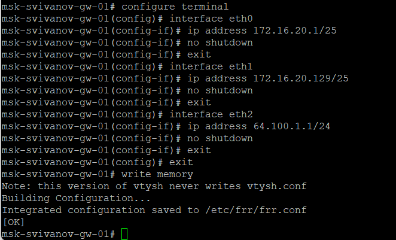{#fig:008 width=70%}

Проверим конфигурацию маршрутизатора и настройки IPv4-адресации: (рис. 9)

```
msk-user-gw-01# show running-config
msk-user-gw-01# show interface brief 
```

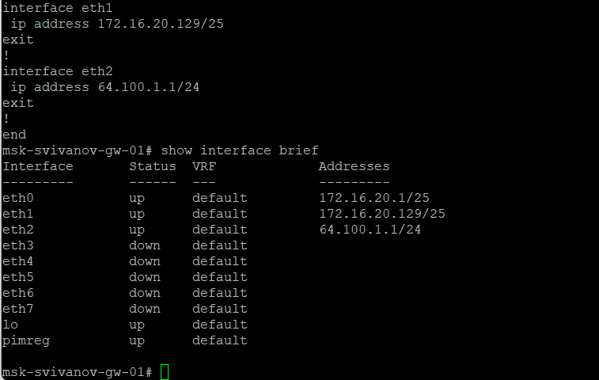{#fig:009 width=70%}

Проверим подключение с помощью команд ping и trace. Узлы PC1 и PC2
должны успешно отправлять эхо-запросы друг другу и на сервер с двойным
стеком (Dual Stack Server). (рис. 10, 11)

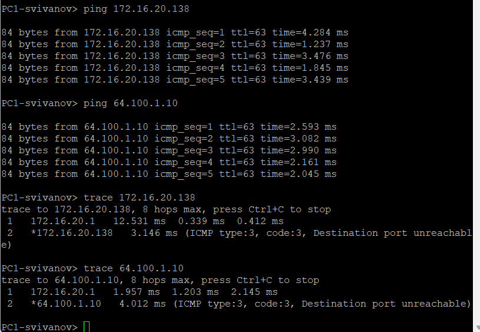{#fig:010 width=70%}

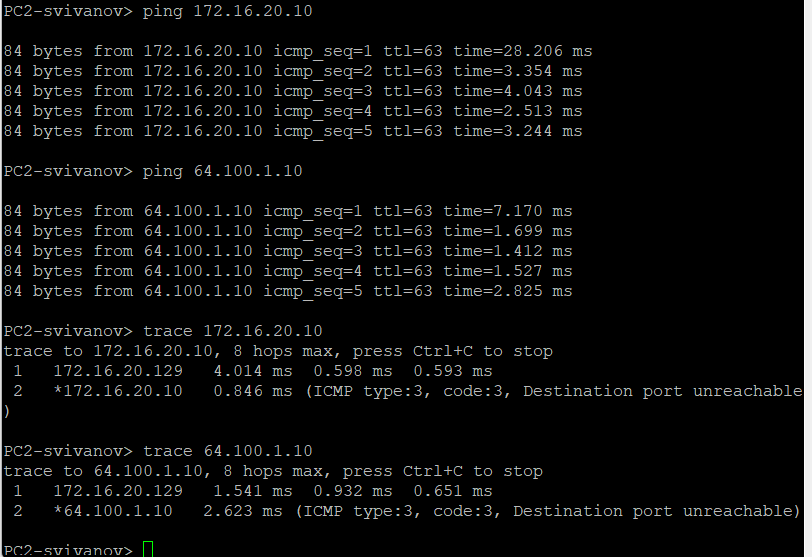{#fig:011 width=70%}

Настроим IPv6-адресацию для интерфейсов узлов PC3, PC4, Server: 

PC3: (рис. 12)

```
ip 2001:db8:c0de:12::a/64
save
```

{#fig:012 width=70%}

PC4: (рис. 13)

```
ip 2001:db8:c0de:13::a/64
save
```

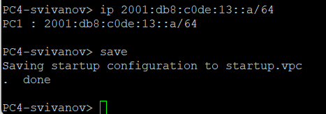{#fig:013 width=70%}

Server: (рис. 14)

```
ip 2001:db8:c0de:11::a/64
save
```

{#fig:014 width=70%}

Посмотрим на PC3 и PC4 конфигурацию IPv4 и IPv6: (рис. 15, 16)

```
show ip
show ipv6
``` 

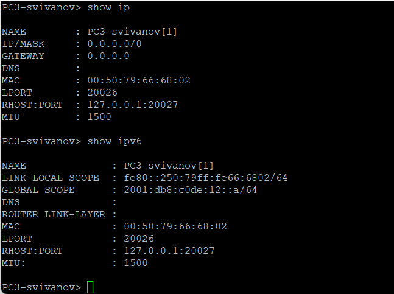{#fig:015 width=70%}

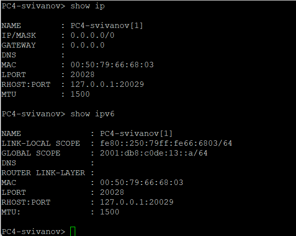{#fig:016 width=70%}

Настроим IPv6-адресацию для интерфейсов локальной сети маршрутизатора VyOS msk-user-gw-02:

Установим систему на маршрутизатор VyOS: (рис. 17)

```
vyos@vyos:~$ install image
```

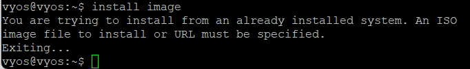{#fig:017 width=70%}

Перейдем в режим конфигурирования, изменим имя устройства: (рис. 18)

```
vyos@vyos$ configure
vyos@vyos# set system host-name msk-user-gw-02
vyos@vyos# compare
vyos@vyos# commit
vyos@vyos# save
vyos@vyos# exit
vyos@vyos$ reboot
```

{#fig:018 width=70%}

Назначим IPv6-адреса маршрутизатору msk-user-gw-02: (рис. 19)

```
vyos@msk-user-gw-02:~$ configure
vyos@msk-user-gw-02# set interfaces ethernet eth0 address 2001:db8:c0de:12::1/64
vyos@msk-user-gw-02# set service router-advert interface eth0 prefix 2001:db8:c0de:12::/64
vyos@msk-user-gw-02# set interfaces ethernet eth1 address 2001:db8:c0de:13::1/64
vyos@msk-user-gw-02# set service router-advert interface eth1 prefix 2001:db8:c0de:13::/64
vyos@msk-user-gw-02# set interfaces ethernet eth2 address 2001:db8:c0de:11::1/64
vyos@msk-user-gw-02# set service router-advert interface eth2 prefix 2001:db8:c0de:11::/64
vyos@msk-user-gw-02# compare
vyos@msk-user-gw-02# commit
vyos@msk-user-gw-02# save
vyos@msk-user-gw-02# show interfaces
```

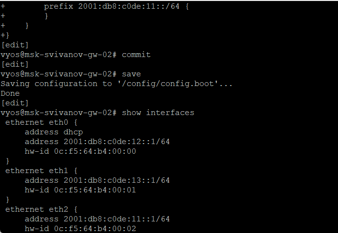{#fig:019 width=70%}

Проверим подключение с помощью команд ping и trace. Узлы PC3 и PC4
должны успешно отправлять эхо-запросы друг другу и на сервер с двойным
стеком (Dual Stack Server). (рис. 20, 21)

{#fig:020 width=70%}

{#fig:021 width=70%}

Убедимся, что устройства из подсети IPv4 не доступны для устройств из
подсети IPv6 и наоборот. Только сервер двойного стека может обращаться
к устройствам обеих подсетей. (рис. 22, 23)

{#fig:022 width=70%}

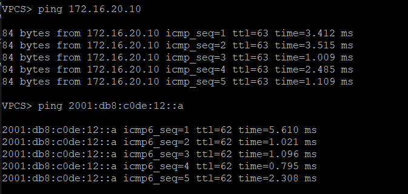{#fig:023 width=70%}

Посмотрим захваченный на соединении сервера двойного стека адресации
с коммутатором трафик ARP, ICMP, ICMPv6. 

ARP-трафик (IPv4):

Запрос "Who has 64.100.1.10? Tell 64.100.1.1": маршрутизатор gw-01 ищет MAC-адрес сервера с IP 64.100.1.10

Сервер отвечает своим MAC-адресом. (рис. 24)

{#fig:024 width=70%}

ICMP-трафик: 

Устройство 172.16.20.10 (РС1) отправляет эхо-запросы на сервер. 

Сервер отвечает эхо-ответами. Связь успешная, всего таких пар запрос-ответ 5, что соответствует тому, что мы в терминале отправили 5 ICMP запросов с РС1 на сервер. (рис. 25)

{#fig:025 width=70%}

ICMPv6-трафик:

Router Solicitation - узел запрашивает маршрутизаторы в сети.

Multicast Listener Report - узлы сообщают о подписке на multicast-группы.

Neighbour Solicitation - это аналог ARP для IPv6, используется для поиска MAC-адреса по IPv6-адресу.

Router Advertisement - маршрутизатор рассылает информацию о себе и префиксах сети. (рис. 26)

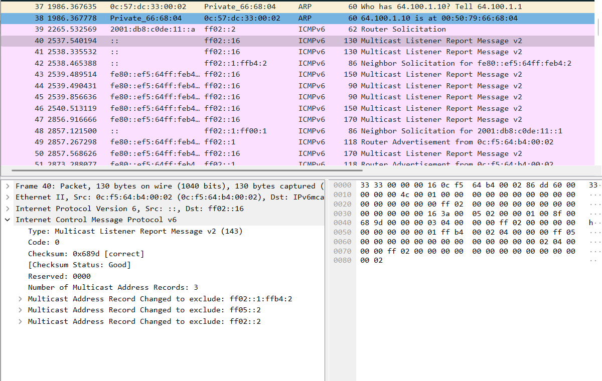{#fig:026 width=70%}

## Задание для самостоятельного выполнения

Задана топология сети. Предполагается, что маршрутизатор разбивает сеть на две подсети с адресами
IPv4 и IPv6:

- подсеть 1: 10.10.1.96/27; 2001:DB8:1:1::/64;
- подсеть 2: 10.10.1.16/28; 2001:DB8:1:4::/64. 

Для начала охарактеризуем подсети, укажем, какие адреса в них входят. Предложим вариант таблицы адресации для заданной топологии и адресного
пространства, причём для интерфейсов маршрутизатора выбрать наименьший адрес в подсети. (рис. 27)

{#fig:027 width=70%}

Построим нашу сеть в новом проекте GNS3. (рис. 28)

{#fig:028 width=70%}

Настроим маршрутизацию на PC1 в соответствии с составленной таблицей. (рис. 29)

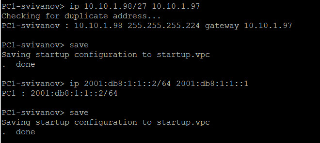{#fig:029 width=70%}

Настроим маршрутизацию на PC2 в соответствии с составленной таблицей. (рис. 30)

{#fig:030 width=70%}

Настроим маршрутизацию на VyOS-роутере. (рис. 31)

{#fig:031 width=70%}

Проверим настройку маршрутизации на VyOS. (рис. 32)

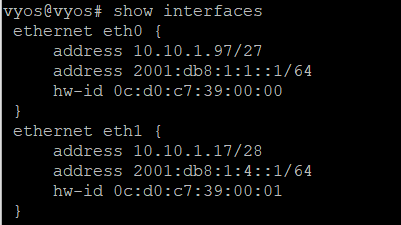{#fig:032 width=70%}

Проверим подключение между устройствами подсети с помощью команд
ping и trace. 

Сначала проверим подключение с РС1 к РС2. Видим, что все корректно. (рис. 33)

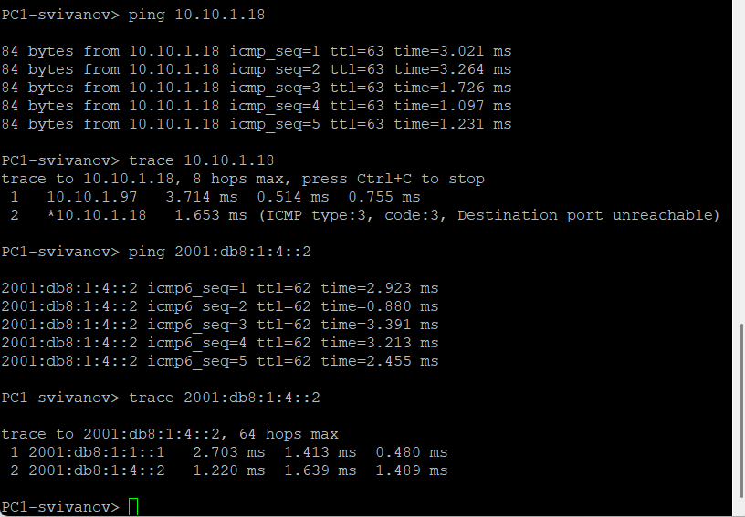{#fig:033 width=70%}

Проверим подключение с РС2 к РС1. Видим, что все корректно. (рис. 34)

{#fig:034 width=70%}

# Выводы

В ходе выполнения лабораторной работы мы изучили принципы распределения и настройки адресного пространства на устройствах сети.