---
## Front matter
title: "Отчет по лабораторной работе №7"
subtitle: "Дисциплина: Сетевые технологии"
author: "Иванов Сергей Владимирович"

## Generic otions
lang: ru-RU
toc-title: "Содержание"

## Bibliography
bibliography: bib/cite.bib
csl: pandoc/csl/gost-r-7-0-5-2008-numeric.csl

## Pdf output format
toc: true # Table of contents
toc-depth: 2
lof: true # List of figures
fontsize: 12pt
linestretch: 1.5
papersize: a4
documentclass: scrreprt
## I18n polyglossia
polyglossia-lang:
  name: russian
  options:
	- spelling=modern
	- babelshorthands=true
polyglossia-otherlangs:
  name: english
## I18n babel
babel-lang: russian
babel-otherlangs: english
## Fonts
mainfont: PT Serif
romanfont: PT Serif
sansfont: PT Sans
monofont: PT Mono
mainfontoptions: Ligatures=TeX
romanfontoptions: Ligatures=TeX
sansfontoptions: Ligatures=TeX,Scale=MatchLowercase
monofontoptions: Scale=MatchLowercase,Scale=0.9
## Biblatex
biblatex: true
biblio-style: "gost-numeric"
biblatexoptions:
  - parentracker=true
  - backend=biber
  - hyperref=auto
  - language=auto
  - autolang=other*
  - citestyle=gost-numeric
## Pandoc-crossref LaTeX customization
figureTitle: "Рис."
listingTitle: "Листинг"
lofTitle: "Список иллюстраций"
lolTitle: "Листинги"
## Misc options
indent: true
header-includes:
  - \usepackage{indentfirst}
  - \usepackage{float} # keep figures where there are in the text
  - \floatplacement{figure}{H} # keep figures where there are in the text
---

# Цель работы

Получение навыков настройки службы DHCP на сетевом оборудовании для
распределения адресов IPv4 и IPv6.

# Выполнение лабораторной работы

## Настройка DHCP в случае IPv4

Запустим GNS3 VM и GNS3. Создадим новый проект. В рабочем пространстве разместим и соединим устройства в соответствии
с топологией. Используем маршрутизатор VyOS и хост (клиент) VPCS. Изменим отображаемые названия устройств. Включим захват трафика на соединении между коммутатором sw-01 и маршрутизатором gw-01. (рис. 1)

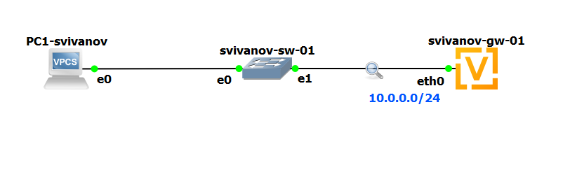{#fig:001 width=70%}

Настроим образ VyOS:

- Установим систему на маршрутизаторы VyOS:
```
vyos@vyos:~$ install image
```

В моем случае установка не требуется. (рис. 2)

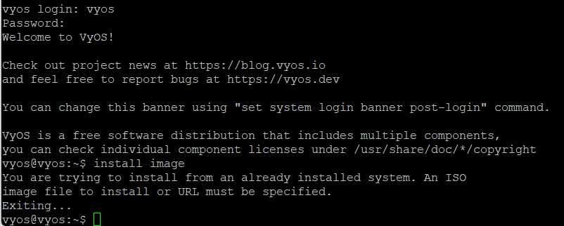{#fig:002 width=70%}

На маршрутизаторе перейдем в режим конфигурирования, изменим
имя устройства и доменное имя, заменим системного пользователя, заданного по умолчанию: (рис 3, 4)

```
vyos@vyos$ configure
vyos@vyos# set system host-name username-gw-01
vyos@vyos# set system domain-name username.net
vyos@vyos# set system login user <username>
-> authentication plaintext-password <mysecurepassword>
vyos@vyos# commit
vyos@vyos# save
vyos@vyos# exit
vyos@vyos$ exit
username-gw-01 login: username
Password:
username@username-gw-01:~$ configure
username@username-gw-01# delete system login user vyos
username@username-gw-01# commit
username@username-gw-01# save
```

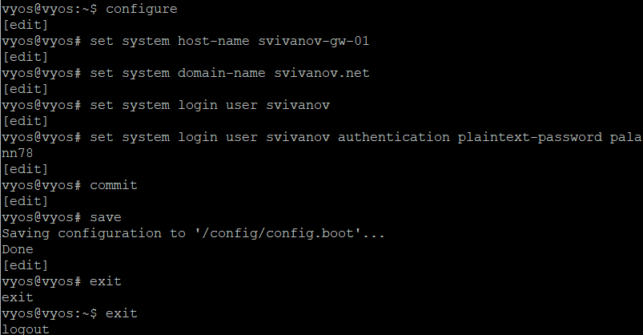{#fig:003 width=70%}

{#fig:004 width=70%}

На маршрутизаторе под созданным пользователем перейдем в режим конфигурирования и настроим адресацию IPv4: (рис. 5)

```
username@username-gw-01# set interfaces ethernet eth0 address 10.0.0.1/24 
``` 

{#fig:005 width=70%}
 
Добавим конфигурацию DHCP-сервера на маршрутизаторе:

```
username@username-gw-01# set service dhcp-server
-> shared-network-name username domain-name username.net
username@username-gw-01# set service dhcp-server
-> shared-network-name username name-server 10.0.0.1
username@username-gw-01# set service dhcp-server
shared-network-name username subnet 10.0.0.0/24
default-router 10.0.0.1
->
->
username@username-gw-01# set service dhcp-server
shared-network-name username subnet 10.0.0.0/24 range
hosts start 10.0.0.2
->
->
username@username-gw-01# set service dhcp-server
shared-network-name username subnet 10.0.0.0/24 range
hosts stop 10.0.0.253
->
->
username@username-gw-01# commit
username@username-gw-01# save
username@username-gw-01# exit
```

Здесь при помощи указанных выше команд была создана разделяемая сеть
(shared-network-name) с названием username, подсеть (subnet) с адресом
10.0.0.0/24, задан диапазон адресов (range) с именем hosts, содержащий
адреса 10.0.0.2–10.0.0.253. (рис. 6)

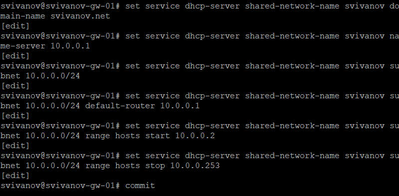{#fig:006 width=70%}

Для просмотра статистики DHCP-сервера и выданных адресов используем
команды: (рис. 7)

```
username@username-gw-01$ show dhcp server statistics
username@username-gw-01$ show dhcp server leases
```

{#fig:007 width=70%}

Настроим конечное устройство PC1:

```
PC1-username> ip dhcp -d
PC1-username> save
```

Здесь использована опция -d для обеспечения возможности просмотра декодированных запросов DHCP. 

1. Этап поиска сервера (discover)

Клиент отправил широковещательное сообщение DHCP DISCOVER, в котором все поля 0.0.0.0, т.к адрес еще не назначен. Цель - найти доступный в сети DHCP-сервер. 

2. Этап предложения сервера (offer)

В ответ наш сервер (10.0.0.1) прислал сообщение DHCP OFFER с предложением настроек и ip 10.0.0.2.

3. Этап подтверждения запроса (reqгest)

Клиент отправил DHCP REQUEST, подтверждая принятые настройки.

4. Этап финального подтверждения (ACK)

Сервер ответил DHCP ACK, завершая процесс.  (рис. 8, 9)

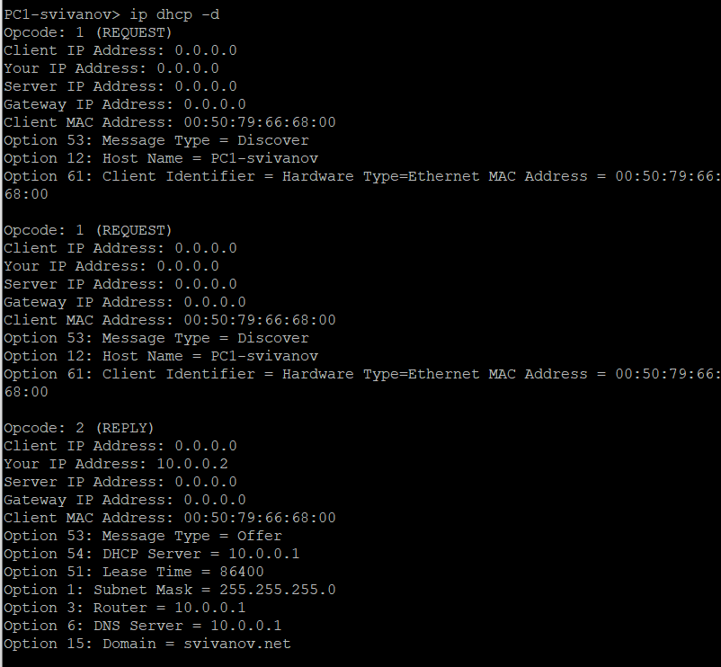{#fig:008 width=70%}

{#fig:009 width=70%}

Проверим конфигурацию IPv4 на узле, пропингуем маршрутизатор: (рис. 10)

```
PC1-username> show ip
PC1-username> ping 10.0.0.1 -c 2
``` 

{#fig:010 width=70%}

На маршрутизаторе вновь посмотрим статистику DHCP-сервера и выданные
адреса: (рис. 11)

```
username@username-gw-01$ show dhcp server statistics
username@username-gw-01$ show dhcp server leases
```
Теперь в статистике отображается, что был выдан 1 адрес, доступных осталось 251. Также видим, какой конкретно был выдан адрес, когда и во сколько, а такжу кому именно он был выдан.

{#fig:011 width=70%}

На маршрутизаторе посмотрим журнал работы DHCP-сервера: (рис. 12)

```
username@username-gw-01$ show log | grep dhcp
```

{#fig:012 width=70%}

Проанализируем пакеты, захваченные Wireshark: (рис. 13)

1. DHCP Discover (пакеты 109, 111)

- Источник: 0.0.0.0 (клиент ещё не имеет IP).
- Назначение: 255.255.255.255 (широковещательный запрос). Поиск DHCP-сервера в сети.

2. DHCP Offer (пакет 112)

- Источник: 10.0.0.1 (DHCP-сервер).
- Назначение: 10.0.0.2 (предлагаемый клиенту адрес). Сервер предлагает адрес 10.0.0.2 и параметры сети.
- Перед отправкой OFFER сервер выполняет ARP-запрос для проверки, не используется ли адрес 10.0.0.2 другим устройством.

3. DHCP Request (пакет 115)

- Широковещательная рассылка (255.255.255.255). Клиент подтверждает принятие адреса 10.0.0.2 от сервера 10.0.0.1.

4. DHCP ACK (пакет 116)

- Источник: 10.0.0.1.
- Назначение: 10.0.0.2 (уже назначенный адрес).
- Окончательное подтверждение аренды адреса.

Работа ARP во время процесса DHC: 

Перед отправкой OFFER: Who has 10.0.0.2? Tell 10.0.0.1. Сервер проверяет, свободен ли адрес 10.0.0.2, отправляя ARP-запрос. Ответа нет = адрес свободен, можно предлагать клиенту.

После получения ACK: Gratuitous ARP for 10.0.0.2 (Request). Клиент отправляет бесплатный ARP-запрос для объявления своего нового адреса 10.0.0.2.

Перед ping: Who has 10.0.0.1? Tell 10.0.0.2. 10.0.0.1 is at 0c:00:32:06:00:00. Клиент выполняет ARP-запрос для определения MAC-адреса шлюза 10.0.0.1. Сервер отвечает своим MAC-адресом 0c:00:32:06:00:00.   

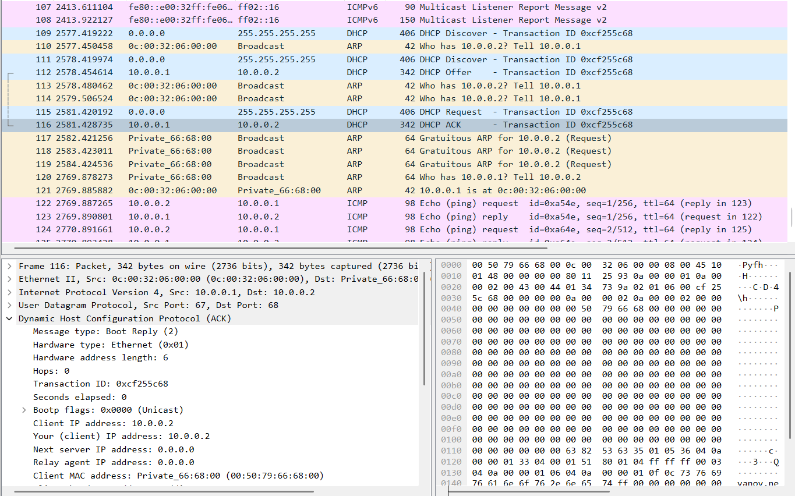{#fig:013 width=70%}

## Настройка DHCP в случае IPv6

В предыдущем проекте в рабочем пространстве дополним сеть, разместив
и соединив устройства в соответствии с топологией. Используем хост (клиент) Kali Linux CLI. Изменим отображаемые названия устройств. Включим захват трафика на соединениях между маршрутизатором gw-01 и коммутаторами sw-02 и sw-03.

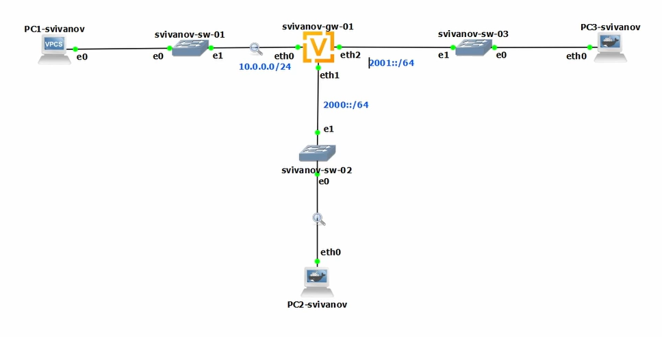{#fig:014 width=70%}

Настроим адресацию IPv6 на маршрутизаторе: (рис. 15)

```
username@username-gw-01:~$ configure
username@username-gw-01# set interfaces ethernet eth1
-> address 2000::1/64
username@username-gw-01# set interfaces ethernet eth2
-> address 2001::1/64
username@username-gw-01# show interfaces
username@username-gw-01# commit
username@username-gw-01# save
```

{#fig:015 width=70%}

На маршрутизаторе настроим DHCPv6 без отслеживания состояния:

Настройка объявления о маршрутизаторах (Router Advertisements, RA) на
интерфейсе eth1:

```
username@username-gw-01# set service router-advert
-> interface eth1 prefix 2000::/64
username@username-gw-01# set service router-advert
-> interface eth1 other-config-flag
```

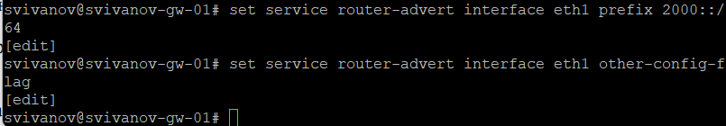{#fig:016 width=70%}

Добавление конфигурации DHCP-сервера: (рис. 17)

```
username@username-gw-01# set service dhcpv6-server
-> shared-network-name username-stateless
username@username-gw-01# set service dhcpv6-server
shared-network-name username-stateless subnet
2000::0/64
->
->
username@username-gw-01# set service dhcpv6-server
shared-network-name username-stateless common-options
name-server 2000::1
->
->
username@username-gw-01# set service dhcpv6-server
shared-network-name username-stateless common-options
domain-search username.net
->
->
username@username-gw-01# commit
username@username-gw-01# save
username@username-gw-01# run show configuration
```

Здесь создана разделяемая сеть (sharednetwork-name) с названием username, задана информация общих опций (common-options) для разделяемой сети. При этом подсеть (subnet)
2000::/64 не требуется настраивать, поскольку она не будет содержать полезной информации.

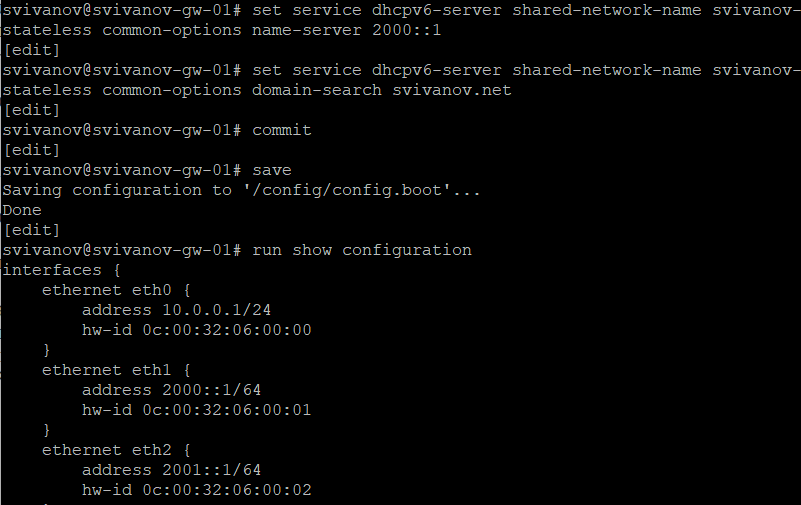{#fig:017 width=70%}

На узле PC2 проверим настройки сети: (рис. 18)

```
root@PC2-username:/# ifconfig
root@PC2-username:/# route -n -A inet6
```

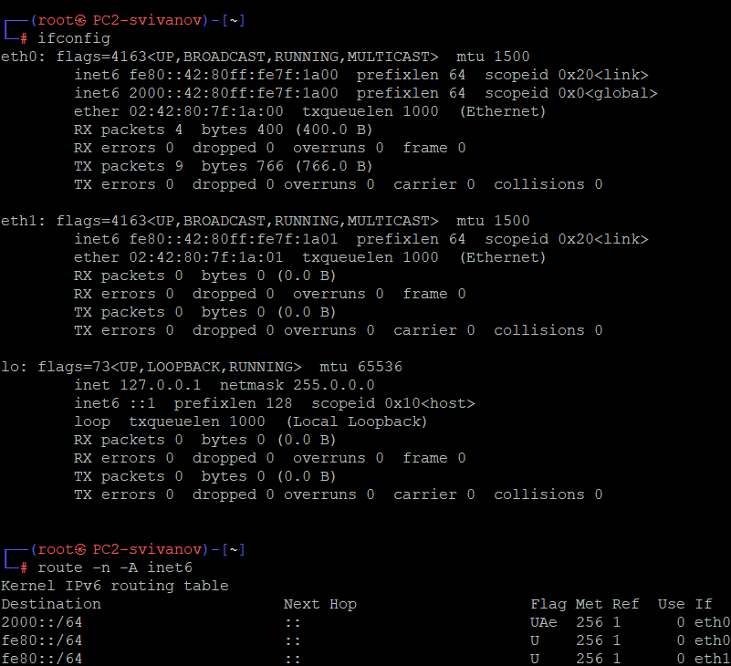{#fig:018 width=70%}

На узле PC2 пропингуем маршрутизатор: (рис. 19)

```
root@PC2-username:/# ping 2000::1 -c 2
```

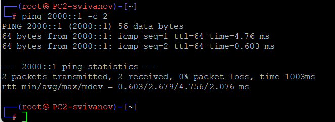{#fig:019 width=70%}

На узле PC2 проверим настройки DNS: (рис. 20)

```
root@PC2-username:/# cat /etc/resolv.conf 
```

{#fig:020 width=70%}

На узле PC2 получим адрес по DHCPv6: (рис. 21)

```
root@PC2-username:/# dhclient -6 -S -v eth0
```

Здесь опция -6 указывает на использование протокола DHCPv6, опция -S —
на запрос только информации DHCPv6, но не адреса, опция -v — на вывод на
экран подробной информации.

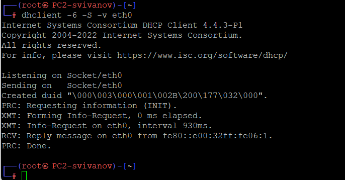{#fig:021 width=70%}

Вновь пропингуем от узла PC2 маршрутизатор, проверим настройки DNS: (рис. 22, 23)

```
root@PC2-username:/# ping 2000::1 -c2
root@PC2-username:/# cat /etc/resolv.conf 
```

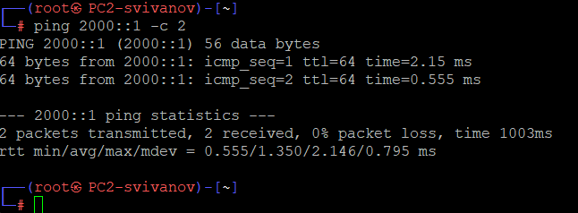{#fig:022 width=70%}

{#fig:023 width=70%}

На маршрутизаторе посмотрим статистику DHCP-сервера и выданные адреса: (рис. 24)

```
username@username-gw-01# run show dhcpv6 server leases
```

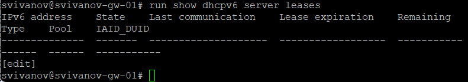{#fig:024 width=70%}

1. Информация с маршрутизатора

Команда show dhcpv6 server leases на маршрутизаторе не показывает активных DHCPv6-аренд.

Это означает, что: DHCPv6-сервер на маршрутизаторе не выдавал адреса устройству PC2.

2. Информация с PC2 

/etc/resolv.conf показывает: DNS-сервер: 2000::1 (IPv6-адрес маршрутизатора). Это указывает на то, что DNS настроен через DHCPv6.

Ping до 2000::1 успешен: PC2 имеет IPv6-адрес в сети 2000::/... и может связываться с маршрутизатором.

3. Анализ захваченного трафика 

ICMPv6 Echo-запросы и ответы (пинги): PC2 (2000::42:80ff:fe7f:...) обменивается эхо-запросами с маршрутизатором (2000::1). Это подтверждает работоспособность IPv6-связи.

ICMPv6 Neighbor Discovery Protocol (NDP):

Neighbor Solicitation (NS) и Neighbor Advertisement (NA) используются для разрешения IPv6-адресов в MAC-адреса (аналог ARP в IPv4).

DHCPv6-трафик:

Information-request (строка 10): PC2 запрашивает у сервера дополнительную информацию (например, DNS).

Reply (строка 11): Сервер отвечает, предоставляя DNS-сервер (2000::1). (рис. 25)

{#fig:025 width=70%}

На маршрутизаторе настроим DHCPv6 с отслеживанием состояния (DHCPv6
Stateful configuration):

На интерфейсе eth2 маршрутизатора настроим объявления о маршрутизаторах (Router Advertisements, RA): (рис. 26)

```
username@username-gw-01# set service router-advert
-> interface eth2 managed-flag
```

{#fig:026 width=70%}

Добавим конфигурацию DHCP-сервера на маршрутизаторе:

```
username@username-gw-01# set service dhcpv6-server
-> shared-network-name username-stateful
username@username-gw-01# set service dhcpv6-server
shared-network-name username-stateful subnet
2001::0/64
->
->
username@username-gw-01# set service dhcpv6-server
shared-network-name username-stateful subnet
2001::0/64 name-server 2001::1
->
->
username@username-gw-01# set service dhcpv6-server
shared-network-name username-stateful subnet
2001::0/64 domain-search username.net
->
->
username@username-gw-01# set service dhcpv6-server
shared-network-name username-stateful subnet
2001::0/64 address-range start 2001::100 stop
2001::199
->
->
->
username@username-gw-01# commit
username@username-gw-01# save
```

Здесь при помощи указанных выше команд создана разделяемая сеть
(shared-network-name) с названием username, подсеть (subnet) с адресом 2001::/64, задан диапазон адресов (range) с именем hosts, содержащий адреса 2001::100 – 2001::199 (рис. 27)

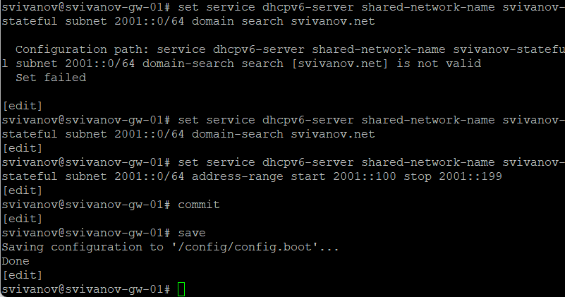{#fig:027 width=70%}

На маршрутизаторе посмотрим выданные адреса: (рис. 28)

```
username@username-gw-01# run show dhcpv6 server leases 
```

{#fig:028 width=70%}

Подключимся к узлу PC3 и проверим настройки сети: (рис. 29)

```
root@PC3-username:/# ifconfig
root@PC3-username:/# route -n -A inet6
```

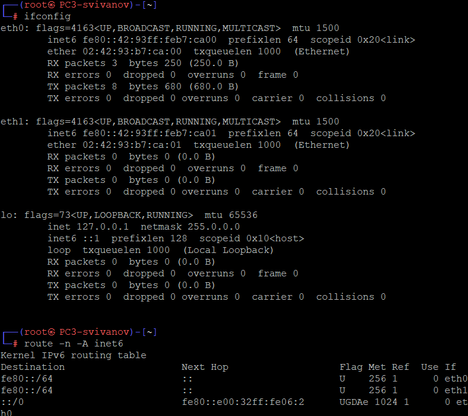{#fig:029 width=70%}

На узле PC3 проверим настройки DNS: (рис. 30)

```
root@PC3-username:/# cat /etc/resolv.conf 
```

{#fig:030 width=70%}

На узле PC3 получим адрес по DHCPv6: (рис. 31)

```
root@PC3-username:/# dhclient -6 -v eth0.
```

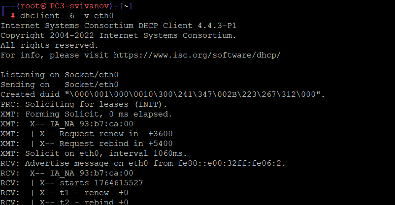{#fig:031 width=70%}

Вновь на узле PC3 проверим настройки сети, пропингуем маршрутизатор,
проверим настройки DNS: (рис. 32, 33)

```
root@PC3-username:/# ifconfig
root@PC3-username:/# route -n -A inet6
root@PC3-username:/# ping 2001::1 -c 2
root@PC3-username:/# cat /etc/resolv.conf 
```

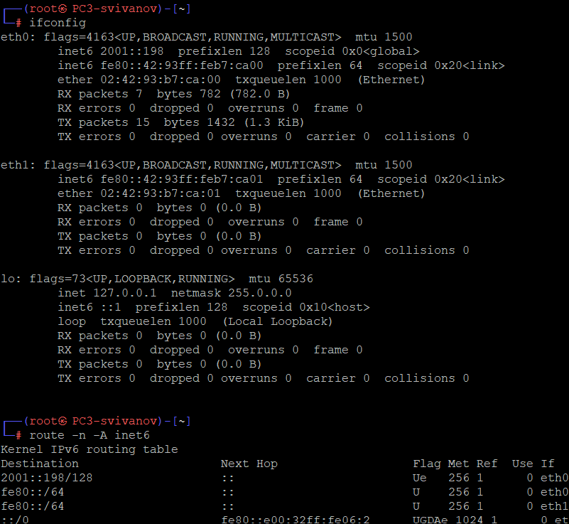{#fig:032 width=70%}

{#fig:033 width=70%}

На маршрутизаторе посмотрим выданные адреса: (рис. 34)

```
username@username-gw-01# run show dhcpv6 server leases 
```

{#fig:034 width=70%}

1. Информация с PC3 

eth0 имеет два IPv6-адреса:

- 2001::198/128 — глобальный адрес с префиксом /128.
- fe80::42:93ff:feb7:ca00/64 — link-local адрес.

Таблица маршрутизации IPv6 (route -n -A inet6):

- Маршрут по умолчанию (::/0) направлен через fe80::e00:32ff:fe06:2 (link-local адрес маршрутизатора).

Ping до 2001::1 успешен: PC3 может связаться с маршрутизатором по адресу 2001::1.

DNS-конфигурация (/etc/resolv.conf):

- DNS-сервер: 2001::1 (маршрутизатор).

2. Информация с маршрутизатора 

DHCPv6-сервер выдает аренды:

- Адрес 2001::198 выдан PC3.
- Состояние: active.
- Тип аренды: non-temporary.

Это подтверждает, что PC3 получил адрес через stateful DHCPv6.

3. Анализ захваченного трафика

Процесс получения адреса через DHCPv6 (stateful):

Пакет 17 (Solicit):

- PC3 (fe80::42:93ff:fe07:e000) отправляет Solicit на multicast-адрес ff02::1:2 (все DHCPv6-серверы).
- Цель: найти доступные DHCPv6-серверы.

Пакет 18 (Advertise):

- Маршрутизатор (fe80::e00:32ff:fe06:2) отвечает Advertise.
- Предлагает адрес 2001::198.

Пакет 19 (Request):

- PC3 отправляет Request на ff02::1:2, запрашивая предложенный адрес.

Пакет 20 (Reply):

- Маршрутизатор подтверждает выдачу адреса 2001::198 через Reply.

ICMPv6 Neighbor Discovery (NDP):

Пакеты 13–16, 24–27:

- Neighbor Solicitation (NS) и Neighbor Advertisement (NA) для разрешения link-local адресов.

ICMPv6 Router Advertisement (RA):

Пакет 28:

- Маршрутизатор отправляет Router Advertisement на ff02::1:1 (все узлы).

Проверка связи и DAD:

Пакет 22:

- Neighbor Solicitation для 2001::198 на multicast ff02::1:ff00:198.
- Это Duplicate Address Detection (DAD) — проверка уникальности адреса перед использованием.

Пакет 29–30:

- PC3 пингует 2001::1 и получает ответ.
- Также выполняется NS для разрешения адреса 2001::198. (рис. 35)

{#fig:035 width=70%}

# Выводы

В ходе выполнения лабораторной работы мы получили навыки настройки службы DHCP на сетевом оборудовании для
распределения адресов IPv4 и IPv6.