---
## Front matter
lang: ru-RU
title: Лабораторная работа №8
subtitle: Сетевые технологии
author:
  - Иванов Сергей Владимирович, НПИбд-01-23
institute:
  - Российский университет дружбы народов, Москва, Россия
date: 19 декабря 2025

## i18n babel
babel-lang: russian
babel-otherlangs: english

## Formatting pdf
toc: false
slide_level: 2
aspectratio: 169
section-titles: true
theme: metropolis
header-includes:
 - \metroset{progressbar=frametitle,sectionpage=progressbar,numbering=fraction}
 - '\makeatletter'
 - '\beamer@ignorenonframefalse'
 - '\makeatother'

 ## Fonts
mainfont: PT Serif
romanfont: PT Serif
sansfont: PT Sans
monofont: PT Mono
mainfontoptions: Ligatures=TeX
romanfontoptions: Ligatures=TeX
sansfontoptions: Ligatures=TeX,Scale=MatchLowercase
monofontoptions: Scale=MatchLowercase,Scale=0.9
---

## Цель

Изучение принципов маршрутизации в IPv4- и IPv6-сетях и принципов настройки сетевого оборудования.

## Настройка динамической маршрутизации в сетях IPv4 и IPv6

Продублируем таблицы адресации. (рис. 1, 2)

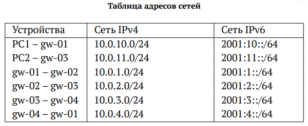{#fig:001 width=70%}

## Настройка динамической маршрутизации в сетях IPv4 и IPv6

{#fig:002 width=70%}

## Настройка динамической маршрутизации в сетях IPv4 и IPv6

Схема L1 (рис. 3)

{#fig:003 width=70%}

## Настройка динамической маршрутизации в сетях IPv4 и IPv6

Схема L3 (рис. 4) 

{#fig:004 width=70%}

## Настройка динамической маршрутизации в сетях IPv4 и IPv6

{#fig:005 width=70%}
 
## Настройка динамической маршрутизации в сетях IPv4 и IPv6

Присвоим IPv4-адреса устройствам PC1 и PC2: 

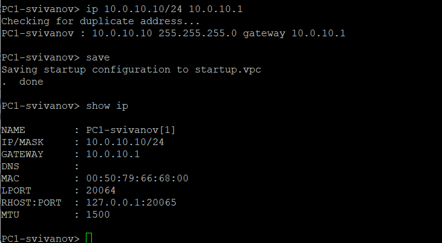{#fig:006 width=70%}

## Настройка динамической маршрутизации в сетях IPv4 и IPv6

{#fig:007 width=70%}

## Настройка динамической маршрутизации в сетях IPv4 и IPv6

Настроим IPv4-адреса на интерфейсах маршрутизаторов: 

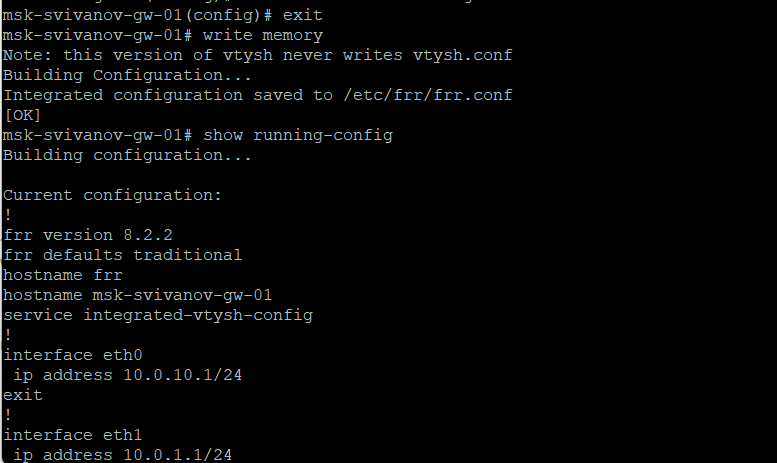{#fig:008 width=70%}

## Настройка динамической маршрутизации в сетях IPv4 и IPv6

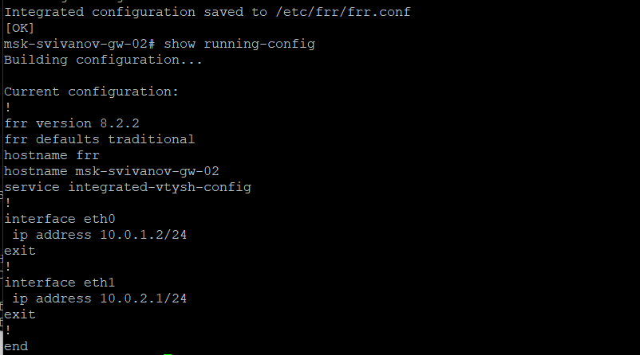{#fig:009 width=70%}

## Настройка динамической маршрутизации в сетях IPv4 и IPv6

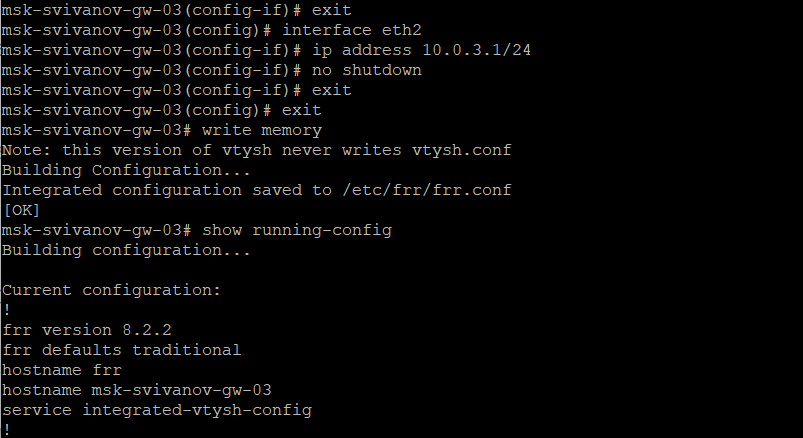{#fig:010 width=70%}

## Настройка динамической маршрутизации в сетях IPv4 и IPv6

{#fig:011 width=70%}

## Настройка динамической маршрутизации в сетях IPv4 и IPv6

Присвоим IPv6-адреса устройствам PC1 и PC2:

{#fig:012 width=70%}

## Настройка динамической маршрутизации в сетях IPv4 и IPv6

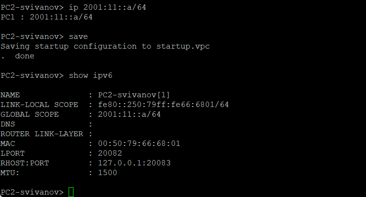{#fig:013 width=70%}

## Настройка динамической маршрутизации в сетях IPv4 и IPv6

Настроим IPv6-адреса на интерфейсах маршрутизаторов: (рис. 14-17)

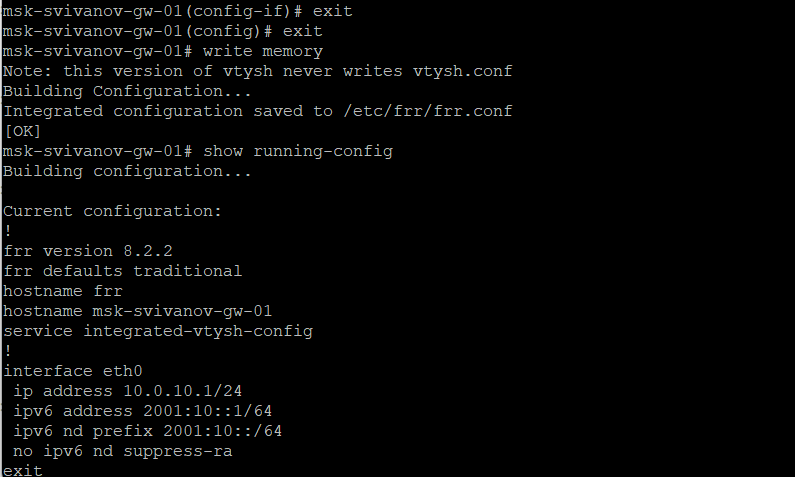{#fig:014 width=70%}

## Настройка динамической маршрутизации в сетях IPv4 и IPv6

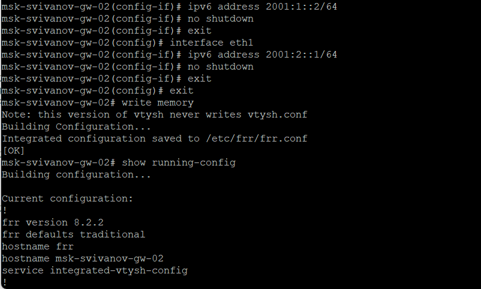{#fig:015 width=70%}

## Настройка динамической маршрутизации в сетях IPv4 и IPv6

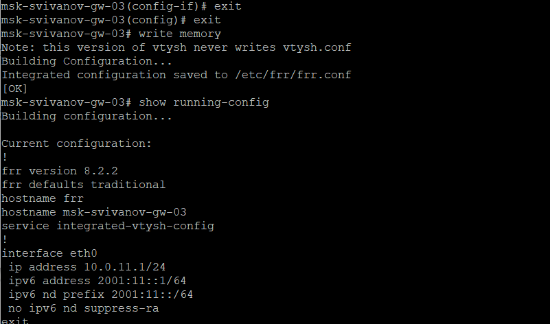{#fig:016 width=70%}

## Настройка динамической маршрутизации в сетях IPv4 и IPv6

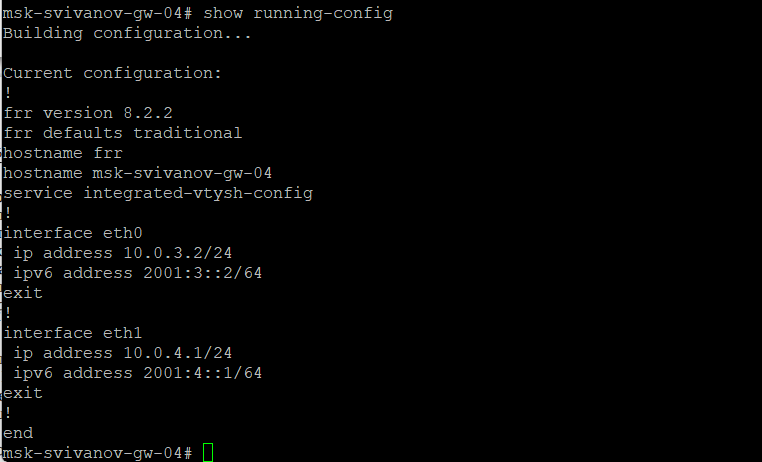{#fig:017 width=70%}

## Настройка динамической маршрутизации по протоколу RIP

На маршрутизаторах настроим RIP 

{#fig:018 width=70%}

## Настройка динамической маршрутизации по протоколу RIP

{#fig:019 width=70%}

## Настройка динамической маршрутизации по протоколу RIP

{#fig:020 width=70%}

## Настройка динамической маршрутизации по протоколу RIP

{#fig:021 width=70%}

## Настройка динамической маршрутизации по протоколу RIP

Убедимся, что маршрутизация по RIP настроена:

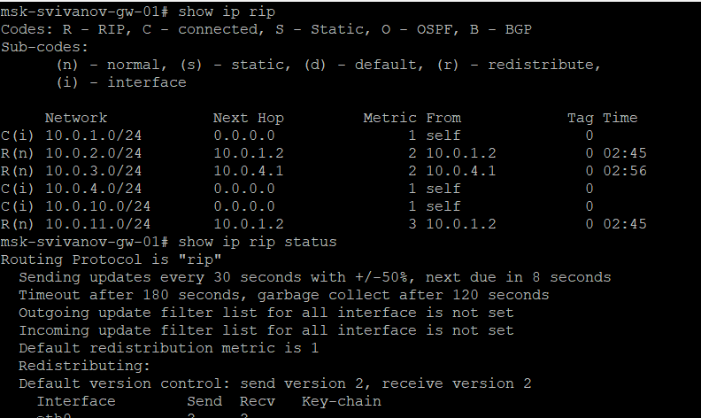{#fig:022 width=70%}

## Настройка динамической маршрутизации по протоколу RIP

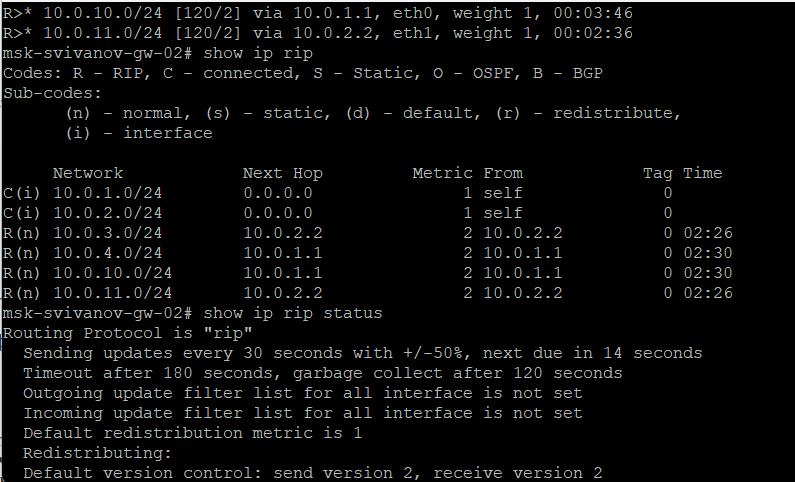{#fig:023 width=70%}

## Настройка динамической маршрутизации по протоколу RIP

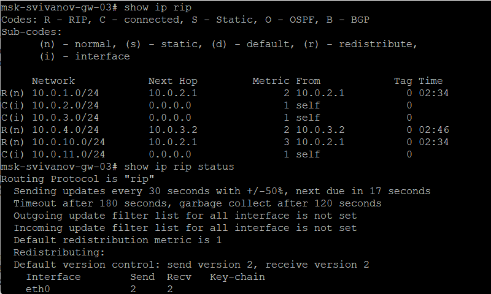{#fig:024 width=70%}

## Настройка динамической маршрутизации по протоколу RIP

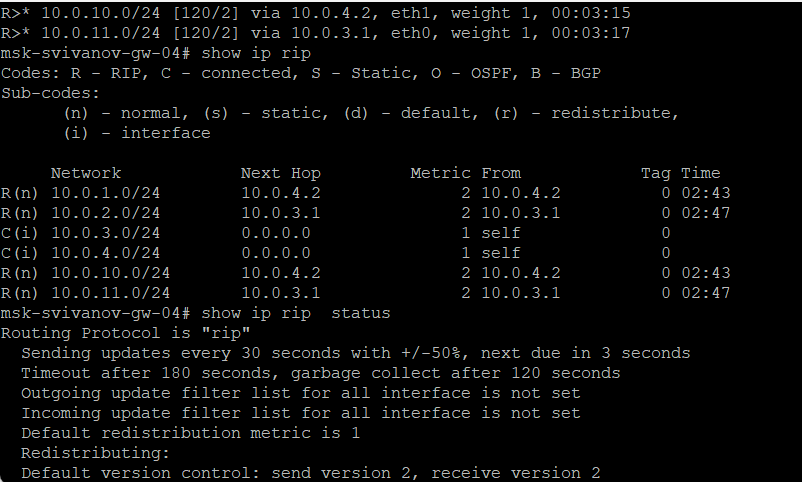{#fig:025 width=70%}

## Настройка динамической маршрутизации по протоколу RIP

С PC1 пропингуем PC2. Пакеты идут через gw-02 (рис. 26)

{#fig:026 width=70%}

## Настройка динамической маршрутизации по протоколу RIP

Проверим метрики протокола RIP

{#fig:027 width=70%}

## Настройка динамической маршрутизации по протоколу RIP

Отключим на gw-02 интерфейс:

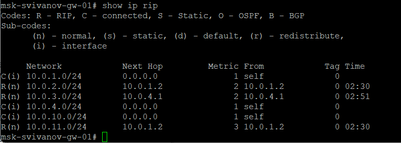{#fig:028 width=70%}

## Настройка динамической маршрутизации по протоколу RIP

С PC1 пропингуем PC2. Видим, что маршрут изменился.

{#fig:029 width=70%}

## Настройка динамической маршрутизации по протоколу RIP

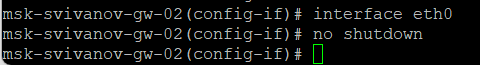{#fig:030 width=70%}

## Настройка динамической маршрутизации по протоколу RIP

С PC1 пропингуем PC2. (рис. 31)

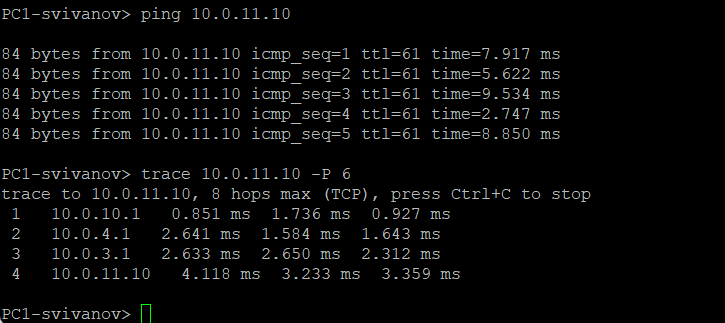{#fig:031 width=70%}

## Настройка динамической маршрутизации по протоколу RIP

Посмотрим захваченный на соединениях трафик. 

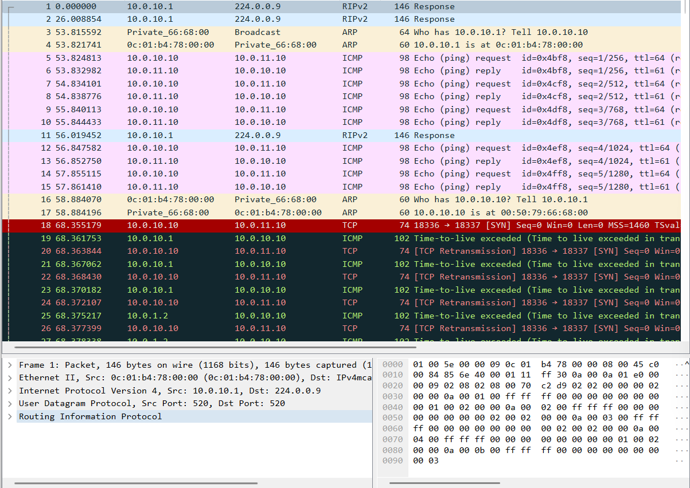{#fig:032 width=70%}

## Настройка динамической маршрутизации по протоколу RIP

{#fig:033 width=70%}

## Настройка динамической маршрутизации по протоколу RIP

{#fig:034 width=70%}

## Настройка динамической маршрутизации по протоколу RIP

На маршрутизаторах настроим RIPng для сетей IPv6:

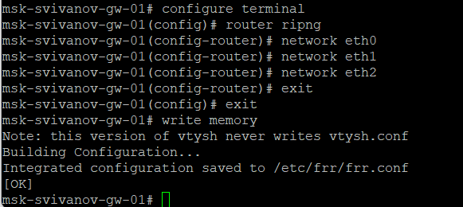{#fig:035 width=70%}

## Настройка динамической маршрутизации по протоколу RIP

{#fig:036 width=70%}

## Настройка динамической маршрутизации по протоколу RIP

{#fig:037 width=70%}

## Настройка динамической маршрутизации по протоколу RIP

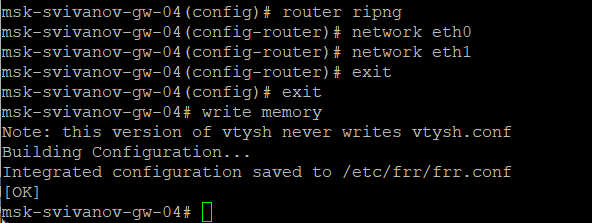{#fig:038 width=70%}

## Настройка динамической маршрутизации по протоколу RIP

С PC1 пропингуем PC2. Пакеты идут через gw-04. 

{#fig:039 width=70%}

## Настройка динамической маршрутизации по протоколу RIP

Проверим метрики протокола RIPng: 

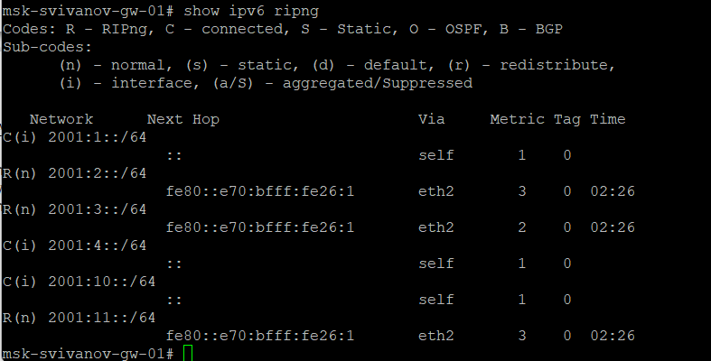{#fig:040 width=70%}

## Настройка динамической маршрутизации по протоколу RIP

Пакет проходит через gw-04. Отключим на gw-04 интерфейс: 

{#fig:041 width=70%}

## Настройка динамической маршрутизации по протоколу RIP

Проверим метрики протокола RIPng: 

{#fig:042 width=70%}

## Настройка динамической маршрутизации по протоколу RIP

С PC1 пропингуем PC2. Пакеты идут через gw-02.

{#fig:043 width=70%}

## Настройка динамической маршрутизации по протоколу RIP

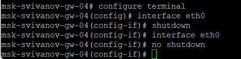{#fig:044 width=70%}

## Настройка динамической маршрутизации по протоколу RIP

С PC1 пропингуем PC2. Пакеты идут через gw-02. 

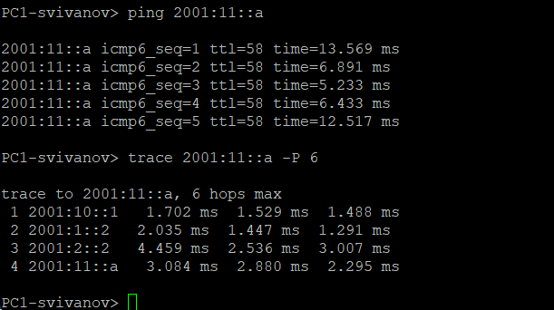{#fig:045 width=70%}

## Настройка динамической маршрутизации по протоколу RIP

Посмотрим захваченный на соединениях трафик

{#fig:046 width=70%}

## Настройка динамической маршрутизации по протоколу RIP

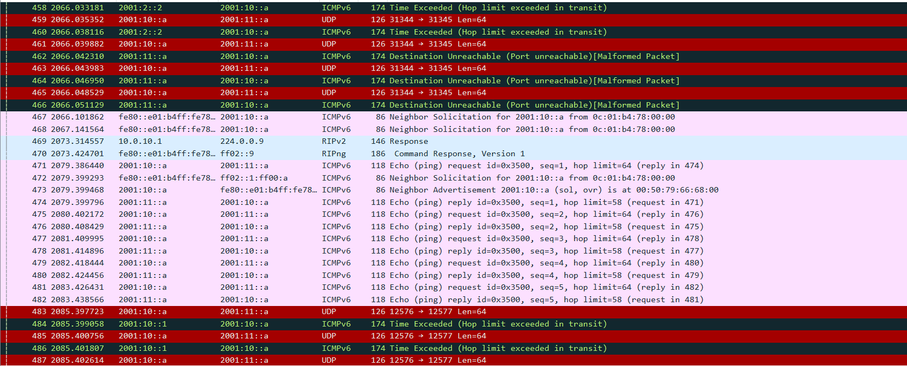{#fig:047 width=70%}

## Настройка динамической маршрутизации по протоколу OSPF

На маршрутизаторах настроим OSPFv2 для сетей IPv4:

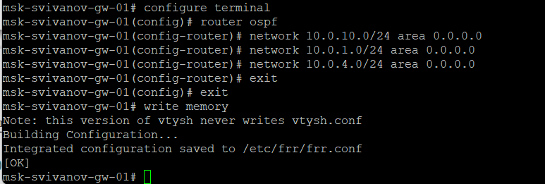{#fig:048 width=70%}

## Настройка динамической маршрутизации по протоколу OSPF

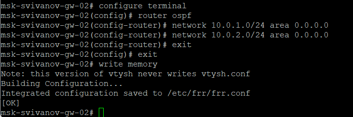{#fig:049 width=70%}

## Настройка динамической маршрутизации по протоколу OSPF

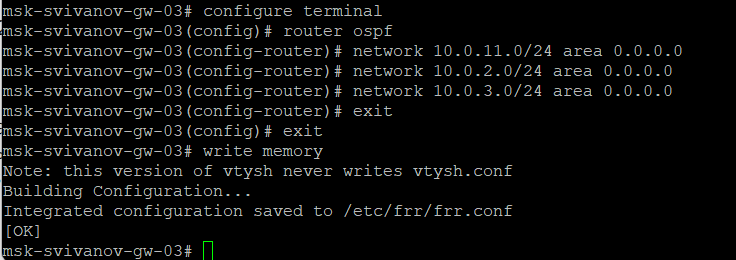{#fig:050 width=70%}

## Настройка динамической маршрутизации по протоколу OSPF

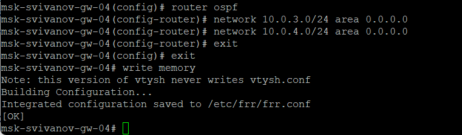{#fig:051 width=70%}

## Настройка динамической маршрутизации по протоколу OSPF

С PC1 пропингуем PC2. Путь проходит через gw-04. (рис. 52)

{#fig:052 width=70%}

## Настройка динамической маршрутизации по протоколу OSPF

Проверим таблицу маршрутизации протокола OSPFv2: (рис. 53)

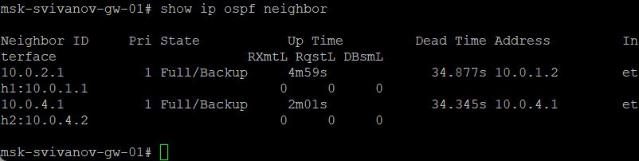{#fig:053 width=70%}

## Настройка динамической маршрутизации по протоколу OSPF

Отключим на gw-04 интерфейс: 

{#fig:054 width=70%}

## Настройка динамической маршрутизации по протоколу OSPF

Проверим таблицу маршрутизации протокола OSPFv2:

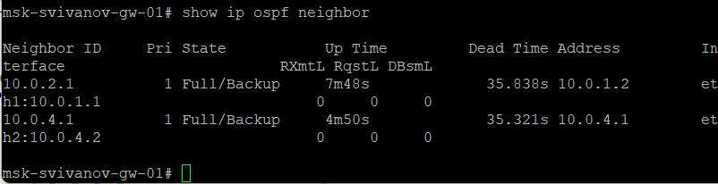{#fig:055 width=70%}

## Настройка динамической маршрутизации по протоколу OSPF

С PC1 пропингуем PC2. Путь проходит через gw-02.

{#fig:056 width=70%}

## Настройка динамической маршрутизации по протоколу OSPF

Включим на маршрутизаторе gw-04 интерфейс: 

{#fig:057 width=70%}

## Настройка динамической маршрутизации по протоколу OSPF

С PC1 пропингуем PC2. Путь проходит через gw-04. 

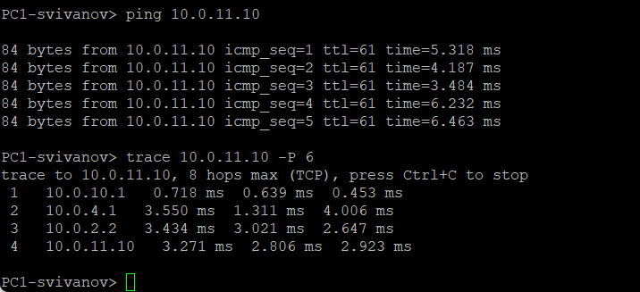{#fig:058 width=70%}

## Настройка динамической маршрутизации по протоколу OSPF

Посмотрим захваченный на соединениях трафик. 

{#fig:059 width=70%}

## Настройка динамической маршрутизации по протоколу OSPF

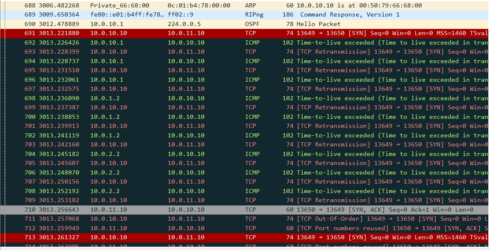{#fig:060 width=70%}

## Настройка динамической маршрутизации по протоколу OSPF

На маршрутизаторах настроим OSPFv3 для сетей IPv6: 

{#fig:061 width=70%}

## Настройка динамической маршрутизации по протоколу OSPF

{#fig:062 width=70%}

## Настройка динамической маршрутизации по протоколу OSPF

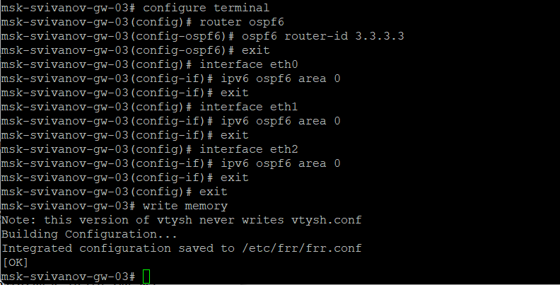{#fig:063 width=70%}

## Настройка динамической маршрутизации по протоколу OSPF

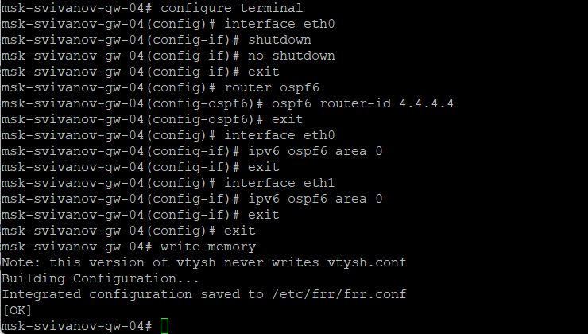{#fig:064 width=70%}

## Настройка динамической маршрутизации по протоколу OSPF

С PC1 пропингуем PC2. Пакеты идут через gw-02 

{#fig:065 width=70%}

## Настройка динамической маршрутизации по протоколу OSPF

Проверим таблицу маршрутизации протокола OSPFv3: 

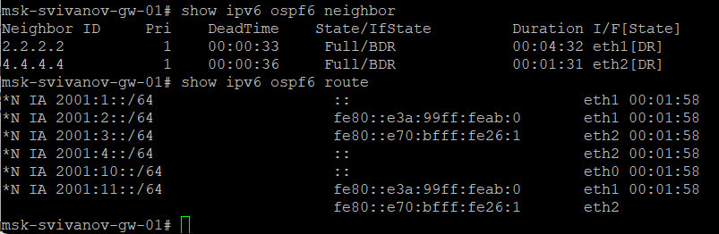{#fig:066 width=70%}

## Настройка динамической маршрутизации по протоколу OSPF

Пакет проходит через gw-02. Отключим на gw-02 интерфейс:

{#fig:067 width=70%}

## Настройка динамической маршрутизации по протоколу OSPF

Проверим таблицу маршрутизации протокола OSPFv3: 

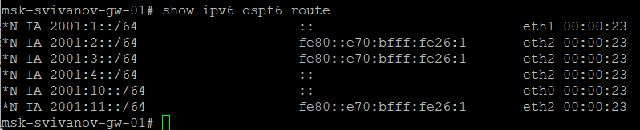{#fig:068 width=70%}

## Настройка динамической маршрутизации по протоколу OSPF

С PC1 пропингуем PC2. Пакеты идут через gw-04. 

{#fig:069 width=70%}

## Настройка динамической маршрутизации по протоколу OSPF

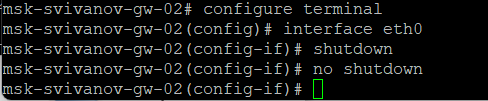{#fig:070 width=70%}

## Настройка динамической маршрутизации по протоколу OSPF

С PC1 пропингуем PC2. Пакеты идут через gw-02. 

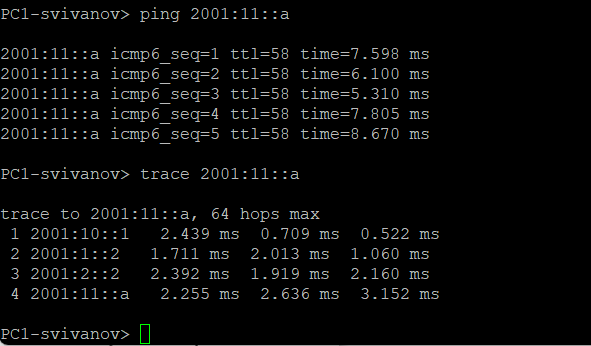{#fig:071 width=70%}

## Настройка динамической маршрутизации по протоколу OSPF

Посмотрим захваченный на соединениях трафик. 

{#fig:072 width=70%}

## Настройка динамической маршрутизации по протоколу OSPF

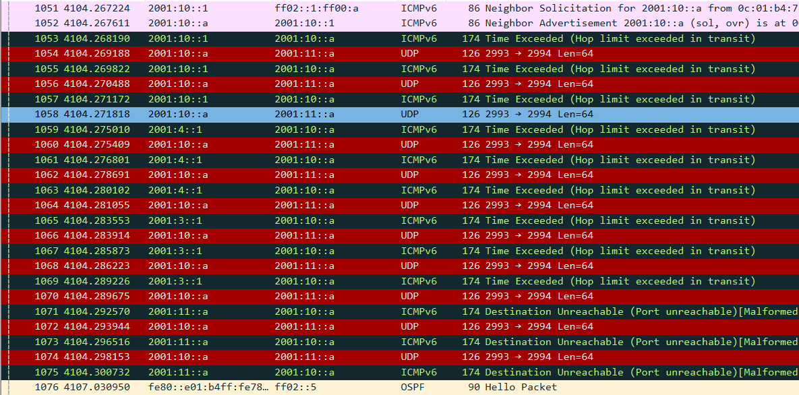{#fig:073 width=70%}

## Построение туннеля IPv6–IPv4

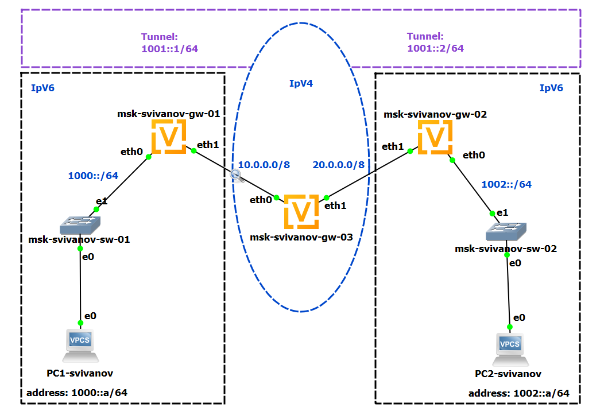{#fig:074 width=70%}

## Построение туннеля IPv6–IPv4

Присвоим адреса устройствам PC1 и PC2: 

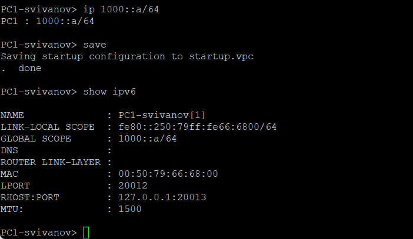{#fig:075 width=70%}

## Построение туннеля IPv6–IPv4

{#fig:076 width=70%}

## Построение туннеля IPv6–IPv4

На маршрутизаторах настроим адреса на интерфейсах: 

{#fig:077 width=70%}

## Построение туннеля IPv6–IPv4

{#fig:078 width=70%}

## Построение туннеля IPv6–IPv4

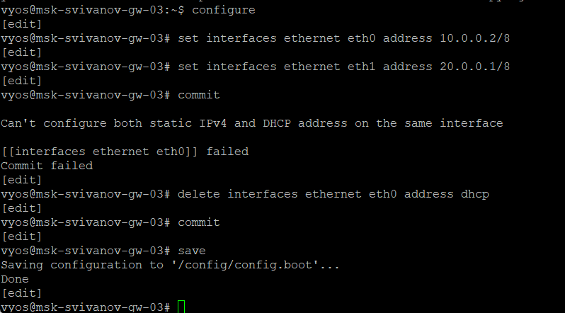{#fig:079 width=70%}

## Построение туннеля IPv6–IPv4

Проверим маршруты с маршрутизатора R1:

{#fig:080 width=70%}

## Построение туннеля IPv6–IPv4

{#fig:081 width=70%}

## Построение туннеля IPv6–IPv4

Настроим маршрутизацию IPv4: (рис. 82-84)

{#fig:082 width=70%}

## Построение туннеля IPv6–IPv4

{#fig:083 width=70%}

## Построение туннеля IPv6–IPv4

{#fig:084 width=70%}

## Построение туннеля IPv6–IPv4

Проверим маршруты: 

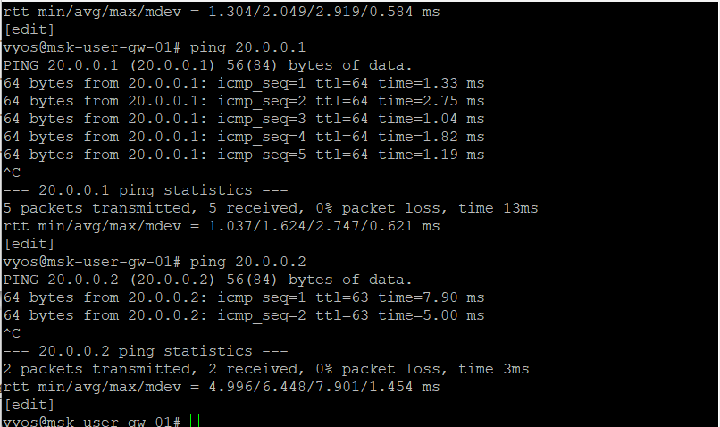{#fig:085 width=70%}

## Построение туннеля IPv6–IPv4

{#fig:086 width=70%}

## Построение туннеля IPv6–IPv4

Создадим туннель IPv6 через сеть IPv4: 

{#fig:087 width=70%}

## Построение туннеля IPv6–IPv4

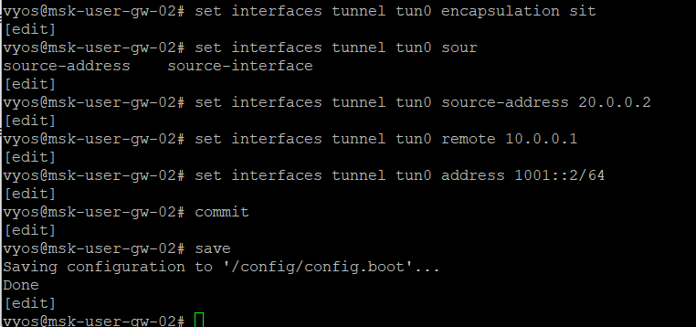{#fig:088 width=70%}

## Построение туннеля IPv6–IPv4

Настроим статическую маршрутизацию IPv6: 

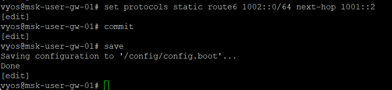{#fig:089 width=70%}

## Построение туннеля IPv6–IPv4

{#fig:090 width=70%}

## Построение туннеля IPv6–IPv4

Проверим доступность оконечных устройств: 

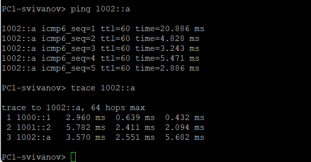{#fig:091 width=70%}

## Построение туннеля IPv6–IPv4

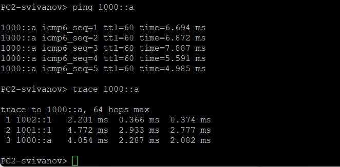{#fig:092 width=70%}

## Построение туннеля IPv6–IPv4

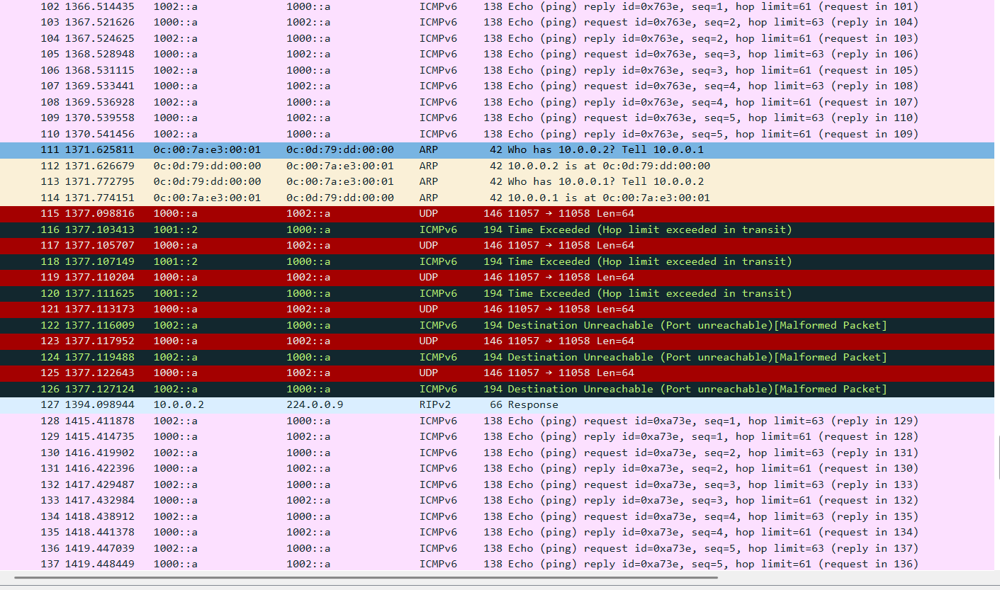{#fig:093 width=70%}

## Построение туннеля IPv6–IPv4

{#fig:094 width=70%}

## Задание для самостоятельного выполнения

Настроить динамическую маршрутизацию сетей IPv4 и IPv6 для протоколов RIP, OSPF, проверить соединения и маршруты.

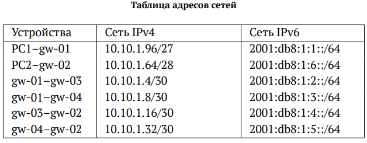{#fig:095 width=70%}

## Задание для самостоятельного выполнения

{#fig:096 width=70%}

## Задание для самостоятельного выполнения

Схема L1 (рис. 97)

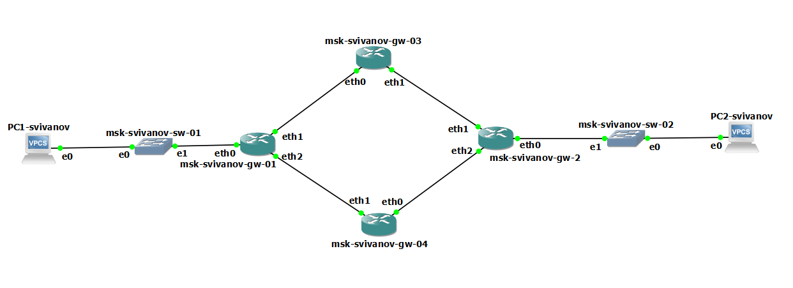{#fig:097 width=70%}

## Задание для самостоятельного выполнения

Схема L3 (рис. 98) 

{#fig:098 width=70%}

## Задание для самостоятельного выполнения

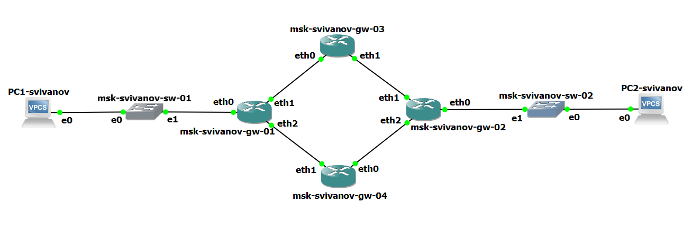{#fig:099 width=70%}

## Задание для самостоятельного выполнения

Присвоим IPv4-адреса устройствам PC1 и PC2:  

{#fig:100 width=70%}

## Задание для самостоятельного выполнения

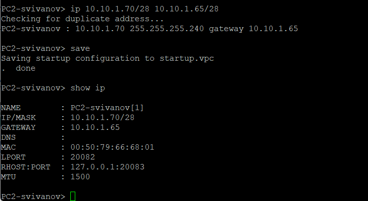{#fig:101 width=70%}

## Задание для самостоятельного выполнения

Настроим IPv4-адреса на интерфейсах маршрутизаторов:

{#fig:102 width=70%}

## Задание для самостоятельного выполнения

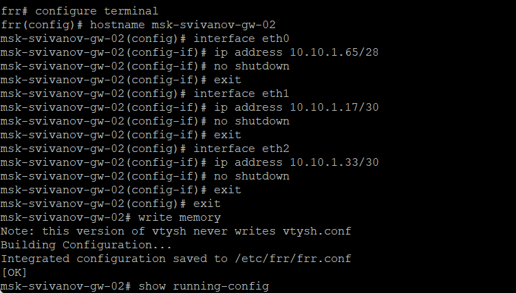{#fig:103 width=70%}

## Задание для самостоятельного выполнения

{#fig:104 width=70%}

## Задание для самостоятельного выполнения

{#fig:105 width=70%}

## Задание для самостоятельного выполнения

Присвоим IPv6-адреса устройствам PC1 и PC2:

{#fig:106 width=70%}

## Задание для самостоятельного выполнения

{#fig:107 width=70%}

## Задание для самостоятельного выполнения

Настроим IPv6-адреса на интерфейсах маршрутизаторов: 

{#fig:108 width=70%}

## Задание для самостоятельного выполнения

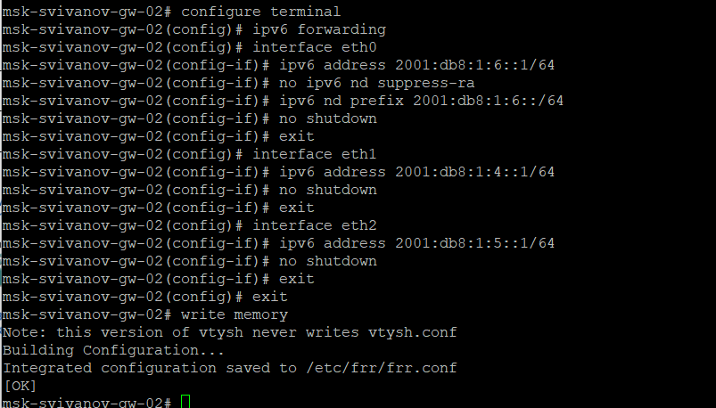{#fig:109 width=70%}

## Задание для самостоятельного выполнения

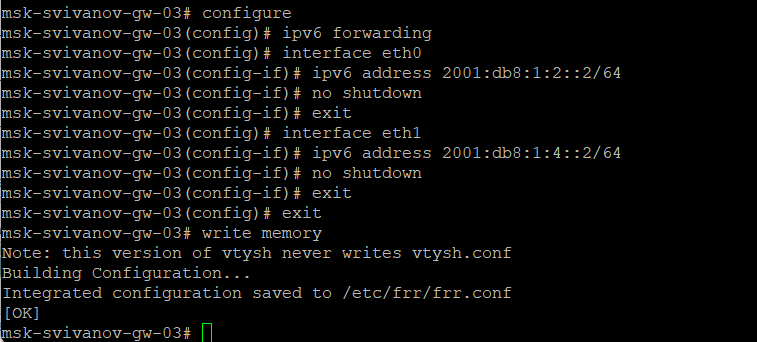{#fig:110 width=70%}

## Задание для самостоятельного выполнения

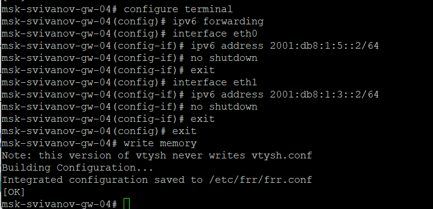{#fig:111 width=70%}

## Задание для самостоятельного выполнения

На маршрутизаторах настроим RIP в качестве протокола динамической маршрутизации:

{#fig:112 width=70%}

## Задание для самостоятельного выполнения

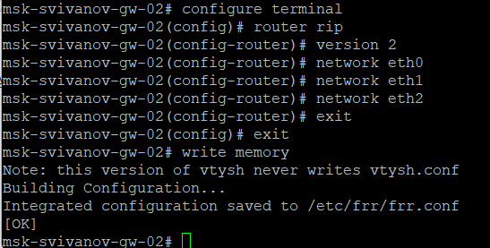{#fig:113 width=70%}

## Задание для самостоятельного выполнения

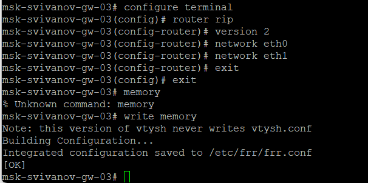{#fig:114 width=70%}

## Задание для самостоятельного выполнения

{#fig:115 width=70%}

## Задание для самостоятельного выполнения

С PC1 пропингуем PC2. Пакеты идут через gw-03 

{#fig:116 width=70%}

## Задание для самостоятельного выполнения

Проверим метрики протокола RIP: (рис. 117)

{#fig:117 width=70%}

## Задание для самостоятельного выполнения

Пакет проходит через gw-03. Отключим на gw-03 интерфейс. Теперь пакеты идут через gw-04. 

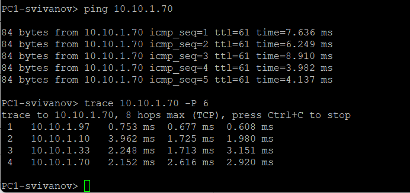{#fig:118 width=70%}

## Задание для самостоятельного выполнения

На маршрутизаторах настроим RIPng для сетей IPv6:

{#fig:119 width=70%}

## Задание для самостоятельного выполнения

{#fig:120 width=70%}

## Задание для самостоятельного выполнения

{#fig:121 width=70%}

## Задание для самостоятельного выполнения

{#fig:122 width=70%}

## Задание для самостоятельного выполнения

С PC1 пропингуем PC2. Пакеты идут через gw-03.

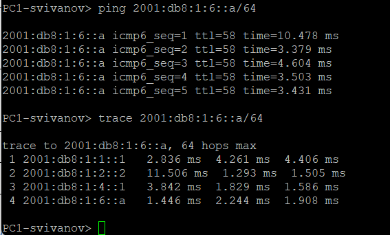{#fig:123 width=70%}

## Задание для самостоятельного выполнения

Проверим метрики протокола RIPng: 

{#fig:124 width=70%}

## Задание для самостоятельного выполнения

Пакет проходит через gw-03. Отключим на gw-03 интерфейс. Теперь пакеты идут через gw-04. 

{#fig:125 width=70%}

## Задание для самостоятельного выполнения

На маршрутизаторах настроим OSPFv2 для сетей IPv4: 

{#fig:126 width=70%}

## Задание для самостоятельного выполнения

{#fig:127 width=70%}

## Задание для самостоятельного выполнения

{#fig:128 width=70%}

## Задание для самостоятельного выполнения

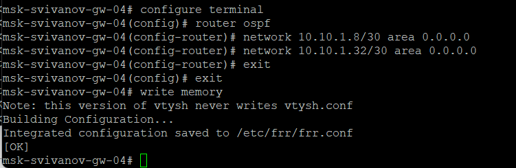{#fig:129 width=70%}

## Задание для самостоятельного выполнения

С PC1 пропингуем PC2. Пакеты идут через gw-04. 

{#fig:130 width=70%}

## Задание для самостоятельного выполнения

Пакет проходит через gw-04. Отключим на gw-04 интерфейс: 

{#fig:131 width=70%}

## Задание для самостоятельного выполнения

С PC1 пропингуем PC2. Пакеты идут через gw-03. 

{#fig:132 width=70%}

## Задание для самостоятельного выполнения

На маршрутизаторах настроим OSPFv3 для сетей IPv6: 

{#fig:133 width=70%}

## Задание для самостоятельного выполнения

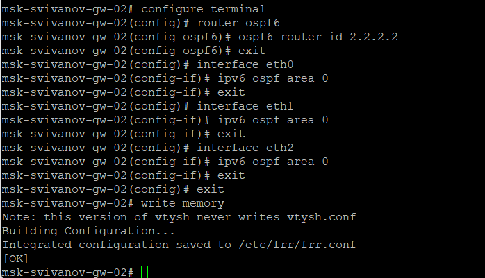{#fig:134 width=70%}

## Задание для самостоятельного выполнения

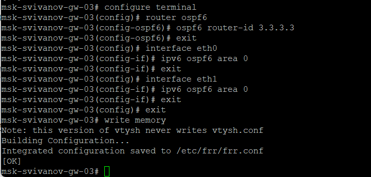{#fig:135 width=70%}

## Задание для самостоятельного выполнения

{#fig:136 width=70%}

## Задание для самостоятельного выполнения

С PC1 пропингуем PC2. Пакеты идут через gw-03. 

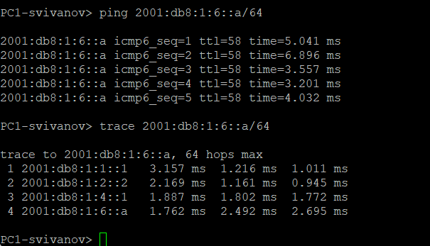{#fig:137 width=70%}

## Задание для самостоятельного выполнения

Пакет проходит через gw-03. Отключим на gw-03 интерфейс: 

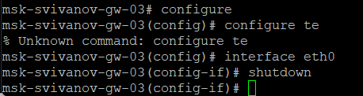{#fig:138 width=70%}

## Задание для самостоятельного выполнения

С PC1 пропингуем PC2. Пакеты идут через gw-04.

{#fig:139 width=70%}

# Вывод

## Вывод 

В ходе выполнения лабораторной работы мы изучили принципы маршрутизации в IPv4- и IPv6-сетях и принципов настройки сетевого оборудования.

 
