---
## Front matter
title: "Отчет по лабораторной работе №8"
subtitle: "Дисциплина: Сетевые технологии"
author: "Иванов Сергей Владимирович"

## Generic otions
lang: ru-RU
toc-title: "Содержание"

## Bibliography
bibliography: bib/cite.bib
csl: pandoc/csl/gost-r-7-0-5-2008-numeric.csl

## Pdf output format
toc: true # Table of contents
toc-depth: 2
lof: true # List of figures
fontsize: 12pt
linestretch: 1.5
papersize: a4
documentclass: scrreprt
## I18n polyglossia
polyglossia-lang:
  name: russian
  options:
	- spelling=modern
	- babelshorthands=true
polyglossia-otherlangs:
  name: english
## I18n babel
babel-lang: russian
babel-otherlangs: english
## Fonts
mainfont: PT Serif
romanfont: PT Serif
sansfont: PT Sans
monofont: PT Mono
mainfontoptions: Ligatures=TeX
romanfontoptions: Ligatures=TeX
sansfontoptions: Ligatures=TeX,Scale=MatchLowercase
monofontoptions: Scale=MatchLowercase,Scale=0.9
## Biblatex
biblatex: true
biblio-style: "gost-numeric"
biblatexoptions:
  - parentracker=true
  - backend=biber
  - hyperref=auto
  - language=auto
  - autolang=other*
  - citestyle=gost-numeric
## Pandoc-crossref LaTeX customization
figureTitle: "Рис."
listingTitle: "Листинг"
lofTitle: "Список иллюстраций"
lolTitle: "Листинги"
## Misc options
indent: true
header-includes:
  - \usepackage{indentfirst}
  - \usepackage{float} # keep figures where there are in the text
  - \floatplacement{figure}{H} # keep figures where there are in the text
---

# Цель работы

Изучение принципов маршрутизации в IPv4- и IPv6-сетях и принципов настройки сетевого оборудования.

# Выполнение лабораторной работы

## Настройка динамической маршрутизации в сетях IPv4 и IPv6

Продублируем таблицы адресации. (рис. 1, 2)

{#fig:001 width=70%}

{#fig:002 width=70%}

Схема L1 (рис. 3)

{#fig:003 width=70%}

Схема L3 (рис. 4) 

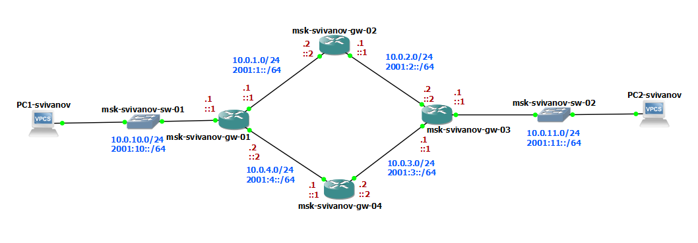{#fig:004 width=70%}

Запустим GNS3 VM и GNS3. Создадим новый проект. В рабочем пространстве разместим и соединим устройства в соответствии
с топологией. Используем маршрутизаторы FRR. Измените отображаемые названия устройств. Включим захват трафика на соединении между коммутатором sw-01 и маршрутизатором gw-01, а также между коммутатором sw-02 и маршрутизатором gw-03. (рис. 5)

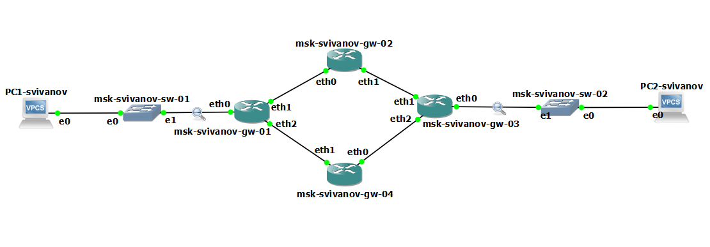{#fig:005 width=70%}
 
Присвоим IPv4-адреса оконечным устройствам PC1 и PC2:  (рис. 6, 7)

{#fig:006 width=70%}

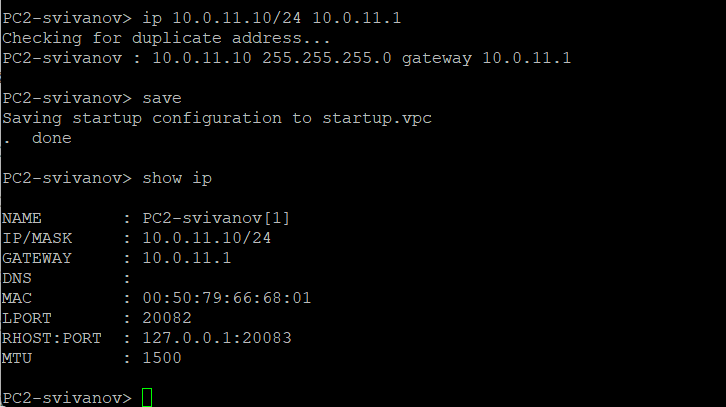{#fig:007 width=70%}

Настроим IPv4-адреса на интерфейсах маршрутизаторов: (рис. 8-11)

{#fig:008 width=70%}

{#fig:009 width=70%}

{#fig:010 width=70%}

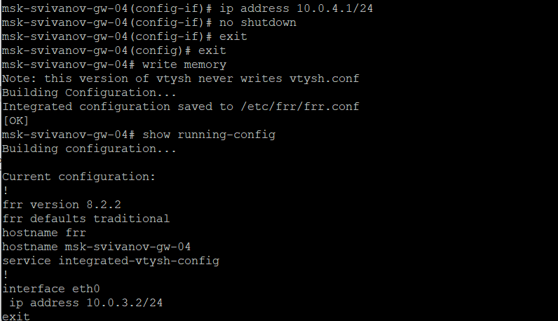{#fig:011 width=70%}

Присвоим IPv6-адреса оконечным устройствам PC1 и PC2: (рис. 12, 13)

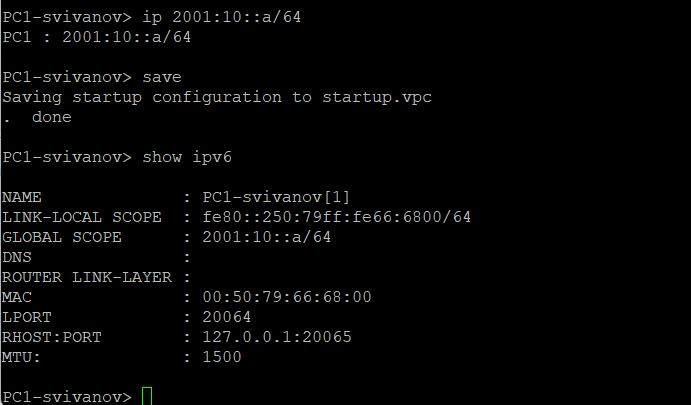{#fig:012 width=70%}

{#fig:013 width=70%}

Настроим IPv6-адреса на интерфейсах маршрутизаторов: (рис. 14-17)

{#fig:014 width=70%}

{#fig:015 width=70%}

{#fig:016 width=70%}

{#fig:017 width=70%}

**Настройка динамической маршрутизации по протоколу RIP:**

На маршрутизаторах настроим RIP в качестве протокола динамической
маршрутизации: (рис. 18-21)

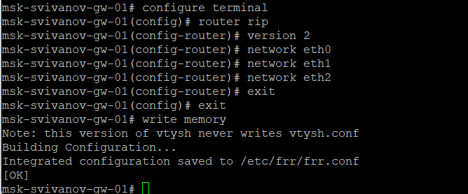{#fig:018 width=70%}

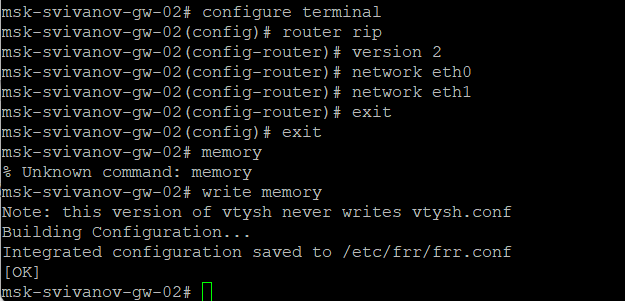{#fig:019 width=70%}

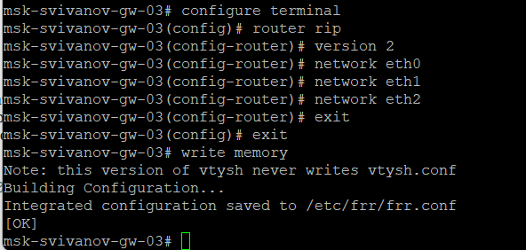{#fig:020 width=70%}

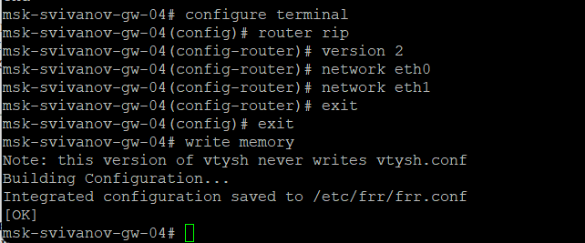{#fig:021 width=70%}

Убедимся, что маршрутизация по RIP настроена: (рис. 22-25)

{#fig:022 width=70%}

{#fig:023 width=70%}

{#fig:024 width=70%}

{#fig:025 width=70%}

Проверим пути прохождения пакетов. С PC1 пропингуем PC2 и определим путь следования пакетов. Пакеты идут через маршрутизатор gw-02 (рис. 26)

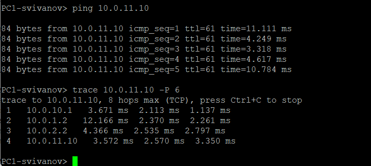{#fig:026 width=70%}

Проверим метрики протокола RIP: (рис. 27)

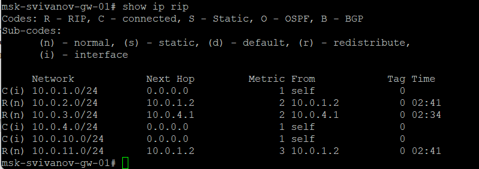{#fig:027 width=70%}

Пакет проходит через маршрутизатор gw-02. Отключим на маршрутизаторе msk-user-gw-02
интерфейс:

```
msk-user-gw-02# configure terminal
msk-user-gw-02(config)# interface eth0
msk-user-gw-02(config-if)# shutdown
```

Проверим метрики протокола RIP: msk-user-gw-01# show ip rip. (рис. 28)

{#fig:028 width=70%}

С PC1 пропингуем PC2 и определим путь следования пакетов. Примерное время восстановления маршрута - 1 минута. Видим, что маршрут изменился и пакеты идут через gw-04 маршрутизатор. (рис. 29)

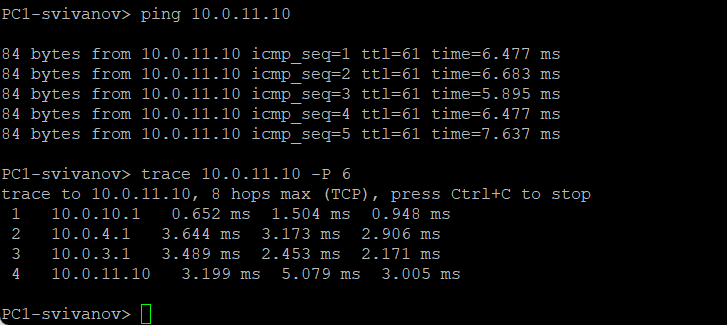{#fig:029 width=70%}

Включим на маршрутизаторе gw-02 интерфейс: (рис. 30)

{#fig:030 width=70%}

С PC1 пропингуем PC2 и определим путь следования пакетов. Так же, через gw-04. (рис. 31)

{#fig:031 width=70%}

Посмотрим захваченный на соединениях трафик. (рис. 32-34)

Работа протокола RIPv2:

- Видны периодические multicast-пакеты (224.0.0.9) от 10.0.10.1 (gw-01) с типом RIPv2 Response. Это подтверждает активность протокола.
- Адрес назначения 224.0.0.9 - это стандартный multicast-адрес для RIPv2.

Процесс ARP:

- Маршрутизатор 10.0.10.1 (gw-01) периодически отправляет запрос "Who has 10.0.10.10", и PC1 (00:50:79:66:68:00) отвечает. Это процесс поддержания ARP-таблиц.

Изменение маршрута и поведение TCP:

- Серия кадров с ошибками "Time-to-Live exceeded" от разных маршрутизаторов (10.0.10.1, 10.0.1.2, 10.0.2.2) - это работа traceroute или неудачных попыток соединения, когда пакеты не доходят из-за обрыва маршрута.

Кадры 37 и 38 демонстрируют:

- Восстановление связи (SYN-ACK от PC2).
- Изменение пути. После отключения основного маршрута трафик пошел по альтернативному пути, который проходит через gw-04.

{#fig:032 width=70%}

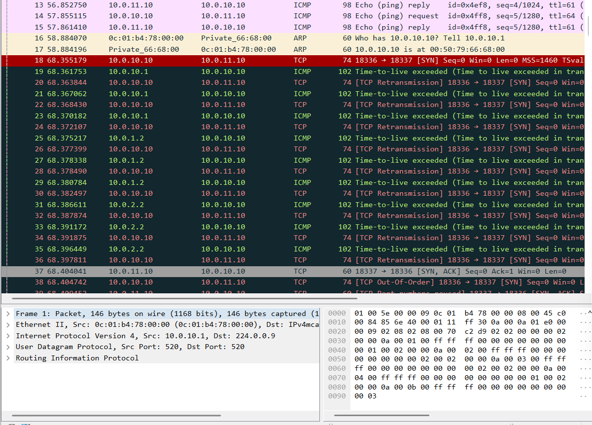{#fig:033 width=70%}

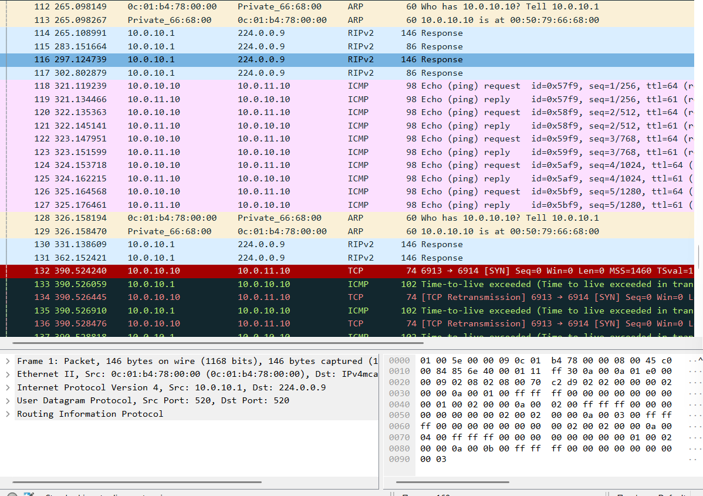{#fig:034 width=70%}

На маршрутизаторах настроим RIPng для сетей IPv6: (рис. 35-38)

{#fig:035 width=70%}

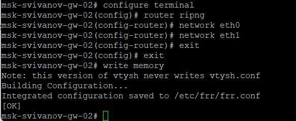{#fig:036 width=70%}

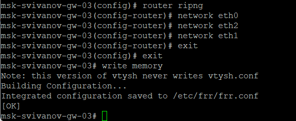{#fig:037 width=70%}

{#fig:038 width=70%}

С PC1 пропингуем PC2 и определим путь следования пакетов. Пакеты идут через gw-04. (рис. 39)

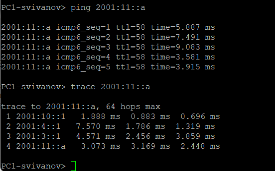{#fig:039 width=70%}

Проверим метрики протокола RIPng: (рис. 40)

{#fig:040 width=70%}

Пакет проходит через маршрутизатор gw-04. Отключим на маршрутизаторе gw-04 интерфейс: (рис. 41)

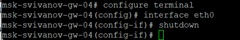{#fig:041 width=70%}

Проверим метрики протокола RIPng: (рис. 42)

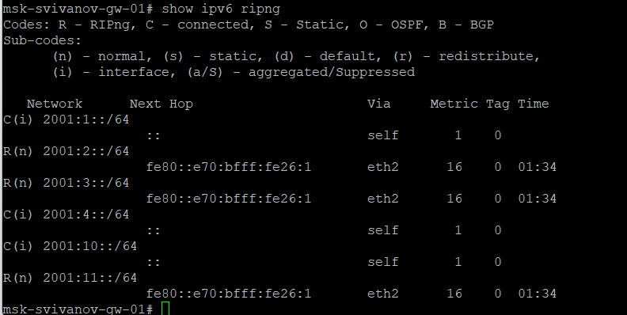{#fig:042 width=70%}

С PC1 пропингуем PC2 и определим путь следования пакетов. Пакеты идут через gw-02. Маршрут восстановился примерно через минуту. (рис. 43)

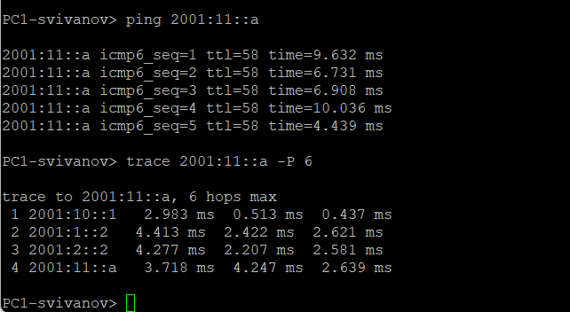{#fig:043 width=70%}

Включим на маршрутизаторе gw-04 интерфейс: (рис. 44)

{#fig:044 width=70%}

С PC1 пропингуем PC2 и определим путь следования пакетов. Пакеты идут через gw-02. (рис. 45)

{#fig:045 width=70%}

Посмотрим захваченный на соединениях трафик. (рис. 42, 43)

Работа IPv6 и ND (Neighbor Discovery):

- Кадры 467-468, 472-473 демонстрируют работу ICMPv6 Neighbor Discovery Protocol. Маршрутизатор (0c:01:b4:78:00:00) ищет MAC-адрес для 2001:10::a (Solicitation), и PC1 отвечает (Advertisement). Это аналог ARP для IPv6.
- Успешные ICMPv6 Echo (пинги) доказывают связность между PC1 и PC2 (кадры 471-482).
- UDP-based traceroute (кадры 459, 461, 463, 465, 483, 485, 487) и соответствующие ответы Time Exceeded (458, 460, 484, 486) позволяют определить промежуточные узлы на пути.
- Ответы Destination Unreachable (Port unreachable) (кадры 462, 464, 466) от 2001:11::a (PC2) являются финальными для traceroute, сигнализируя, что пакет дошел до цели, но порт закрыт.

Подтверждение динамической маршрутизации:

- Наличие двух различных источников сообщений Time Exceeded (2001:1::2 и 2001:2::2) в ответ на один запрос traceroute является признаком наличия более одного пути в сети. 

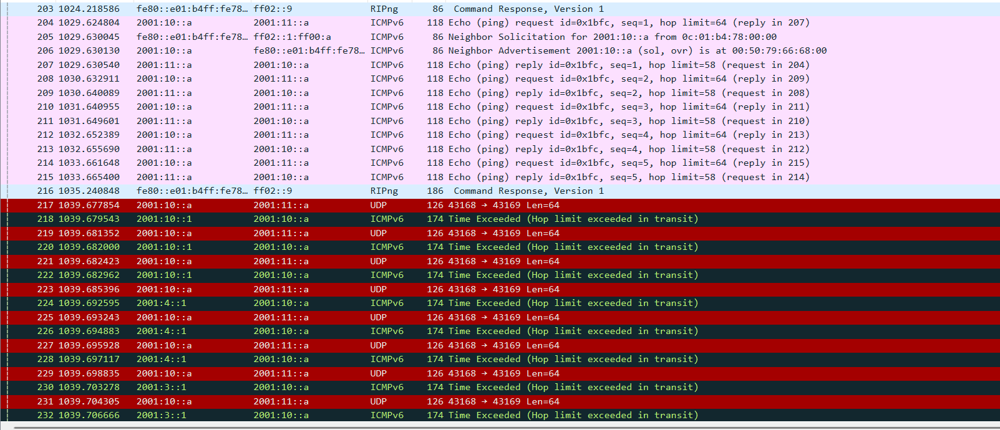{#fig:046 width=70%}

{#fig:047 width=70%}

**Настройка динамической маршрутизации по протоколу OSPF:**

На маршрутизаторах настроим OSPFv2 для сетей IPv4: (рис. 48-51)

{#fig:048 width=70%}

{#fig:049 width=70%}

{#fig:050 width=70%}

{#fig:051 width=70%}

С PC1 пропингуем PC2 и определим путь следования пакетов. Путь проходит через gw-04. (рис. 52)

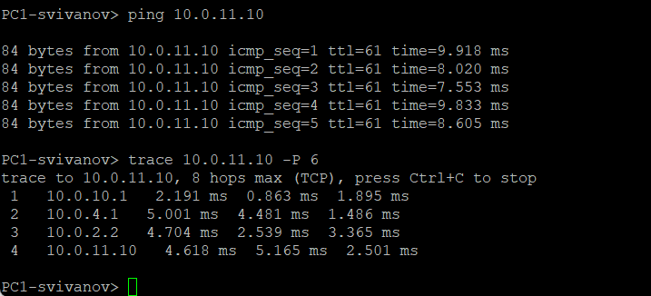{#fig:052 width=70%}

Проверим таблицу маршрутизации протокола OSPFv2: (рис. 53)

{#fig:053 width=70%}

Пакет проходит через маршрутизатор gw-04. Отключим на маршрутизаторе gw-04 интерфейс: (рис. 54)

{#fig:054 width=70%}

Проверим таблицу маршрутизации протокола OSPFv2: (рис. 55)

{#fig:055 width=70%}

С PC1 пропингуем PC2 и определим путь следования пакетов. Путь проходит через gw-02. Время восстановления пути - около минуты. (рис. 56)

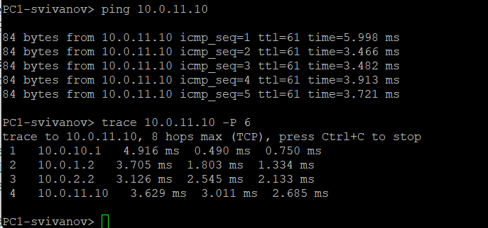{#fig:056 width=70%}

Включим на маршрутизаторе gw-04 интерфейс: (рис. 57)

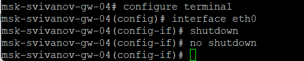{#fig:057 width=70%}

С PC1 пропингуем PC2 и определим путь следования пакетов. Путь проходит через gw-04. (рис. 58)

{#fig:058 width=70%}

Посмотрим захваченный на соединениях трафик. (рис. 59, 60)

Подтверждение работы OSPFv2: 

- Присутствуют периодические multicast-пакеты OSPF Hello (224.0.0.5) от 10.0.10.1. Это доказывает, что OSPF настроен и работает на интерфейсе, подключенном к PC1.

Демонстрация отказоустойчивости OSPF: 

- Последовательность кадров 691-713 является иллюстрацией работы OSPF при сбое

Проблема: Потеря связи с соседом (gw-02).

- Действие OSPF: Быстрый перерасчет и активация резервного пути (через gw-04).
- Результат в трафике: Восстановление соединения (SYN-ACK от PC2) и TCP-ретрансмиссии с пометкой Out-Of-Order, указывающие на изменение пути.

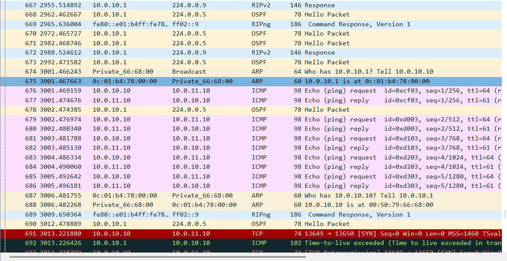{#fig:059 width=70%}

{#fig:060 width=70%}

На маршрутизаторах настроим OSPFv3 для сетей IPv6: (рис. 61-64)

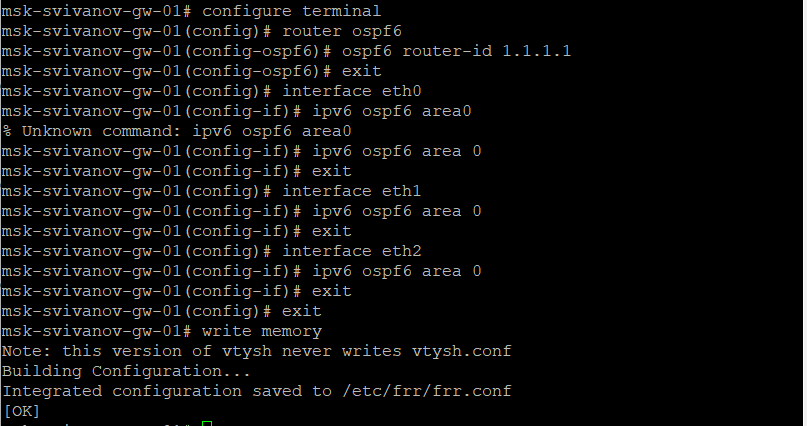{#fig:061 width=70%}

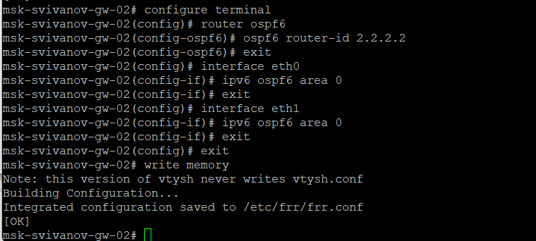{#fig:062 width=70%}

{#fig:063 width=70%}

{#fig:064 width=70%}

С PC1 пропингуем PC2 и определим путь следования пакетов. Пакеты идут через gw-02 (рис. 65)

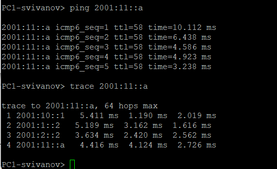{#fig:065 width=70%}

Проверим таблицу маршрутизации протокола OSPFv3: (рис. 66)

{#fig:066 width=70%}

Пакет проходит через маршрутизатор gw-02. Отключим на маршрутизаторе gw-02 интерфейс: (рис. 67)

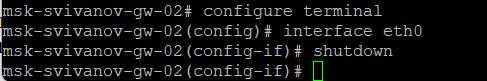{#fig:067 width=70%}

Проверим таблицу маршрутизации протокола OSPFv3: (рис. 68)

{#fig:068 width=70%}

С PC1 пропингуем PC2 и определим путь следования пакетов. Пакеты идут через gw-04. Примерное время восстановления - 1 минута. (рис. 69)

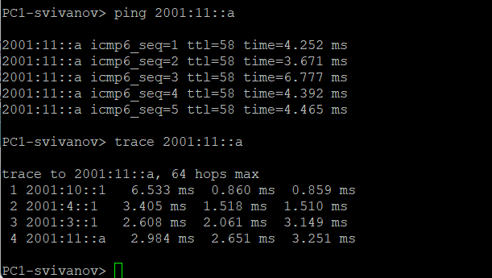{#fig:069 width=70%}

Включим на маршрутизаторе gw-02 интерфейс: (рис. 70)

{#fig:070 width=70%}

С PC1 пропингуем PC2 и определим путь следования пакетов. Пакеты идут через gw-02. (рис. 71)

{#fig:071 width=70%}

Посмотрим захваченный на соединениях трафик. (рис. 72, 73)

Подтверждение работы OSPFv3: 
- Регулярные multicast-пакеты OSPFv3 Hello на адрес ff02::5 (кадры 1029, 1040, 1047, 1075) доказывают, что протокол настроен и работает. Адрес ff02::5 — это All OSPFv3 Routers multicast-адрес.

- Последовательность ответов Time Exceeded от gw-04 (2001:4::1) и gw-03 (2001:3::1) в ответ на traceroute (1059-1069) говорят, что при недоступности маршрута через gw-02, OSPFv3 мгновенно активировал альтернативный путь через gw-04.

- NDP (Neighbor Discovery Protocol): Кадры 1043-1045 и 1051-1052 показывают процесс разрешения адресов: маршрутизатор ищет MAC-адрес для 2001:10::a (Solicitation), и PC1 отвечает (Advertisement).

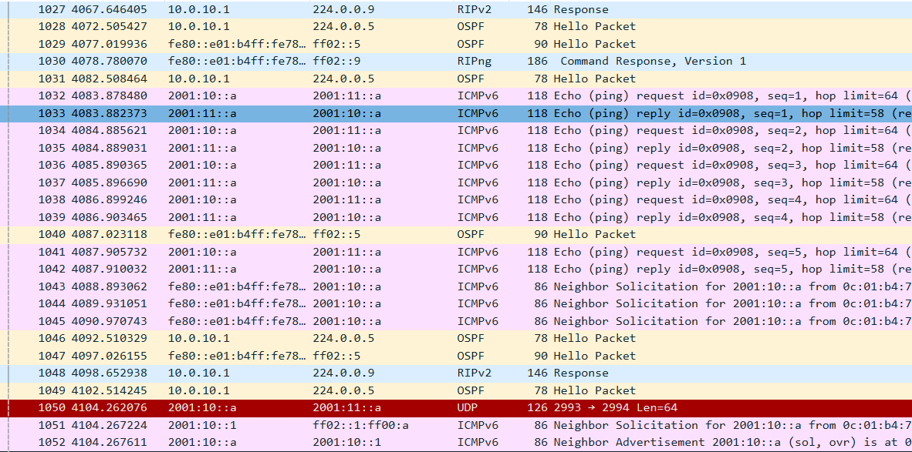{#fig:072 width=70%}

{#fig:073 width=70%}

## Построение туннеля IPv6–IPv4

Создадим новый проект в GNS3. В рабочем пространстве разместим и соедините устройства в соответствии
с топологией. Используем маршрутизаторы VyOS. Изменим отображаемые названия устройств. На соединении между первым и третьим маршрутизаторами подключим
анализатор трафика. (рис. 74)

{#fig:074 width=70%}

Присвоим адреса оконечным устройствам PC1 и PC2: (рис. 75, 76)

{#fig:075 width=70%}

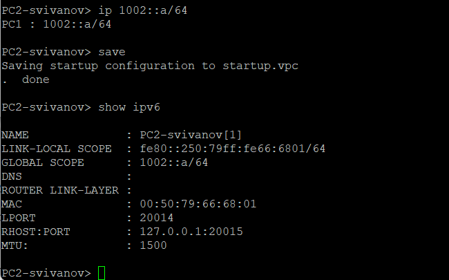{#fig:076 width=70%}

На маршрутизаторах перейдем в режим конфигурирования, изменим имя
устройства, настроим адреса на интерфейсах маршрутизаторов: (рис. 77-79)

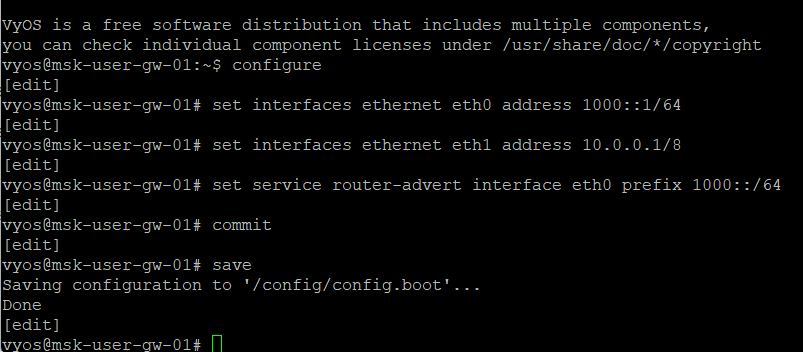{#fig:077 width=70%}

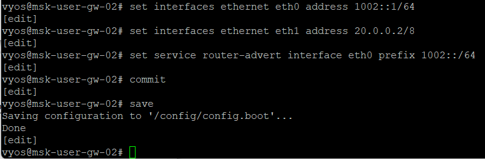{#fig:078 width=70%}

{#fig:079 width=70%}

Проверим маршруты с маршрутизатора R1: (рис. 80)

{#fig:080 width=70%}

ping 10.0.0.2 (R3, интерфейс eth0): Успешно. Все 10 пакетов доставлены. Это объясняется тем, что адреса 10.0.0.1 (R1) и 10.0.0.2 (R3) находятся в одной подсети (10.0.0.0/8). Для связи используется прямое взаимодействие на канальном уровне.

Сначала выполняется разрешение MAC-адреса через протокол ARP (кадры 23-24).

Затем происходит непосредственный обмен ICMP Echo-запросами и ответами (кадры 25-46).

ping 20.0.0.1 (R3, интерфейс eth1): Неудачно. Сообщение об ошибке: connect: Network is unreachable.

ping 20.0.0.2 (R2, интерфейс eth1): Неудачно. Аналогичная ошибка: connect: Network is unreachable.

Сети 20.0.0.0/8 не подключены напрямую к маршрутизатору R1. В его таблице маршрутизации отсутствуют записи о том, как достичь этих сетей. Ошибка Network is unreachable возникает на уровне операционной системы маршрутизатора R1, который, не найдя подходящего маршрута, даже не пытается отправить пакет в сеть. Это подтверждается полным отсутствием в захвате трафика каких-либо пакетов, направленных на адреса 20.0.0.1 или 20.0.0.2. (рис. 81)

{#fig:081 width=70%}

Настроим маршрутизацию IPv4: (рис. 82-84)

{#fig:082 width=70%}

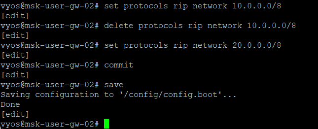{#fig:083 width=70%}

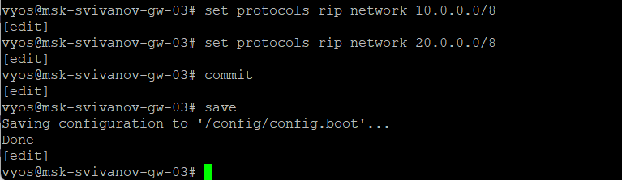{#fig:084 width=70%}

Проверим маршруты: (рис. 85)

{#fig:085 width=70%}

Результаты проверки маршрутов с R1 после настройки RIP:

ping 10.0.0.2 (R3): Успешно.

ping 20.0.0.1 (интерфейс R3): Успешно. Все 5 пакетов доставлены. Это стало возможным потому, что R3 через RIP анонсировал свою сеть 20.0.0.0/8 для R1.

ping 20.0.0.2 (R2): Успешно. Все 2 пакета доставлены. 

Анализ трафика:

Наличие периодических multicast-пакетов RIPv2 Response от 10.0.0.2 (R3) на адрес 224.0.0.9 (кадры 53, 54, 55, 70, 87) подтверждает работу протокола динамической маршрутизации. (рис. 86) 

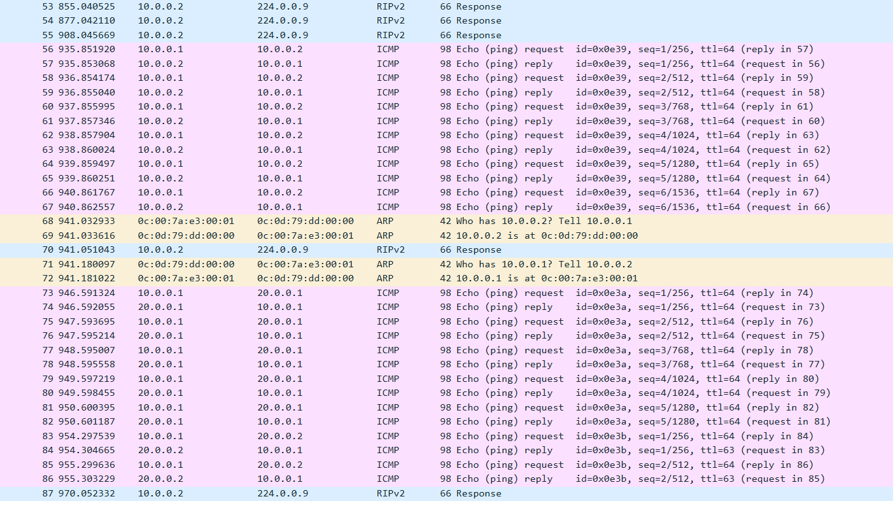{#fig:086 width=70%}

Создадим туннель IPv6 через сеть IPv4: (рис. 87, 88)

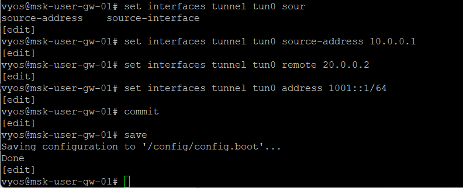{#fig:087 width=70%}

{#fig:088 width=70%}

Настроим статическую маршрутизацию IPv6: (рис. 89, 90)

{#fig:089 width=70%}

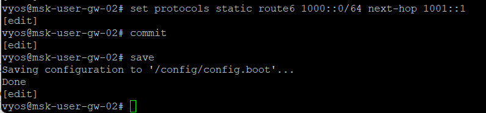{#fig:090 width=70%}

Проверим доступность оконечных устройств: (рис. 91, 92)

{#fig:091 width=70%}

{#fig:092 width=70%}

Анализ результатов проверки: (рис. 93, 94)

ping и trace с PC1 к PC2: Успешно. Трассировка показывает путь: PC1 (1000::a) - R1 (1000::1) - Конец туннеля на R2 (1001::2) - PC2 (1002::a).

ping и trace с PC2 к PC1: Успешно. Трассировка показывает симметричный путь: PC2 - R2 (1002::1) - Конец туннеля на R1 (1001::1) - PC1.

Результаты trace указывают на то, что трафик проходит через туннельные интерфейсы 1001::1 и 1001::2.

Анализ трафика:

Захват трафика был на физическом соединении между маршрутизаторами R1 и R3 (сеть 10.0.0.0/8).

Отсутствие чистого IPv6-трафика: В захвате не наблюдается пакетов IPv6 с адресами 1000::a или 1002::a, идущих между 10.0.0.1 и 20.0.0.2. Исходные IPv6-пакеты упакованы внутрь IPv4-пакетов для передачи по IPv4-сети.

Виден UDP-based traceroute от PC1 к PC2 (кадры 115-126). Ответы ICMPv6 Time Exceeded приходят с адреса 1001::2 — это туннельный интерфейс маршрутизатора R2. Факт получения этой ошибки с туннельного интерфейса доказывает, что IPv6-пакет дошел по туннелю до R2 и был там обработан.

{#fig:093 width=70%}

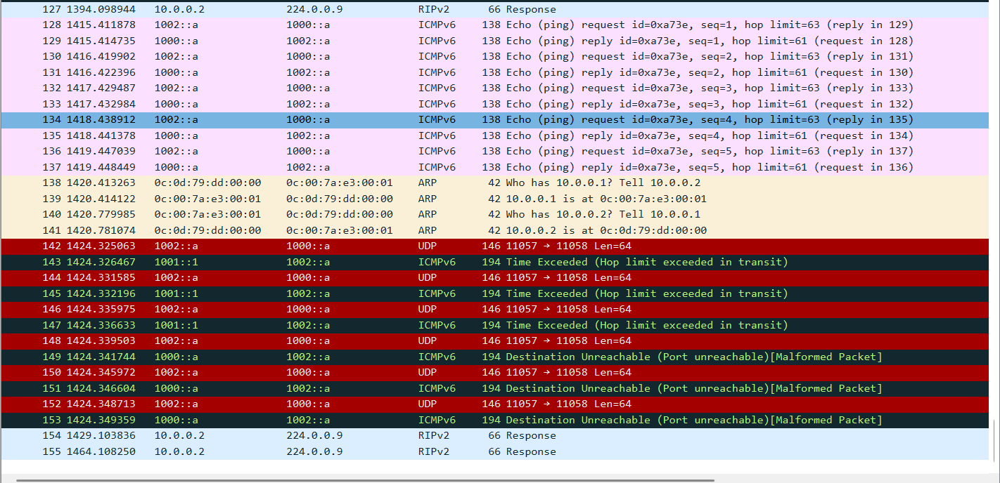{#fig:094 width=70%}

## Задание для самостоятельного выполнения

Необходимо настроить динамическую маршрутизацию сетей IPv4 и IPv6 для протоколов
RIP, OSPF, проверить соединения и маршруты.

Создадим таблицы адресации. (рис. 95, 96)

{#fig:095 width=70%}

{#fig:096 width=70%}

Схема L1 (рис. 97)

{#fig:097 width=70%}

Схема L3 (рис. 98) 

{#fig:098 width=70%}

Создадим новый проект, построим сеть в соответсвии с заданной топологией, дадим названия устройствам, соединим их и включим. (рис. 99)

{#fig:099 width=70%}

Присвоим IPv4-адреса оконечным устройствам PC1 и PC2:  (рис. 100, 101)

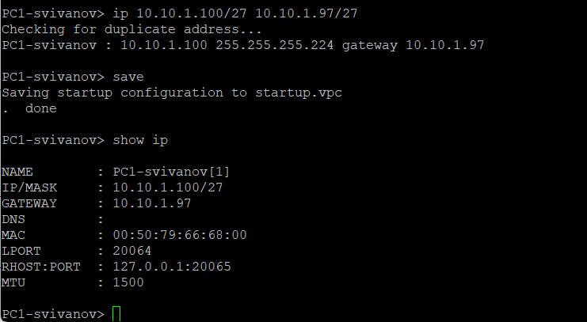{#fig:100 width=70%}

{#fig:101 width=70%}

Настроим IPv4-адреса на интерфейсах маршрутизаторов: (рис. 102-105)

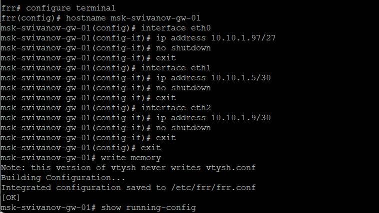{#fig:102 width=70%}

{#fig:103 width=70%}

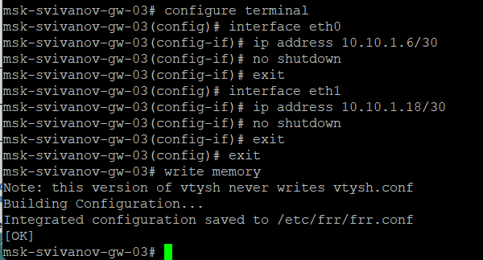{#fig:104 width=70%}

{#fig:105 width=70%}

Присвоим IPv6-адреса оконечным устройствам PC1 и PC2: (рис. 106, 107)

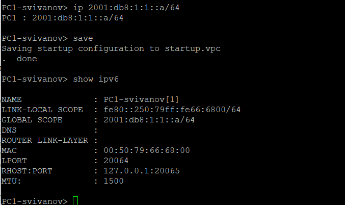{#fig:106 width=70%}

{#fig:107 width=70%}

Настроим IPv6-адреса на интерфейсах маршрутизаторов: (рис. 108-111)

{#fig:108 width=70%}

{#fig:109 width=70%}

{#fig:110 width=70%}

{#fig:111 width=70%}

**Настройка динамической маршрутизации по протоколу RIP:**

На маршрутизаторах настроим RIP в качестве протокола динамической маршрутизации: (рис. 112-115)

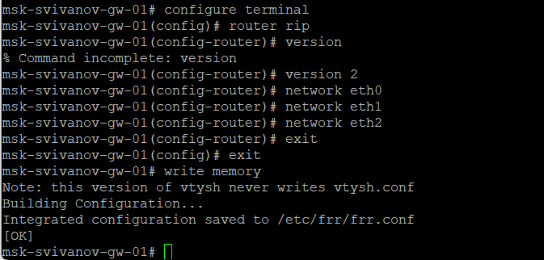{#fig:112 width=70%}

{#fig:113 width=70%}

{#fig:114 width=70%}

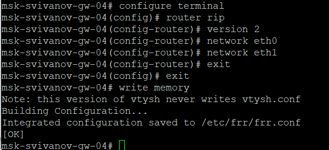{#fig:115 width=70%}

Проверим пути прохождения пакетов: С PC1 пропингуем PC2 и определим путь следования пакетов. Пакеты идут через gw-03 (рис. 116)

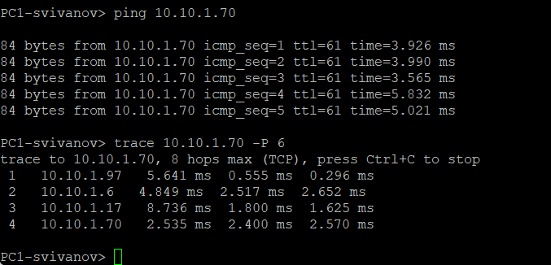{#fig:116 width=70%}

Проверим метрики протокола RIP: (рис. 117)

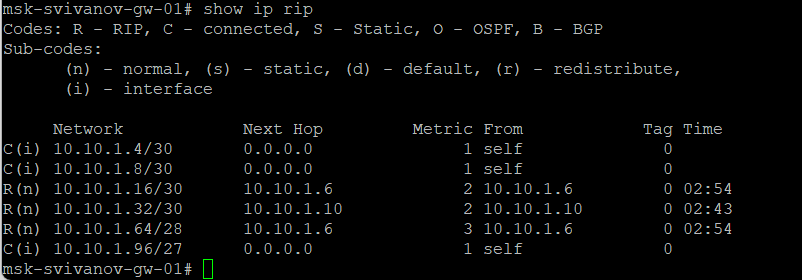{#fig:117 width=70%}

Пакет проходит через маршрутизатор gw-03. Отключим на маршрутизаторе gw-03 интерфейс. С PC1 пропингуем PC2. Теперь пакеты идут через gw-04. Примерное время восстановления маршрута - 1 минута. (рис. 118)

{#fig:118 width=70%}

На маршрутизаторах настроим RIPng для сетей IPv6: (рис. 119-122)

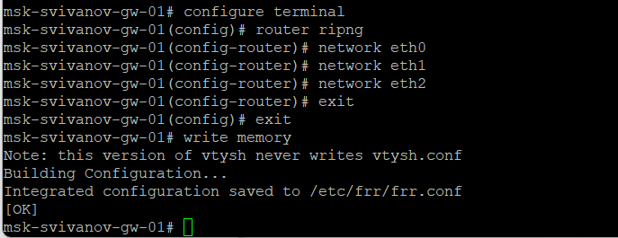{#fig:119 width=70%}

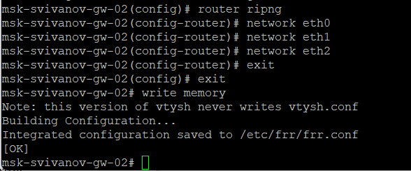{#fig:120 width=70%}

{#fig:121 width=70%}

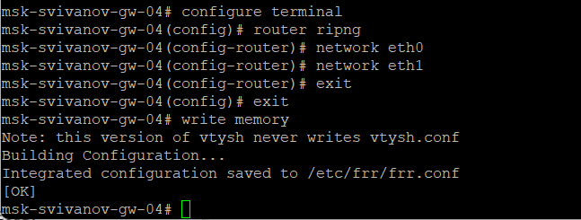{#fig:122 width=70%}

С PC1 пропингуем PC2. Пакеты идут через gw-03. (рис. 123)

{#fig:123 width=70%}

Проверим метрики протокола RIPng: (рис. 124)

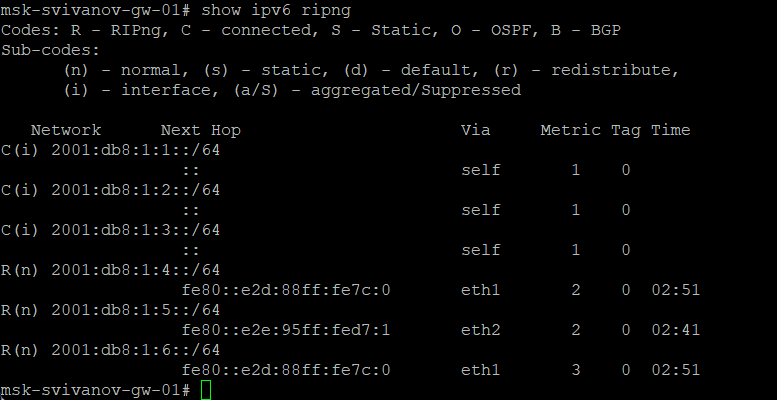{#fig:124 width=70%}

Пакет проходит через маршрутизатор gw-03. Отключим на маршрутизаторе gw-03 интерфейс. С PC1 пропингуем PC2. Теперь пакеты идут через gw-04. Примерное время восстановления маршрута - 1 минута. (рис. 125)

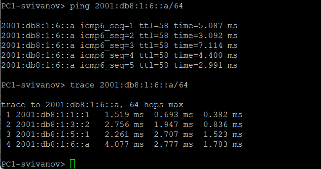{#fig:125 width=70%}

**Настройка динамической маршрутизации по протоколу OSPF:**

На маршрутизаторах настроим OSPFv2 для сетей IPv4: (рис. 126-129)

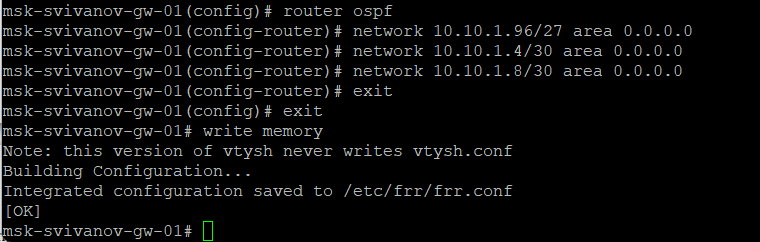{#fig:126 width=70%}

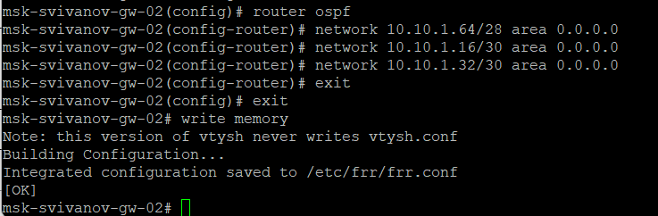{#fig:127 width=70%}

{#fig:128 width=70%}

{#fig:129 width=70%}

С PC1 пропингуем PC2. Пакеты идут через gw-04. (рис. 130)

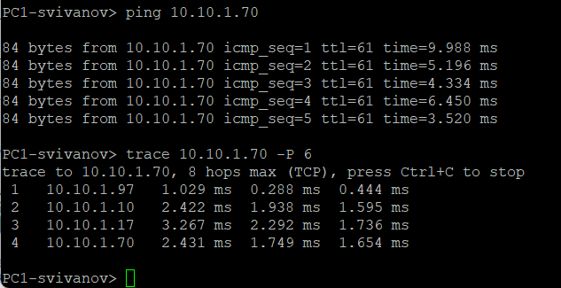{#fig:130 width=70%}

Пакет проходит через маршрутизатор gw-04. Отключим на маршрутизаторе gw-04 интерфейс: (рис. 131)

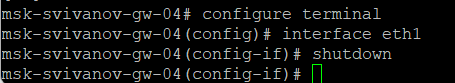{#fig:131 width=70%}

С PC1 пропингуем PC2. Пакеты идут через gw-03. Примерное время восстановления маршрута - 1 минута. (рис. 132)

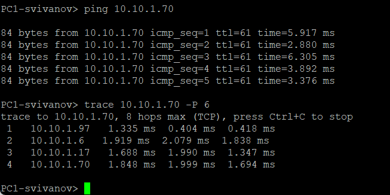{#fig:132 width=70%}

На маршрутизаторах настроим OSPFv3 для сетей IPv6: (рис. 133-136)

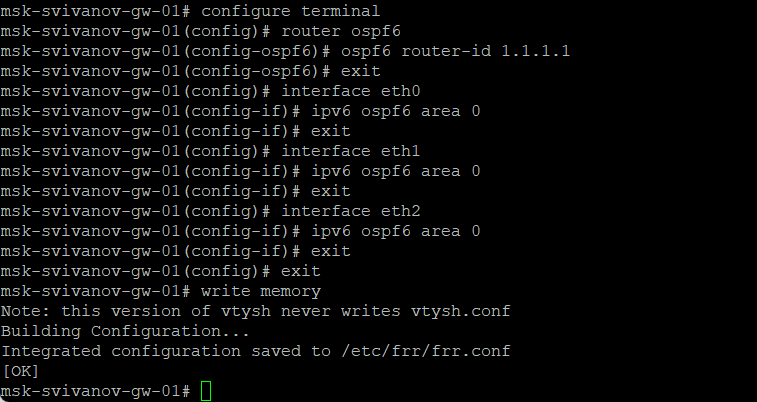{#fig:133 width=70%}

{#fig:134 width=70%}

{#fig:135 width=70%}

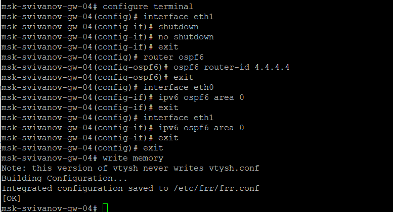{#fig:136 width=70%}

С PC1 пропингуем PC2. Пакеты идут через gw-03. (рис. 137)

{#fig:137 width=70%}

Пакет проходит через маршрутизатор gw-03. Отключим на маршрутизаторе gw-03 интерфейс: (рис. 138)

{#fig:138 width=70%}

С PC1 пропингуем PC2. Пакеты идут через gw-04. Примерное время восстановления маршрута - 1 минута. (рис. 139)

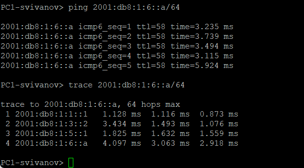{#fig:139 width=70%}

# Выводы

В ходе выполнения лабораторной работы мы изучили принципы маршрутизации в IPv4- и IPv6-сетях и принципов настройки сетевого оборудования.
